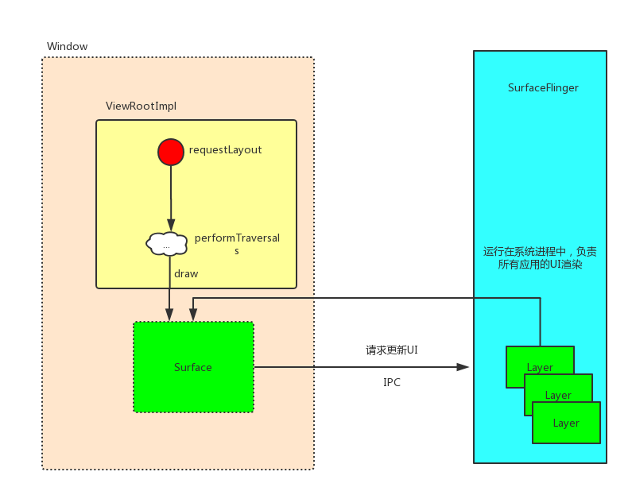
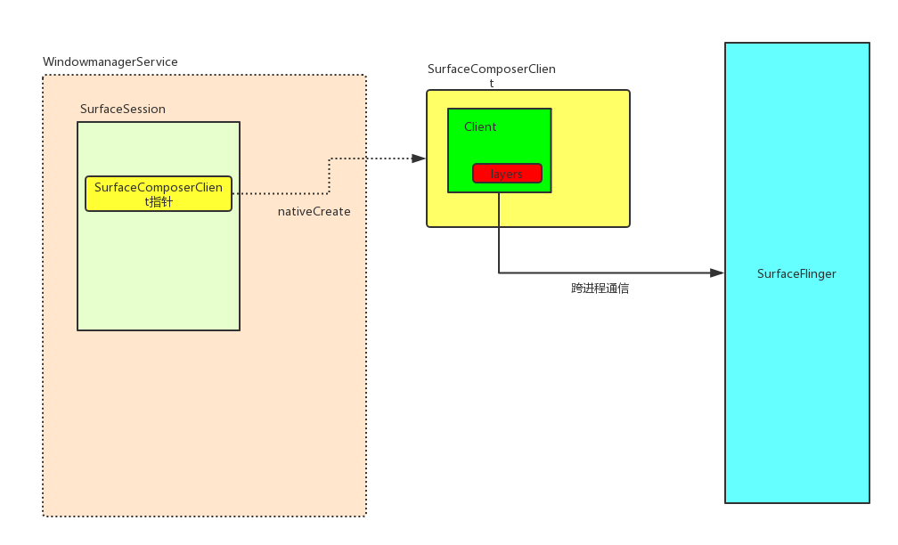

本文是[Android视图层源码分析](https://github.com/SusionSuc/AdvancedAndroid/blob/master/AndroidFramework%E6%BA%90%E7%A0%81%E5%88%86%E6%9E%90/Android%E8%A7%86%E5%9B%BE%E5%B1%82%E6%BA%90%E7%A0%81%E5%88%86%E6%9E%90/README.md)系列第二篇文章，通过上一篇文章已经了解到`WindowManager.addView(contentView)`最终会交给`WindowManagerService`处理，`WindowManagerService`会创建这个`contentView`定义的UI载体`Surface`,本文的目的就是理清`Surface`的创建过程，以及它与`SurfaceFlinger`的关系。

**文章比较长，但希望你可以坚持看完，相信会有一定收获的**

本文是基于[Google Android Repo](https://android.googlesource.com/)中的较新的源码分析的。`Android UI`渲染这一块变化还是比较大的，逻辑可能和网上大部分文章有一些出入。

在本文正式开始之前，我们先来了解一下与SurfaceFlinger相关的基础知识:

- 与SurfaceFlinger相关的基础知识

`SurfaceFlinger`可以说是`Android UI`渲染体系的核心，在Android系统启动时会启动`SurfaceFlinger`服务,它的主要作用就是被Android应用程序调用，把绘制(测量，布局，绘制)后的窗口(Surface)渲染到手机屏幕上。所以整个
UI刷新过程可能像下面这张图:



当然实际上的UI渲染原理可没有像上图那样这么简单。为了接下来在源码追踪的过程中不迷路，我们带着下面几个问题来开始分析:

1. WindowManagerService是如何管理Window的？
2. Surface是如何创建的？
3. SurfaceFlinger是如何管理多个应用的UI渲染的？
4. SurfaceFlinger中UI渲染的基本单元是什么？

ok，接下来就开始`Android UI显示原理之Surface的创建`的主要流程分析。由于整个体系的源码流程很复杂，因此在追踪源码时我只贴了一些整个流程分析中的主要节点，并且加了一些注释。

在上一篇文章[深入剖析Window组成](深入剖析Window组成.md)中我们知道，`ViewRootImpl`管理着整个view tree。
对于`ViewRootImpl.setView()`，我们可以简单的把它当做一个`UI渲染操作`的入口，因此我们就从这个方法开始看:

## WindowManagerService对于Window的管理

>ViewRootImpl.java
```
public void setView(View view, WindowManager.LayoutParams attrs, View panelParentView) {
    ...
    //mWindowSession是一个aidl，ViewRootImpl利用它来和WindowManagerService交互
    //mWindow是一个aidl，WindowManagerService可以利用这个对象与服务端交互
    //mAttachInfo可以理解为是一个data bean，可以跨进程传递
    res = mWindowSession.addToDisplay(mWindow, mSeq, mWindowAttributes,
            getHostVisibility(), mDisplay.getDisplayId(), mWinFrame,
            mAttachInfo.mContentInsets, mAttachInfo.mStableInsets,
            mAttachInfo.mOutsets, mAttachInfo.mDisplayCutout, mInputChannel);
    ...
}
```
即`ViewRootImpl.setView()`方法会向`WindowManagerService`请求添加一个`Window`,`mWindowSession.addToDisplay()`跨进程最终调用到了`WindowManagerService.addWindow()`:

>WindowManagerService.java
```
public int addWindow(Session session, IWindow client...) {
    ...
    //WindowState用来描述一个Window
    final WindowState win = new WindowState(this, session, client, token, parentWindow,
                appOp[0], seq, attrs, viewVisibility, session.mUid,
                session.mCanAddInternalSystemWindow);
    ...
    win.attach();  //会创建一个SurfaceSession

    mWindowMap.put(client.asBinder(), win); //mWindowMap是WindowManagerService用来保存当前所有Window新的的集合
    ...
    win.mToken.addWindow(win); //一个token下会有多个win state。 其实token与PhoneWindow是一一对应的。
    ...
}
```
`WindowState`是`WindowManagerService`用来描述应用程序的一个`Window`的对象。上面注释我标注了`win.attach()`,这个方法可以说是`Window`与`SurfaceFlinger`链接的起点,它最终会调用到`Session.windowAddedLocked()`:

>Session.java
```
void windowAddedLocked(String packageName) {
    ...
    if (mSurfaceSession == null) { 
        ...
        mSurfaceSession = new SurfaceSession();
        ...
    }
}

//SurfaceSession类的构造方法
public final class SurfaceSession {
    private long mNativeClient; // SurfaceComposerClient*

    public SurfaceSession() {
        mNativeClient = nativeCreate(); 
    }
```
这里调用了native方法`nativeCreate()`，这个方法其实是返回了一个`SurfaceComposerClient指针`。那这个对象是怎么创建的呢？

## SurfaceComposerClient的创建

>android_view_SurfaceSession.cpp
```
static jlong nativeCreate(JNIEnv* env, jclass clazz) {
    SurfaceComposerClient* client = new SurfaceComposerClient(); //构造函数其实并没有做什么
    client->incStrong((void*)nativeCreate);
    return reinterpret_cast<jlong>(client);
}
```

即构造了一个`SurfaceComposerClient`对象。并返回它的指针。**这个对象一个应用程序就有一个**，它是应用程序与`SurfaceFlinger`沟通的桥梁，为什么这么说呢？在`SurfaceComposerClient指针`第一次使用时会调用下面这个方法:

```
//这个方法在第一次使用SurfaceComposerClient的指针的时候会调用
void SurfaceComposerClient::onFirstRef() {
    ....
    sp<ISurfaceComposerClient> conn;
    //sf 就是SurfaceFlinger
    conn = (rootProducer != nullptr) ? sf->createScopedConnection(rootProducer) :
            sf->createConnection();
    ...
}
```

即通过`SurfaceFlinger(它本身具有跨进程通信的能力)`创建了一个`ISurfaceComposerClient`对象:

>SurfaceFlinger.cpp
```
sp<ISurfaceComposerClient> SurfaceFlinger::createConnection() {
    return initClient(new Client(this)); //initClient这个方法其实并没有做什么，
}
```

即构造了一个`Client`对象，`Client`实现了`ISurfaceComposerClient`接口。是一个可以跨进程通信的aidl对象。即`SurfaceComposerClient`可以通过它来和`SurfaceFlinger`通信。除此之外它还可以创建`Surface`，并且维护一个应用程序的所有`Layer(下文会分析到它是什么)`。**它是一个十分重要的对象**，我们先来看一下它的组成,它所涉及的其他东西在下文分析中都会讲到:

>Client.h
```
class Client : public BnSurfaceComposerClient
{
public:
    ...
    void attachLayer(const sp<IBinder>& handle, const sp<Layer>& layer);
    void detachLayer(const Layer* layer);
    ...
private:
    // ISurfaceComposerClient interface。   gbp很重要，它维护这一个应用程序的渲染 Buffer队列
    virtual status_t createSurface(...sp<IBinder>* handle, sp<IGraphicBufferProducer>* gbp);

    virtual status_t destroySurface(const sp<IBinder>& handle); 

    //跨进程通信方法
    virtual status_t onTransact(uint32_t code, const Parcel& data, Parcel* reply, uint32_t flags);
    ...

    // constant
    sp<SurfaceFlinger> mFlinger;

    // protected by mLock
    DefaultKeyedVector< wp<IBinder>, wp<Layer> > mLayers; // 一个应用程序的所有Layer
    ...
};
```

经过上面这一顿源码分析，我们大概知道了`ViewRootImpl.setView()`所引发的主要操作:

1. `WindowManagerService`创建了一个`WindowState`。用来表示客户端的一个`Window`
2. `WindowManagerService`创建了一个`SurfaceSession`,`SurfaceSession`会与`SurfaceFlinger`构建链接，创建了一个`SurfaceComposerClient`对象，一个应用程序只具有一个这个对象。
3. `SurfaceComposerClient`创建了一个`Client`, 这个对象十分重要，它维护这应用程序的渲染核心数据，并负责与`SurfaceFlinger`通信。

如下图:



**经过上面的步骤，应用程序的`ViewRootImpl`已经被`WindowManagerService`识别，并且应用程序已经与`SurfaceFlinger`建立连接。即创建了`SurfaceComposerClient`和`Client`对象**

文章开始就已经说了`Surface`是`Window(ViewRootImpl)`的UI载体，那`Surface`是在哪里创建的呢？

## Surface的创建

其实一个`ViewRootImpl`就对应一个`Surface`。这点可以通过`ViewRootImpl`的源码看出:

>ViewRootImpl.java
```
public final Surface mSurface = new Surface();
```

即`ViewRootImpl`在构造的时候就`new 了一个 Surface`。但其实这个新new的`Surface`并没有什么逻辑，它的构造函数是空的。那么`Surface`到底是在哪里创建的呢？


### 触发Surface的创建操作

我们还是回到`ViewRootImpl.setView()`来看一下:
```
public void setView(View view, WindowManager.LayoutParams attrs, View panelParentView) {
    ...
    requestLayout(); //susion 请求layout。先添加到待渲染队列中  
    ...
    res = mWindowSession.addToDisplay(mWindow, ...); //WindowManagerService会创建mWindow对应的WindowState
    ...
}
```

即在向`WindowManagerService`请求创建`WindowState`之前，调用了`requestLayout()`,这个方法会引起`ViewRootImpl`所管理的整个view tree的重新渲染。它最终会调用到`scheduleTraversals()`:

```
void scheduleTraversals() {
    ...
    mChoreographer.postCallback(Choreographer.CALLBACK_TRAVERSAL, mTraversalRunnable, null);
    ...
}
```

对于`Choreographer`本文不做详细的分析，可以去参考 [Android Choreographer 源码分析](https://www.jianshu.com/p/996bca12eb1d)的分析来了解这个类。

`scheduleTraversals()`会通过`Choreographer`来post一个`mTraversalRunnable`，`Choreographer`接收显示系统的时间脉冲(垂直同步信号-VSync信号，16ms发出一次)，在下一个frame渲染时控制执行这个`mTraversalRunnable`。

但是`mTraversalRunnable`的执行至少要在应用程序与`SurfaceFlinger`建立连接之后。这是因为渲染操作是由`SurfaceFlinger`负责调度了，如果应用程序还没有与`SurfaceFlinger`创建连接，那`SurfaceFlinger`当然不会渲染这个应用程序。所以在执行完` mWindowSession.addToDisplay(mWindow, ...)`之后，才会执行`mTraversalRunnable`:

>ViewRootImpl.java
```
final class TraversalRunnable implements Runnable {
    @Override
    public void run() {
        doTraversal();
    }
}
```

`doTraversal()`会调用到`ViewRootImpl.performTraversals()`,大部分同学可能知道这个方法是一个`view tree`的`measure/layout/draw`的控制方法:

```
private void performTraversals() {
    finalView host = mView; //mView是一个Window的根View，对于Activity来说就是DecorView
    ...
    relayoutWindow(params, viewVisibility, insetsPending);
    ...
    performMeasure(childWidthMeasureSpec, childHeightMeasureSpec);
    ...         
    performLayout(lp, mWidth, mHeight);
    ...
    performDraw();
    ...
}
```

`Surface`的具体创建就由`relayoutWindow(params, viewVisibility, insetsPending)`这个方法来完成的。这个方法会通过`IPC`调用到`WindowManagerService.relayoutWindow()`:

>ViewRootImpl.java
```
private int relayoutWindow(WindowManager.LayoutParams params, ...) throws RemoteException {
    ...
    int relayoutResult = mWindowSession.relayout(mWindow,..., mSurface);
    ...
}
```

上面我省略了`mWindowSession.relayout()`方法的很多参数，不过有一个十分重要的参数我没有省略，就是`mSurface`。前面已经分析了它就是一个空的`Surface`对象。其实:

**真正的Surface创建是由`SurfaceControl`完成的，应用程序`ViewRootImpl`的`Surface`只是一个指针，指向这个`Surface`**

下面就来看一下`SurfaceControl`是如何创建`Surface`的:

`mWindowSession.relayout()`会调用到`WindowManagerService.relayoutWindow()`:

>WindowManagerService.java
```
 //这里的outSurface其实就是ViewRootImpl中的那个Surface
public int relayoutWindow(Session session, IWindow client....Surface outSurface){ 
    ...
    result = createSurfaceControl(outSurface, result, win, winAnimator);  
    ...
}

private int createSurfaceControl(Surface outSurface, int result, WindowState win,WindowStateAnimator winAnimator) {
    ...
    surfaceController = winAnimator.createSurfaceLocked(win.mAttrs.type, win.mOwnerUid);
    ...
    surfaceController.getSurface(outSurface);
}
```
`winAnimator.createSurfaceLocked`实际上是创建了一个`SurfaceControl`。即上面是先构造`SurfaceControl`，然后在构造`Surface`。

### SurfaceControl的创建

`winAnimator.createSurfaceLocked`其实是通过`SurfaceControl`的构造函数创建了一个`SurfaceControl`对象,这个对象的作用其实就是负责维护`Surface`,`Surface`其实也是由这个对象负责创建的，我们看一下这个对象的构造方法:

>SurfaceControl.java
```
long mNativeObject; //成员指针变量，指向native创建的SurfaceControl

private SurfaceControl(SurfaceSession session, String name, int w, int h, int format, int flags,
            SurfaceControl parent, int windowType, int ownerUid){
    ...
    mNativeObject = nativeCreate(session, name, w, h, format, flags,
        parent != null ? parent.mNativeObject : 0, windowType, ownerUid);
    ...
}
```

即调用了`nativeCreate()`并返回一个`SurfaceControl`指针:

>android_view_SurfaceControl.cpp 
```
static jlong nativeCreate(JNIEnv* env, ...) {
    //这个client其实就是前面创建的SurfaceComposerClinent
    sp<SurfaceComposerClient> client(android_view_SurfaceSession_getClient(env, sessionObj)); 
    sp<SurfaceControl> surface; //创建成功之后，这个指针会指向新创建的SurfaceControl
    status_t err = client->createSurfaceChecked(String8(name.c_str()), w, h, format, &surface, flags, parent, windowType, ownerUid);
    ...
    return reinterpret_cast<jlong>(surface.get()); //返回这个SurfaceControl的地址
}
```

即调用到`SurfaceComposerClient.createSurfaceChecked()`:

>SurfaceComposerClient.cpp
```
//outSurface会指向新创建的SurfaceControl
status_t SurfaceComposerClient::createSurfaceChecked(...sp<SurfaceControl>* outSurface..) 
{
    sp<IGraphicBufferProducer> gbp; //这个对象很重要
    ...
    err = mClient->createSurface(name, w, h, format, flags, parentHandle, windowType, ownerUid, &handle, &gbp);
    if (err == NO_ERROR) {
        //SurfaceControl创建成功, 指针赋值
        *outSurface = new SurfaceControl(this, handle, gbp, true);
    }
    return err;
}
```

上面这个方法实际上是调用`Client.createSurface()`来创建一个`Surface`。在创建时有一个很重要的参数`sp<IGraphicBufferProducer> gbp`,在下面源码分析中我们也要重点注意它。这是因为应用所渲染的每一帧，实际上都会添加到`IGraphicBufferProducer`中，来等待`SurfaceFlinger`的渲染。这个过程我们在下一篇文章中会分析，我们先继续来看一下`Surface`是如何被`Client`创建的:

>Client.cpp
```
status_t Client::createSurface(...)
{
    ...
    //gbp 直接透传到了SurfaceFlinger
    return mFlinger->createLayer(name, this, w, h, format, flags, windowType, ownerUid, handle, gbp, &parent);
}
```

??? 不是说好的要创建`Surface`呢？怎么变成`mFlinger->createLayer()`? 额，我也不明白这个突然转变，不过我们只要知道:

**`Surface`在`SurfaceFlinger`中对应的实体其实是`Layer`**

我们继续看一下`mFlinger->createLayer()`

>SurfaceFlinger.cpp
```
status_t SurfaceFlinger::createLayer(const String8& name,const sp<Client>& client...)
{
    status_t result = NO_ERROR;
    sp<Layer> layer; //将要创建的layer
    switch (flags & ISurfaceComposerClient::eFXSurfaceMask) {
        case ISurfaceComposerClient::eFXSurfaceNormal:
            result = createBufferLayer(client,
                    uniqueName, w, h, flags, format,
                    handle, gbp, &layer); // 注意gbp，这时候还没有构造呢！
            break;
            ... //Layer 分为好几种，这里不全部列出
    }
    ...
    result = addClientLayer(client, *handle, *gbp, layer, *parent);  //这个layer和client相关联, 添加到Client的mLayers集合中。
    ...
    return result;
}
```

从`SurfaceFlinger.createLayer()`方法可以看出`Layer`分为好几种。我们这里只对普通的`BufferLayer`的创建做一下分析，看`createBufferLayer()`:

```
status_t SurfaceFlinger::createBufferLayer(const sp<Client>& client... sp<Layer>* outLayer)
{
    ...
    sp<BufferLayer> layer = new BufferLayer(this, client, name, w, h, flags);
    status_t err = layer->setBuffers(w, h, format, flags);  //设置layer的宽高
    if (err == NO_ERROR) {
        *handle = layer->getHandle(); //创建handle
        *gbp = layer->getProducer(); //创建 gbp IGraphicBufferProducer
        *outLayer = layer; //把新建的layer的指针拷贝给outLayer,这样outLayer就指向了新建的BufferLayer
    }
    return err;
}
```

前面我说过`IGraphicBufferProducer(gbp)`是一个很重要的对象，它涉及到`SurfaceFlinger`的渲染逻辑，下面我们就看一下这个对象的创建逻辑:

#### IGraphicBufferProducer(gbp)的创建

>BufferLayer.cpp
```
sp<IGraphicBufferProducer> BufferLayer::getProducer() const {
    return mProducer;
}
```
即`mProducer`其实是`Layer`的成员变量，它的创建时机是`Layer`第一次被使用时:

```
void BufferLayer::onFirstRef() {
    ...
    BufferQueue::createBufferQueue(&producer, &consumer, true); 
    mProducer = new MonitoredProducer(producer, mFlinger, this);
    ...
}
```

所以`mProducer`的实例是`MonitoredProducer`,但其实它只是一个装饰类，它实际功能都委托给构造它的参数`producer`:

>BufferQueue.cpp
```
void BufferQueue::createBufferQueue(sp<IGraphicBufferProducer>* outProducer,
    ...
    sp<IGraphicBufferProducer> producer(new BufferQueueProducer(core, consumerIsSurfaceFlinger));
    sp<IGraphicBufferConsumer> consumer(new BufferQueueConsumer(core)); //注意这个consumer
    ...
    *outProducer = producer;
    *outConsumer = consumer;
}
```

所以实际实现`mProducer`的工作的`queueProducer`是`BufferQueueProducer`。

所以构造一个`SurfaceControl`所做的工作就是创建了一个`SurfaceControl`,并让`SurfaceFlinger`创建了一个对应的`Layer`，`Layer`中有一个`IGraphicBufferProducer`,它的实例是`BufferQueueProducer`。

可以用下面这个图来描述`SurfaceControl`的创建过程:


#### 从SurfaceControl中获取Surface

我们回看`WindowManagerService.createSurfaceControl()`， 来看一下java层的`Surface`对象到底是个什么:

>WindowManagerService.java
```
private int createSurfaceControl(Surface outSurface, int result, WindowState win,WindowStateAnimator winAnimator) {
    ...
    surfaceController = winAnimator.createSurfaceLocked(win.mAttrs.type, win.mOwnerUid);
    ...
    surfaceController.getSurface(outSurface);
}
```

上面我们已经了解了`winAnimator.createSurfaceLocked`的整个过程，我们看一下`surfaceController.getSurface(outSurface)`, `surfaceController`是`WindowSurfaceController`的实例:

```
//WindowSurfaceController.java
void getSurface(Surface outSurface) {
    outSurface.copyFrom(mSurfaceControl);
}

//Surface.java
public void copyFrom(SurfaceControl other) {
    ...
    long surfaceControlPtr = other.mNativeObject;
    ...
    long newNativeObject = nativeGetFromSurfaceControl(surfaceControlPtr);
    ...
    mNativeObject = ptr; // mNativeObject指向native创建的Surface
}
```

即`Surface.copyFrom()`方法调用`nativeGetFromSurfaceControl()`来获取一个指针，这个指针是根据前面创建的`SurfaceControl`的指针来寻找的，即传入的参数`surfaceControlPtr`:

>android_view_Surface.cpp
```
static jlong nativeGetFromSurfaceControl(JNIEnv* env, jclass clazz, jlong surfaceControlNativeObj) {
    sp<SurfaceControl> ctrl(reinterpret_cast<SurfaceControl *>(surfaceControlNativeObj)); //把java指针转化内native指针
    sp<Surface> surface(ctrl->getSurface()); //直接构造一个Surface，指向 ctrl->getSurface()
    if (surface != NULL) {
        surface->incStrong(&sRefBaseOwner); //强引用
    }
    return reinterpret_cast<jlong>(surface.get());
}
```

这里的`ctrl`指向前面创建的`SurfaceControl`，继续追溯`ctrl->getSurface()`:

>SurfaceControl.cpp
```
sp<Surface> SurfaceControl::getSurface() const
{
    Mutex::Autolock _l(mLock);
    if (mSurfaceData == 0) {
        return generateSurfaceLocked();
    }
    return mSurfaceData;
}

sp<Surface> SurfaceControl::generateSurfaceLocked() const
{
    //这个mGraphicBufferProducer其实就是上面分析的BufferQueueProducer
    mSurfaceData = new Surface(mGraphicBufferProducer, false); 
    return mSurfaceData;
}
```

即直接new了一个`nativie的Surface`返回给java层，`java层的Surface`指向的就是`native层的Surface`。

所以`Surface`的实际创建可以用下图表示:


经过上面这个图，也可以理解`SurfaceControl`为什么叫`SurfaceControl`了。

本文到这里已经很长了，对于**UI的渲染过程**到下一篇文章再分析。

**欢迎关注我的[Android进阶计划](https://github.com/SusionSuc/AdvancedAndroid)看更多干货**

**欢迎关注我的微信公众号:susion随心**


参考文章:

>[AndroidUI系列—浅谈图像渲染机制](https://www.jianshu.com/p/1998182670fb)
