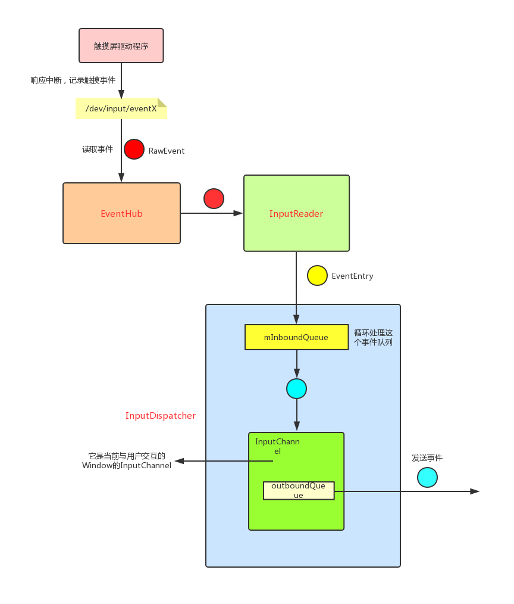

>本文会分析**从触摸事件的产生->Activity.disTouchEvent()**整个过程。通过本文对于**触摸事件的产生和系统处理过程**有一个简单了解即可。

## 触摸事件的产生 : 触摸事件与中断

学习过`Linux`驱动程序编写的同学可能知道`Linux`是以中断的方式处理用户的输入事件。触摸事件其实是一种特殊的输入事件。它的处理方式与输入事件相同，只不过触摸事件的提供的信息要稍微复杂一些。系统手机触摸事件的大致原理是:我们对硬件进行操作(触摸屏)会导致这个硬件产生对应的中断。该硬件的驱动程序会处理这个中断。不同的硬件驱动程序处理的方式不同，不过最终都是将数据处理后存放进对应的`/dev/input/eventX`文件中。即**硬件驱动程序完成了触摸事件的数据收集**

硬件驱动程序把触摸事件信息写入到`/dev/input/eventX`后，系统就会处理这些触摸事件:

## 系统对触摸事件的处理

系统对于触摸事件的处理主要是通过3个组件来完成的:

- EventHub : 它的作用是监听、读取`/dev/input`目录下产生的新事件，并封装成`RawEvent`结构体供`InputReader`使用。
- InputReader : 通过`EventHub`从`/dev/input`节点获取事件信息，转换成`EventEntry`事件加入到`InputDispatcher`的`mInboundQueue`队列中。
- InputDispatcher : 从`mInboundQueue`队列取出事件，转换成`DispatchEntry`事件加入到`Connection`的`outboundQueue`队列。再然后开始处理分发事件。

可以用下面这张图描述上面3个组件之间的逻辑:



图中比较难理解的地方可能是`InputChannel`,下面我们来专门分析一下它

## InputChannel

我们可以简单的把它理解为一个`socket`。一个`Window`会对应两个`InputChannel`，这两个`InputChannel`会相互通信。一个`InputChannel`会注册到`InputDispatcher`中, 称为`serverChannel`。一个会保留在应用程序进程的`Window`中,称为`clientChannel`。

下面来简要了解一下这两个`InputChannel`的创建过程，在[Android的UI显示原理之Surface的创建](Android的UI显示原理之Surface的创建.md)中知道，一个应用程序的`Window`在`WMS`中对应一个`WindowState`,其实在创建`WindowState`时就会创建这两个`InputChannel`:

### 服务端InputChannel的创建及注册

>WindowManagerService.java
```
 public int addWindow(Session session...) {
        ...
        WindowState win = new WindowState(this, session, client, token,
            attachedWindow, appOp[0], seq, attrs, viewVisibility, displayContent);
        ...
        final boolean openInputChannels = (outInputChannel != null && (attrs.inputFeatures & INPUT_FEATURE_NO_INPUT_CHANNEL) == 0);
        if  (openInputChannels) {
            win.openInputChannel(outInputChannel);
        }
    ...
}

void openInputChannel(InputChannel outInputChannel) { //这个 outInputChannel 其实是应用程序获取的inputchannel,它其实就是 inputChannels[1];
    InputChannel[] inputChannels = InputChannel.openInputChannelPair(makeInputChannelName()); //通过native创建了两个InputChannel,实际上是创建了两个socket
    mInputChannel = inputChannels[0]; // 这里将服务端的inputChannel保存在了WindowState中
    mClientChannel = inputChannels[1];
    ....
    mService.mInputManager.registerInputChannel(mInputChannel, mInputWindowHandle); 
}
```

`registerInputChannel(..);`实际上就是把`InputChannel`注册到了`InputDispatcher`中。上图中的`InputChannel`其实就是在创建一个`WindowState`时注册的。来看一下`InputDispatcher`中注册`InputChannel`都干了什么:

```
status_t InputDispatcher::registerInputChannel(const sp<InputChannel>& inputChannel,const sp<InputWindowHandle>& inputWindowHandle, bool monitor) {

    sp<Connection> connection = new Connection(inputChannel, inputWindowHandle, monitor); //利用 inputChannel 创建了一个 connection

    int fd = inputChannel->getFd();
    mConnectionsByFd.add(fd, connection);

    //把这个 inputChannel 的 fd添加到 Looper中
    mLooper->addFd(fd, 0, ALOOPER_EVENT_INPUT, handleReceiveCallback, this); 

    mLooper->wake();

    return OK;
}
```

即利用`InputChannel`创建了一个`Connection`，并且把这个`InputChannel`添加到`mLooper`中。那这里这个`mLooper`是什么呢？是UI线程的那个`Looper`吗？这部分我们后面再看，我们先来看一下客户端`InputChannel`的相关过程。

### 客户端InputChannel的触摸事件的监听

客户端(应用程序)`Window`是如何通过`InputChannel`来接收触摸事件的呢？上面`openInputChannel()`方法创建完`InputChannel`后会走到下面的代码:

>ViewRootImpl.java
```
if (mInputChannel != null) { //mInputChannel即为前面创建的 client inputchannel
    mInputEventReceiver = new WindowInputEventReceiver(mInputChannel, Looper.myLooper());
}
```

这里的new了一个`WindowInputEventReceiver`,看一下它的初始化过程:

```
public InputEventReceiver(InputChannel inputChannel, Looper looper) {
    ...
    mInputChannel = inputChannel;
    mMessageQueue = looper.getQueue();
    mReceiverPtr = nativeInit(new WeakReference<InputEventReceiver>(this),inputChannel, mMessageQueue);
    ...
}


static jlong nativeInit(JNIEnv* env, jclass clazz, jobject receiverWeak, jobject inputChannelObj, jobject messageQueueObj) {
    ...
    sp<NativeInputEventReceiver> receiver = new NativeInputEventReceiver(env,receiverWeak, inputChannel, messageQueue);
    status_t status = receiver->initialize();
    ...
}
```

即主要初始化了`NativeInputEventReceiver`,它的`initialize()`调用了`setFdEvents()`:

```
void NativeInputEventReceiver::setFdEvents(int events) {
    ...
    int fd = mInputConsumer.getChannel()->getFd(); // 这个InputChannel就是客户端的 InputChannel
    ...
    mMessageQueue->getLooper()->addFd(fd, 0, events, this, NULL);
}
```

这里将客户端的InputChannel保存的Fd加入到了Native Looper中。看一下`addFd`:

```
int Looper::addFd(int fd, int ident, int events, const sp<LooperCallback>& callback, void* data) {
    Request request;
    request.fd = fd;
    request.callback = callback;
    request.events = events;
    ...
    mRequests.add(fd, request);
}
```

这里就是利用`fd`来构造了一个`Request`。注意:这里的`callback`就是`NativeInputEventReceiver`。

OK,到这里我们就看完了`客户端的InputChannel`的初始化。继续来看一下上面提到的`native消息队列`。


## Android Native 消息循环

我们知道`Looper`从`MessageQueue`中不断获取消息并处理消息。其实在`MessageQueue`创建时还创建了一个`native`的消息队列。触摸事件就会放到这个消息队列中等待执行:

```
MessageQueue(boolean quitAllowed) {
    mQuitAllowed = quitAllowed;
    mPtr = nativeInit();
}

static jlong android_os_MessageQueue_nativeInit(JNIEnv* env, jclass clazz) {
    NativeMessageQueue* nativeMessageQueue = new NativeMessageQueue(); 
    ...
    nativeMessageQueue->incStrong(env);
    return reinterpret_cast<jlong>(nativeMessageQueue);
}

NativeMessageQueue::NativeMessageQueue() : mPollEnv(NULL), mPollObj(NULL), mExceptionObj(NULL) {
    mLooper = Looper::getForThread();  //其实就是主线程的Looper
    if (mLooper == NULL) {
        mLooper = new Looper(false); 
        Looper::setForThread(mLooper);
    }
}
```

即创建了一个`NativeMessageQueue`。`Looper`在循环读取`MessageQueue`中的消息时其实也读取了`NativeMessageQueue`中的消息:

>Looper.java
```
public static void loop() {
    final Looper me = myLooper();
    ...
    final MessageQueue queue = me.mQueue;
    ...
    for (;;) {
        Message msg = queue.next(); // might block
        ...
    }
}

Message next() {
    ....
    for (;;) {
        ...
        nativePollOnce(ptr, nextPollTimeoutMillis);
        ...
    }
}
```

即调用到了`nativePollOnce()`方法。在这个方法中会读取`Server InputChannel`发送的触摸事件。它最终调用到`Looper.pollInner()`

```
int Looper::pollInner(int timeoutMillis) {
    ...
    struct epoll_event eventItems[EPOLL_MAX_EVENTS];
    int eventCount = epoll_wait(mEpollFd, eventItems, EPOLL_MAX_EVENTS, timeoutMillis); //阻塞读取event， 并保存到eventItems
    ...

    for (int i = 0; i < eventCount; i++) { //依次处理每一个读取到的event
        int fd = eventItems[i].data.fd; 
        uint32_t epollEvents = eventItems[i].events;

        ... 
        ssize_t requestIndex = mRequests.indexOfKey(fd);
        ...
        pushResponse(events, mRequests.valueAt(requestIndex));
    }
}
```

即调用`pushResponse`来依次处理每一个`Event`。这里的`mRequests.valueAt(requestIndex)`就是前面`客户端的InputChannel`。`pushResponse`会回调到`NativeInputEventReceiver.handleEvent()`。

## InputDispatcher通过InputChannel发送触摸事件

上面我们知道了客户端会通过`Looper`不断处理`NativeMessageQueue`中的消息，那触摸事件的消息是如何发送到`NativeMessageQueue`的呢？其实触摸原始事件是通过建立好的`InputChannel.sendMessage()`来发送的:

```
status_t InputChannel::sendMessage(const InputMessage* msg) {
    size_t msgLength = msg->size();
    ssize_t nWrite;
    do {
        nWrite = ::send(mFd, msg, msgLength, MSG_DONTWAIT | MSG_NOSIGNAL);
    } while (nWrite == -1 && errno == EINTR);
	...
    return OK;
}
```

**即会直接调用send()函数向fd表示的socket中写入数据。**


上面`pollInner`会因为`InputChannel.sendMessage()`发送的数据而被唤醒。进而并通过fd找到注册好的request(`InputChannel`)，进而调用request中的NativeInputEventReceiver的handleEvent()方法，参数就是我们接收到的事件信息与数据。

上面整个过程可以用下图表示:


## WindowInputEventReceiver派发触摸事件

`WindowInputEventReceiver.dispatchInputEvent()`会调用到`WindowInputEventReceiver.onInputEvent()`:

>ViewRootImpl.java
```
    public void onInputEvent(InputEvent event, int displayId) {
        enqueueInputEvent(event, this, 0, true);
    }
```


 前面已经了解了`InputDispatcher`会把触摸事件发送到`Window`的`Client InputChannel`


**本文内容参考自以下文章**:

[Android 触摸事件分发机制（一）从内核到应用 一切的开始](https://www.viseator.com/2017/09/14/android_view_event_1/)

[Android 触摸事件分发机制（二）原始事件消息传递与分发的开始](https://www.viseator.com/2017/10/07/android_view_event_2/)

[Input系统—事件处理全过程](http://gityuan.com/2016/12/31/input-ipc/)


