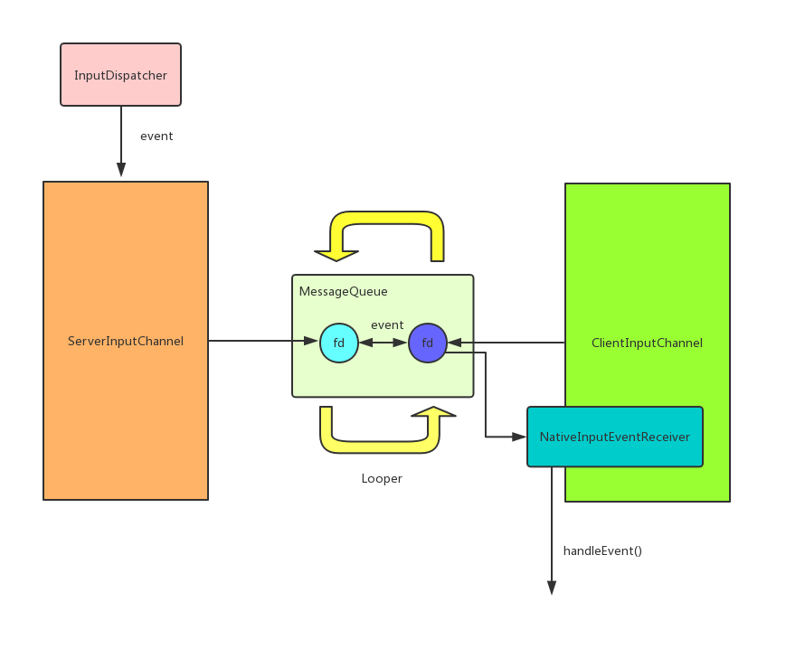

>本文会分析**从触摸事件的产生->Activity.disTouchEvent()**整个过程。通过本文对于**触摸事件的产生和系统处理过程**有一个简单了解即可。

## 触摸事件的产生 : 触摸事件与中断

学习过`Linux`驱动程序编写的同学可能知道`Linux`是以中断的方式处理用户的输入事件。触摸事件其实是一种特殊的输入事件。它的处理方式与输入事件相同，只不过触摸事件的提供的信息要稍微复杂一些。

触摸事件产生的大致原理是:用户对硬件进行操作(触摸屏)会导致这个硬件产生对应的中断。该硬件的驱动程序会处理这个中断。不同的硬件驱动程序处理的方式不同，不过最终都是将数据处理后存放进对应的`/dev/input/eventX`文件中。即**硬件驱动程序完成了触摸事件的数据收集**

那`/dev/input/eventX`中的触摸事件是如何派发到`Activity`的呢？其实整个过程可以分为两个部分:一个是`native(C++)层`的处理、一个是`java层`的处理。我们先来看一下`native层`是如何处理的。

## 系统对触摸事件的处理

在`native层`主要是通过下面3个组件来对触摸事件进行处理的，这3个组件都运行在系统服务中:

- EventHub : 它的作用是监听、读取`/dev/input`目录下产生的新事件，并封装成`RawEvent`结构体供`InputReader`使用。
- InputReader : 通过`EventHub`从`/dev/input`节点获取事件信息，转换成`EventEntry`事件加入到`InputDispatcher`的`mInboundQueue`队列中。
- InputDispatcher : 从`mInboundQueue`队列取出事件，转换成`DispatchEntry`事件加入到`Connection`的`outboundQueue`队列。然后使用`InputChannel`分发事件到`java层`。

可以用下面这张图描述上面3个组件之间的逻辑:


## InputChannel

我们可以简单的把它理解为一个`socket`, 即可以用来接收数据或者发送数据。一个`Window`会对应两个`InputChannel`，这两个`InputChannel`会相互通信。一个`InputChannel`会注册到`InputDispatcher`中, 称为`serverChannel`。另一个会保留在应用程序进程的`Window`中,称为`clientChannel`。

下面来简要了解一下这两个`InputChannel`的创建过程,在[Android的UI显示原理之Surface的创建](Android的UI显示原理之Surface的创建.md)中知道，一个应用程序的`Window`在`WMS`中会对应一个`WindowState`,其实在创建`WindowState`时就会创建这两个`InputChannel`:

### 服务端InputChannel的创建及注册

>WindowManagerService.java
```
 public int addWindow(Session session...) {
        ...
        WindowState win = new WindowState(this, session, client, token,
            attachedWindow, appOp[0], seq, attrs, viewVisibility, displayContent);
        ...
        final boolean openInputChannels = (outInputChannel != null && (attrs.inputFeatures & INPUT_FEATURE_NO_INPUT_CHANNEL) == 0);
        if  (openInputChannels) {
            win.openInputChannel(outInputChannel);
        }
    ...
}

void openInputChannel(InputChannel outInputChannel) { //这个 outInputChannel 其实是应用程序获取的inputchannel,它其实就是 inputChannels[1];
    InputChannel[] inputChannels = InputChannel.openInputChannelPair(makeInputChannelName()); //通过native创建了两个InputChannel,实际上是创建了两个socket
    mInputChannel = inputChannels[0]; // 这里将服务端的inputChannel保存在了WindowState中
    mClientChannel = inputChannels[1];
    ....
    mService.mInputManager.registerInputChannel(mInputChannel, mInputWindowHandle); 
}
```

`registerInputChannel(..);`实际上就是把`InputChannel`注册到了`InputDispatcher`中。上图中的`InputChannel`其实就是在创建一个`WindowState`时注册的。来看一下`InputDispatcher`中注册`InputChannel`都干了什么:

```
status_t InputDispatcher::registerInputChannel(const sp<InputChannel>& inputChannel,const sp<InputWindowHandle>& inputWindowHandle, bool monitor) {

    sp<Connection> connection = new Connection(inputChannel, inputWindowHandle, monitor); //利用 inputChannel 创建了一个 connection,简单的理解为socket的链接。

    int fd = inputChannel->getFd();
    mConnectionsByFd.add(fd, connection);

    //把这个 inputChannel 的 fd添加到 Looper中
    mLooper->addFd(fd, 0, ALOOPER_EVENT_INPUT, handleReceiveCallback, this); 

    mLooper->wake();

    return OK;
}
```

即利用`InputChannel`创建了一个`Connection`，`InputDispatcher`会通过这个`Connection`来向`InputChannel`发射数据。并且把这个`InputChannel`添加到`mLooper`中。

那这里这个`mLooper`是什么呢？是UI线程的那个`Looper`吗？这部分我们后面再看，我们先来看一下客户端`InputChannel`的相关过程。

### 客户端InputChannel的触摸事件的监听

客户端(应用程序)`Window`是如何通过`InputChannel`来接收触摸事件的呢？上面`WindowState.openInputChannel()`方法创建完`InputChannel`后会走到下面的代码:

>ViewRootImpl.java
```
if (mInputChannel != null) { // mInputChannel 即为前面创建的 client inputchannel
    mInputEventReceiver = new WindowInputEventReceiver(mInputChannel, Looper.myLooper());
}
```

这里的new了一个`WindowInputEventReceiver`,看一下它的初始化过程:

```
public InputEventReceiver(InputChannel inputChannel, Looper looper) {
    ...
    mInputChannel = inputChannel;
    mMessageQueue = looper.getQueue();
    mReceiverPtr = nativeInit(new WeakReference<InputEventReceiver>(this),inputChannel, mMessageQueue);
    ...
}

static jlong nativeInit(JNIEnv* env, jclass clazz, jobject receiverWeak, jobject inputChannelObj, jobject messageQueueObj) {
    ...
    sp<NativeInputEventReceiver> receiver = new NativeInputEventReceiver(env,receiverWeak, inputChannel, messageQueue);
    status_t status = receiver->initialize();
    ...
}
```

即主要初始化了`NativeInputEventReceiver` ,它的`initialize()`调用了`setFdEvents()`:

```
void NativeInputEventReceiver::setFdEvents(int events) {
    ...
    int fd = mInputConsumer.getChannel()->getFd(); // 这个InputChannel就是客户端的 InputChannel 的 Connection
    ...
    mMessageQueue->getLooper()->addFd(fd, 0, events, this, NULL);
}
```

这里将客户端的`InputChannel的 Connection Fd`加入到了`Native Looper（下面会分析它）`中。看一下`addFd`:

```
int Looper::addFd(int fd, int ident, int events, const sp<LooperCallback>& callback, void* data) {
    Request request;
    request.fd = fd;
    request.callback = callback;
    request.events = events;
    ...
    mRequests.add(fd, request);
}
```

这里就是利用`fd`来构造了一个`Request`。 **注意 :这里的`callback`就是`NativeInputEventReceiver`**。

OK,到这里我们就看完了`客户端的InputChannel`的初始化。继续来看一下上面提到的`native消息队列`与`Native Looper`。


## Android Native 消息循环

我们知道`Looper`从`MessageQueue`中不断获取消息并处理消息。其实在`MessageQueue`创建时还创建了一个`native`的消息队列。`InputDispatcher`的触摸事件就会放到这个消息队列中等待执行。先来看一下这个消息队列的创建:

```
MessageQueue(boolean quitAllowed) {
    mQuitAllowed = quitAllowed;
    mPtr = nativeInit();
}

static jlong android_os_MessageQueue_nativeInit(JNIEnv* env, jclass clazz) {
    NativeMessageQueue* nativeMessageQueue = new NativeMessageQueue(); 
    ...
    nativeMessageQueue->incStrong(env);
    return reinterpret_cast<jlong>(nativeMessageQueue);
}

NativeMessageQueue::NativeMessageQueue() : mPollEnv(NULL), mPollObj(NULL), mExceptionObj(NULL) {
    mLooper = Looper::getForThread();  // 其实就是主线程的Looper
    if (mLooper == NULL) {
        mLooper = new Looper(false); 
        Looper::setForThread(mLooper);
    }
}
```

即创建了一个`NativeMessageQueue`。`Looper`在循环读取`MessageQueue`中的消息的同时其实也读取了`NativeMessageQueue`中的消息:

>Looper.java
```
public static void loop() {
    final Looper me = myLooper();
    ...
    final MessageQueue queue = me.mQueue;
    ...
    for (;;) {
        Message msg = queue.next(); // might block
        ...
    }
}

Message next() {
    ....
    for (;;) {
        ...
        nativePollOnce(ptr, nextPollTimeoutMillis);
        ...
    }
}
```

即调用到了`nativePollOnce()`方法。在这个方法中会读取`Server InputChannel`发送的触摸事件(怎么发送的后面会讲到)。这个方法最终调用到`Looper.pollInner()`

```
int Looper::pollInner(int timeoutMillis) {
    ...
    struct epoll_event eventItems[EPOLL_MAX_EVENTS];
    int eventCount = epoll_wait(mEpollFd, eventItems, EPOLL_MAX_EVENTS, timeoutMillis);  // 阻塞读取event， 并保存到eventItems
    ...

    for (int i = 0; i < eventCount; i++) { //依次处理每一个读取到的event
        int fd = eventItems[i].data.fd; 
        uint32_t epollEvents = eventItems[i].events;

        ... 
        ssize_t requestIndex = mRequests.indexOfKey(fd);
        ...
        pushResponse(events, mRequests.valueAt(requestIndex));
    }
}
```

`pollInner`会调用`pushResponse`来依次处理每一个`Event`。这里的`mRequests.valueAt(requestIndex)`就是前面`客户端的InputChannel`注册时的一些信息。`pushResponse`会回调到`NativeInputEventReceiver.handleEvent()`。

## InputDispatcher通过服务端InputChannel发送触摸事件

上面我们知道了客户端会通过`Looper`不断处理`NativeMessageQueue`中的消息，那触摸事件的消息是如何发送到`NativeMessageQueue`的呢？其实触摸原始事件是通过建立好的`InputChannel.sendMessage()`来发送的:

```
status_t InputChannel::sendMessage(const InputMessage* msg) {
    size_t msgLength = msg->size();
    ssize_t nWrite;
    do {
        nWrite = ::send(mFd, msg, msgLength, MSG_DONTWAIT | MSG_NOSIGNAL); //向socket中写入数据
    } while (nWrite == -1 && errno == EINTR);
	...
    return OK;
}
```

这个方法是`InputDispatcher`调用的。上面`pollInner`会因为`InputChannel.sendMessage()`发送的数据而被唤醒。进而调用request中的`NativeInputEventReceiver`的`handleEvent()`方法，参数就是我们接收到的事件信息与数据。

上面整个过程可以用下图表示:




**其实上面整个过程是利用`Socket`完成了数据的跨进程通信。`Socket`的`阻塞/通知机制`在这里是十分高效的。`NativeMessageQueue/Looper`的主要作用是监听`InputDispatcher`给`服务端InputChannel`发送的触摸数据。然后把这些数据转通过`NativeInputEventReceiver.handleEvent()`回调到客户端。**


## NativeInputEventReceiver.handleEvent()

>android_view_NativeInputEventReceiver.cpp
```
int NativeInputEventReceiver::handleEvent(int receiveFd, int events, void* data) {
 	...
    if (events & ALOOPER_EVENT_INPUT) {
        JNIEnv* env = AndroidRuntime::getJNIEnv();
        status_t status = consumeEvents(env, false /*consumeBatches*/, -1, NULL);
        mMessageQueue->raiseAndClearException(env, "handleReceiveCallback");
        return status == OK || status == NO_MEMORY ? 1 : 0;
    }
	...
    return 1;
}
```

即主要通过`consumeEvents()`来处理这个事件:

```

status_t NativeInputEventReceiver::consumeEvents(JNIEnv* env,...) 
{

    ...
    InputEvent* inputEvent;
    status_t status = mInputConsumer.consume(&mInputEventFactory,consumeBatches, frameTime, &seq, &inputEvent);

    jobject inputEventObj;
    ...
    switch (inputEvent->getType()) {
        ...
        case AINPUT_EVENT_TYPE_MOTION: {
            MotionEvent* motionEvent = static_cast<MotionEvent*>(inputEvent); // MotionEvent的产生
            inputEventObj = android_view_MotionEvent_obtainAsCopy(env, motionEvent);
            break;
        }
    }

    if (inputEventObj) {
        env->CallVoidMethod(receiverObj.get(),
                gInputEventReceiverClassInfo.dispatchInputEvent, seq, inputEventObj,
                displayId);
    }
}

}
```

这个方法的主要处理是:

1. `mInputConsumer.consume()`会调用到`mChannel->receiveMessage(&mMsg);`,`mChannel`其实就是`客户端InputChannel`，它通过`socket`接收`服务端InputChannel`的消息。这个消息其实就是触摸事件。
2. 产生`MotionEvent`对象`inputEventObj`,这个对象可以通过`jni`调用
3. 调用`jni`方法`gInputEventReceiverClassInfo.dispatchInputEvent()`

其实`gInputEventReceiverClassInfo.dispatchInputEvent()`最终调用到java层`InputEventReceiver.dispatchInputEvent()`, 这个方法是java层分发触摸事件的开始。

## InputEventReceiver的dispatchInputEvent()

>InputEventReceiver.java
```
private void dispatchInputEvent(int seq, InputEvent event) {
    mSeqMap.put(event.getSequenceNumber(), seq);
    onInputEvent(event);
}
```

`InputEventReceiver`是一个抽象类，它在java层的实现是`ViewRootImpl.WindowInputEventReceiver`,它复写了`onInputEvent()`:

```
@Override
public void onInputEvent(InputEvent event) {
    enqueueInputEvent(event, this, 0, true);
}
```

`enqueueInputEvent()`最终会调用`deliverInputEvent()`处理事件:

```
private void deliverInputEvent(QueuedInputEvent q) {
    ...
    InputStage stage;
    if (q.shouldSendToSynthesizer()) {
        stage = mSyntheticInputStage;
    } else {
        stage = q.shouldSkipIme() ? mFirstPostImeInputStage : mFirstInputStage;
    }

    if (stage != null) {
        stage.deliver(q);
    } else {
        finishInputEvent(q);
    }
}
```

`InputStage`可以理解为处理事件过程中的一步，多个`InputStage`可以组成一个处理流程，他们的组织形式类似于一个链表。看一下它的类组成应该就能猜到个大概:

```
abstract class InputStage {
    private final InputStage mNext;
    
    ...
    protected void onDeliverToNext(QueuedInputEvent q) {
        if (mNext != null) {
            mNext.deliver(q);
        } else {
            finishInputEvent(q);
        }
    }
    ...
    protected int onProcess(QueuedInputEvent q) {
        return FORWARD;
    }
}
```

事件`QueuedInputEvent`最终会由`ViewPostImeInputStage`处理,它的`onProcess()`会调用到`processPointerEvent`:

```
private int processPointerEvent(QueuedInputEvent q) {
    final MotionEvent event = (MotionEvent)q.mEvent;

    final View eventTarget = (event.isFromSource(InputDevice.SOURCE_MOUSE) && mCapturingView != null) ? mCapturingView : mView;

    boolean handled = eventTarget.dispatchPointerEvent(event);
	...
}
```

这里的`eventTarget(View)`其实就是`DecorView`,即回调到了`DecorView.dispatchPointerEvent()`:

>View.java
```
public final boolean dispatchPointerEvent(MotionEvent event) {
    if (event.isTouchEvent()) {
        return dispatchTouchEvent(event);
    } else {
        return dispatchGenericMotionEvent(event);
    }
}
```

>DecorView.java
```
public boolean dispatchTouchEvent(MotionEvent ev) {
    final Window.Callback cb = mWindow.getCallback();
    return cb != null && !mWindow.isDestroyed() && mFeatureId < 0 ? cb.dispatchTouchEvent(ev) : super.dispatchTouchEvent(ev);
}
```

这里的`Window.Callback`其实就是`Activity`:

```
public class Activity extends ContextThemeWrapper implements Window.Callback,...{
```

即回调到`Activity.dispatchTouchEvent()`


**本文内容参考自以下文章,感谢这些作者的细致分析**:

[Android 触摸事件分发机制（一）从内核到应用 一切的开始](https://www.viseator.com/2017/09/14/android_view_event_1/)

[Android 触摸事件分发机制（二）原始事件消息传递与分发的开始](https://www.viseator.com/2017/10/07/android_view_event_2/)

[Input系统—事件处理全过程](http://gityuan.com/2016/12/31/input-ipc/)


