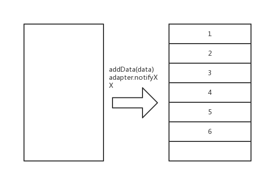

>前面分析了[RecyclerView的基本结构](https://github.com/SusionSuc/AdvancedAndroid/blob/master/AndroidFramework%E6%BA%90%E7%A0%81%E5%88%86%E6%9E%90/recyclerview/RecyclerView%E7%9A%84%E5%9F%BA%E6%9C%AC%E7%BB%84%E6%88%90%E7%BB%93%E6%9E%84.md)
>本文继续来看一下`RecyclerView`是如何`完成UI的刷新`以及`在滑动时子View是如何被添加的`。

本文会从源码分析两件事 :

1. `adapter.notifyXXX()`时RecyclerView的UI刷新的逻辑,即`子View`是如何添加到`RecyclerView`中的。
2. 在数据存在的情况下，滑动`RecyclerView`时`子View`是如何添加到`RecyclerView`的。

本文不会涉及到`RecyclerView`的动画，动画的实现会专门在一篇文章中分析。

## `adapter.notifyDataSetChanged()`引起的刷新

我们假设`RecyclerView`在初始状态是没有数据的，然后往数据源中加入数据后，调用`adapter.notifyDataSetChanged()`来引起`RecyclerView`的刷新:
```
data.addAll(datas)
adapter.notifyDataSetChanged()
```
用图描述就是下面两个状态的转换:



接下来就来分析这个变化的源码，在上一篇文章中已经解释过，`adapter.notifyDataSetChanged()`时，会引起`RecyclerView`重新布局(`requestLayout`)，`RecyclerView`的`onMeasure`就不看了，核心逻辑不在这里。因此从`onLayout()`方法开始看:

### RecyclerView.onLayout

这个方法直接调用了`dispatchLayout`:
```
void dispatchLayout() {
    ...
    if (mState.mLayoutStep == State.STEP_START) {
        dispatchLayoutStep1();
        dispatchLayoutStep2();
    } else if (数据变化 || 布局变化) {
        dispatchLayoutStep2();
    }
    dispatchLayoutStep3();
}
```

上面我裁剪掉了一些代码，可以看到整个布局过程总共分为3步, 下面是这3步对应的方法:

```
STEP_START ->  dispatchLayoutStep1()
STEP_LAYOUT -> dispatchLayoutStep2()
STEP_ANIMATIONS -> dispatchLayoutStep2(), dispatchLayoutStep3()
```

第一步`STEP_START`主要是来存储当前`子View`的状态并确定是否要执行动画。这一步就不细看了。 而第3步`STEP_ANIMATIONS`是来执行动画的，本文也不分析了，本文主要来看一下第二步`STEP_LAYOUT`,即`dispatchLayoutStep2()`:

#### dispatchLayoutStep2()

先来看一下这个方法的大致执行逻辑:

```
private void dispatchLayoutStep2() {  
    startInterceptRequestLayout(); //方法执行期间不能重入
    ...
    //设置好初始状态
    mState.mItemCount = mAdapter.getItemCount();
    mState.mDeletedInvisibleItemCountSincePreviousLayout = 0;
    mState.mInPreLayout = false;

    mLayout.onLayoutChildren(mRecycler, mState); //调用布局管理器去布局

    mState.mStructureChanged = false;
    mPendingSavedState = null;
    ...
    mState.mLayoutStep = State.STEP_ANIMATIONS; //接下来执行布局的第三步

    stopInterceptRequestLayout(false);
}
```

这里有一个`mState`，它是一个`RecyclerView.State`对象。顾名思义它是用来保存`RecyclerView`状态的一个对象，主要是在`LayoutManager、Adapter等`组件之间共享状态的。可以看到这个方法将布局的工作交给了`mLayout`。这里它的实例是`LinearLayoutManager`，因此接下来看一下`LinearLayoutManager.onLayoutChildren()`:

### LinearLayoutManager.onLayoutChildren()

这个方法也挺长的，就不展示具体源码了。不过布局逻辑还是很简单的:

1. 确定锚点`(Anchor)View`, 设置好`AnchorInfo`
2. 确定有多少布局空间可用``
3. 根据当前设置的`LinearLayoutManager`的方向(是否是reverse),开始摆放子View

接下来就从源码来看这三步。

#### 确定锚点View

锚点View大部分是通过`updateAnchorFromChildren`方法确定的,这个方法主要是获取一个View，把它的信息设置到`AnchorInfo`中 :

```
mAnchorInfo.mLayoutFromEnd = mShouldReverseLayout   // 即和你是否在 manifest中设置了布局 rtl 有关

private boolean updateAnchorFromChildren(RecyclerView.Recycler recycler, RecyclerView.State state, AnchorInfo anchorInfo) {
    ...
    View referenceChild = anchorInfo.mLayoutFromEnd
            ? findReferenceChildClosestToEnd(recycler, state) //如果是从end(尾部)位置开始布局，那就找最接近end的那个位置的View作为锚点View
            : findReferenceChildClosestToStart(recycler, state); //如果是从start(头部)位置开始布局，那就找最接近start的那个位置的View作为锚点View

    if (referenceChild != null) {
        anchorInfo.assignFromView(referenceChild, getPosition(referenceChild)); 
        ...
        return true;
    }
    return false;
}
```

即， 如果是`start to end`, 那么就找最接近start(RecyclerView头部)的View作为布局的锚点View。如果是`end to start (rtl)`, 就找最接近end的View作为布局的锚点。

`AnchorInfo`最重要的两个属性时`mCoordinate`和`mPosition`，找到锚点View后就会设置这两个属性，即` anchorInfo.assignFromView()`方法:
```
public void assignFromView(View child, int position) {
    if (mLayoutFromEnd) {
        mCoordinate = mOrientationHelper.getDecoratedEnd(child) + mOrientationHelper.getTotalSpaceChange();
    } else {
        mCoordinate = mOrientationHelper.getDecoratedStart(child);  
    }
    mPosition = position;
}
```

`mCoordinate`其实就是`锚点View`的`Y(X)`坐标去掉`RecyclerView`的padding。`mPosition`其实就是`锚点View`的位置。

#### 确定有多少布局空间可用并填充子View

当确定好`AnchorInfo`后，需要根据`AnchorInfo`来确定`RecyclerView`当前可用于布局的空间,然后来填充子View。以布局方向为`start to end (正常方向)`为例, 这里的`锚点View`其实是`RecyclerView`最顶部的View:

```
    // fill towards end
    updateLayoutStateToFillEnd(mAnchorInfo); //确定布局可用空间
    ...
    fill(recycler, mLayoutState, state, false); //填充view
    endOffset = mLayoutState.mOffset; 

    // fill towards start  
    updateLayoutStateToFillStart(mAnchorInfo);
    ...
    fill(recycler, mLayoutState, state, false);
```

来看一下可用布局空间是如何确定的`updateLayoutStateToFillEnd()`:

```
updateLayoutStateToFillEnd(anchorInfo.mPosition, anchorInfo.mCoordinate);

void updateLayoutStateToFillEnd(int itemPosition, int offset) {
    mLayoutState.mAvailable = mOrientationHelper.getEndAfterPadding() - offset;
    ...
    mLayoutState.mCurrentPosition = itemPosition;
    mLayoutState.mLayoutDirection = LayoutState.LAYOUT_END;
    mLayoutState.mOffset = offset;
    mLayoutState.mScrollingOffset = LayoutState.SCROLLING_OFFSET_NaN;
}
```

`mLayoutState`是`LinearLayoutManager`用来保存布局状态的一个对象。`mLayoutState.mAvailable`就是用来表示`有多少空间可用来布局`。`mOrientationHelper.getEndAfterPadding() - offset`其实大致可以理解为`RecyclerView`的高度。*所以这里可用布局空间就是RecyclerView的高度*

接下来继续看`LinearLayoutManager.fill()`方法，这个方法是布局的核心方法，是用来向`RecyclerView`中添加子View的方法:

```
int fill(RecyclerView.Recycler recycler, LayoutState layoutState, RecyclerView.State state, boolean stopOnFocusable) {
    final int start = layoutState.mAvailable;  //前面分析，其实就是RecyclerView的高度
    ...
    int remainingSpace = layoutState.mAvailable + layoutState.mExtra;  //extra 是你设置的额外布局的范围, 这个一般不推荐设置
    LayoutChunkResult layoutChunkResult = mLayoutChunkResult;
    while ((layoutState.mInfinite || remainingSpace > 0) && layoutState.hasMore(state)) {
        layoutChunkResult.resetInternal();
        ...
        layoutChunk(recycler, state, layoutState, layoutChunkResult);   //布局的核心方法
        ...
        layoutState.mOffset += layoutChunkResult.mConsumed * layoutState.mLayoutDirection; // 一次 layoutChunk 消耗了多少空间
        ...
        子View的回收工作
    }
    ...
}
```

这里我们不看`子View回收逻辑`，会在单独的一篇文章中讲, 即这个方法的核心是调用`layoutChunk()`来不断消耗`layoutState.mAvailable`,直到消耗完毕。继续看一下`layoutChunk()方法`, 这个方法的主要逻辑是:

1. 从`Recycler`中获取一个`View`
2. 添加到`RecyclerView`中
3. 调整`View`的布局参数，调用其`onMeasure、onLayout`方法。

```
void layoutChunk(RecyclerView.Recycler recycler, RecyclerView.State state,LayoutState layoutState, LayoutChunkResult result) {
        View view = layoutState.next(recycler);  //这个方法会向 recycler view 要一个holder 
        ...
        if (mShouldReverseLayout == (layoutState.mLayoutDirection == LayoutState.LAYOUT_START)) {
            addView(view);   
        } else {
            addView(view, 0);
        }
        measureChildWithMargins(view, 0, 0);    //调用view的measure
        
        ...measure后确定布局参数

        layoutDecoratedWithMargins(view, left, top, right, bottom); //调用view的layout
        ...
    }
```

到这里其实就完成了上面的`fill towards end`:
```
    updateLayoutStateToFillEnd(mAnchorInfo); //确定布局可用空间
    ...
    fill(recycler, mLayoutState, state, false); //填充view
```

其实还有`fill towards start`:

```
    updateLayoutStateToFillStart(mAnchorInfo);
    ...
    fill(recycler, mLayoutState, state, false);
```

`fill towards end`我们前面已经看了，其实就是从头部开始，把子View添加到`RecyclerView`的尾部，那`fill towards start`是什么含义呢？


