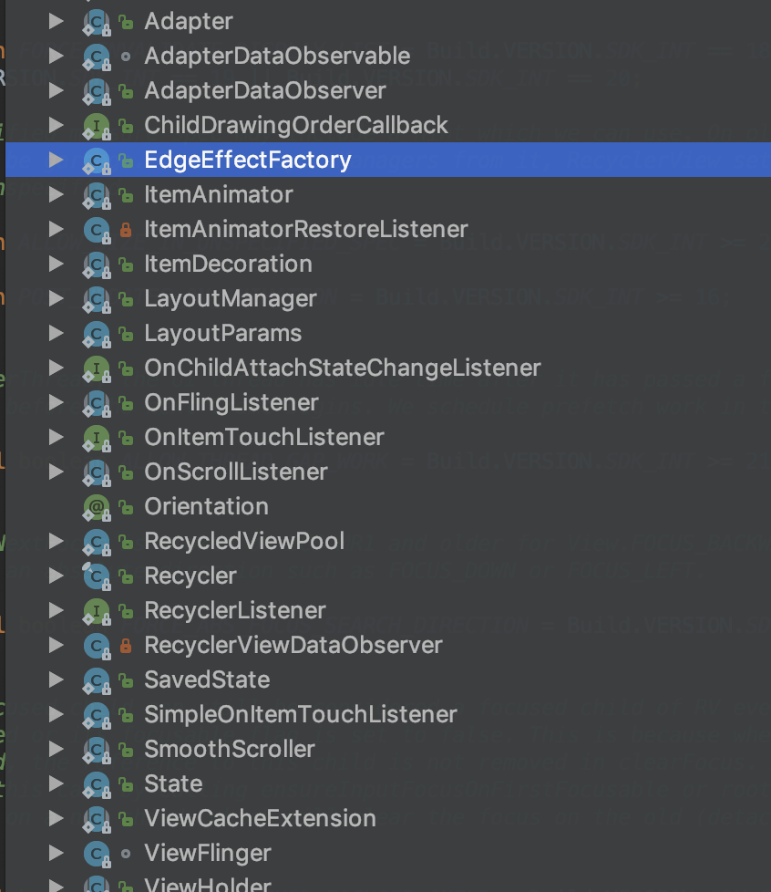
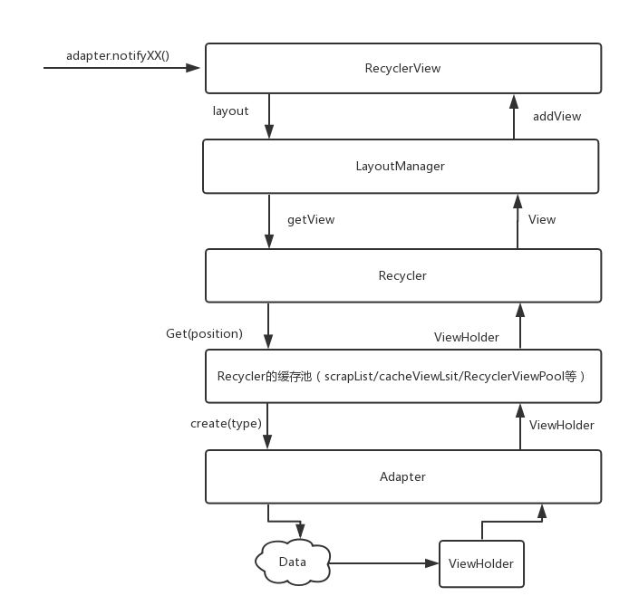
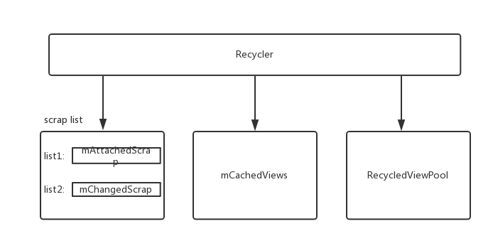

>`RecyclerView`作为Android开发中最常用的View之一。很多`App`的feed流都是使用`RecyclerView`来实现的。加深对于`RecyclerView`的掌握对于开发效率和开发质量都有很重要的意义。接下来我打算从源码
>角度剖析`RecyclerView`的实现，加深对于`RecycledView`额的了解。`RecyclerView`的源码实现还是很庞大的。本文就先来看一下`RecyclerView`的整体设计，了解其核心实现类的作用。

下面这张图是我截取的`RecyclerView的Structure:`



本文着重看: `Adapter`、`LayoutManager`、`ViewHolder`、`Recycler`、`RecyclerPool`

先用一张图大致描述他们之间的关系,这张图是`adapter.notifyXX()`时`RecyclerView`的执行逻辑涉及到的一些类:



## ViewHolder

对于`Adapter`来说，一个`ViewHolder`就对应一个`data`。它也是`Recycler缓存池`的基本单元。

```
class ViewHolder {
    public final View itemView;
    int mPosition = NO_POSITION;
    int mItemViewType = INVALID_TYPE;
    int mFlags;
    ...
}
```
上面我列出了`ViewHolder`最重要的4个属性:

- itemView : 会被当做`child view`来`add`到`RecyclerView`中。
- mPosition : 标记当前的`ViewHolder`在`Adapter`中所处的位置。
- mItemViewType : 这个`ViewHolder`的`Type`，在`ViewHolder`保存到`RecyclerPool`时，主要靠这个类型来对`ViewHolder`做复用。
- mFlags : 标记`ViewHolder`的状态，比如 `FLAG_BOUND(显示在屏幕上)`、`FLAG_INVALID(无效，想要使用必须rebound)`、`FLAG_REMOVED(已被移除)`等。

## Adapter

它的工作是把`data`和`View`绑定，即上面说的一个`data`对应一个`ViewHolder`。比如下面这个Adapter:

```
class SimpleStringAdapter(val dataSource: List<String>, val context: Context) : RecyclerView.Adapter<RecyclerView.ViewHolder>() {

    override fun onBindViewHolder(holder: RecyclerView.ViewHolder, position: Int) {
        if (holder.itemView is ViewHolderRenderProtocol) {
            (holder.itemView as ViewHolderRenderProtocol).render(dataSource[position], position)
        }
    }

    override fun onCreateViewHolder(parent: ViewGroup, viewType: Int) = SimpleVH(SimpleStringView(context))

    override fun getItemCount() = dataSource.size

    override fun getItemViewType(position: Int) = 1
}
```
即: 

1. 它引用着一个数据源集合`dataSource`
2. `getItemCount()`用来告诉`RecyclerView`展示的总条目
3. 它并不是直接映射`data -> ViewHolder`， 而是 `data position -> data type -> viewholder`。 所以对于`ViewHolder`来说，它知道的只是它的`view type`

## LayoutManager

它是`RecyclerView`的布局管理者，`RecyclerView`在`onLayout`时，会利用它来`layoutChildren`,它决定了`RecyclerView`中的子View如何摆放。但不止如此, 它做的工作还有:

1. 测量子View
2. 对子View进行布局
3. 对子View进行回收
4. 子View动画的调度
5. 负责`RecyclerView`滚动的实现
6. ...

## Recycler

对于`LayoutManager`来说，它是`ViewHolder`的提供者。对于`RecyclerView`来说，它是`ViewHolder`的管理者，是`RecyclerView`最核心的实现。下面这张图大致描述了它的组成:



### scrap list

```
final ArrayList<ViewHolder> mAttachedScrap = new ArrayList<>();
ArrayList<ViewHolder> mChangedScrap = null;
```

- `View Scrap状态`
相信你在许多`RecyclerView`的`crash log`中都看到过这个单词。它是指`View`在`RecyclerView`布局期间进入分离状态的子视图。即它已经被`deatach`(并不是调用了onDetatchToWindow方法, 是被标记为`FLAG_TMP_DETACHED`状态)了。这种`View`是可以被立即复用的。它在复用时，如果数据没有更新，是不需要调用`onBindViewHolder`方法的。如果数据更新了，那么需要重新调用`onBindViewHolder`。

`mAttachedScrap`和`mChangedScrap`中的View复用主要作用在`adapter.notifyXXX`时。这时候就会产生很多`scrap`状态的`view`。 也可以把它理解为一个`ViewHolder`的缓存。不过在从这里获取`ViewHolder`时完全是根据`ViewHolder`的`position`而不是`item type`。


### mCacheViews

可以把它理解为`RecyclerView`的一级缓存。它的默认大小是2。只能减少不能增加。从中可以根据`item type`来获取`ViewHolder`

### RecycledViewPool

它是一个可以被复用的`ViewHolder`缓存池。即可以给多个`RecycledView`来设置统一个`RecycledViewPool`。这个对于多tab的应用可能会有很显著的效果。它内部利用一个`ScrapData`来保存`ViewHolder`:

```
class ScrapData {
    final ArrayList<ViewHolder> mScrapHeap = new ArrayList<>();
    int mMaxScrap = DEFAULT_MAX_SCRAP;   //最多缓存5个
    long mCreateRunningAverageNs = 0;
    long mBindRunningAverageNs = 0;
}

SparseArray<ScrapData> mScrap = new SparseArray<>();
```

一个`ScrapData`对应一种`type`的`ViewHolder`。看一下它的获取`ViewHolder`和保存`ViewHolder`的方法:

```
//存
public void putRecycledView(ViewHolder scrap) {
    final int viewType = scrap.getItemViewType();
    final ArrayList<ViewHolder> scrapHeap = getScrapDataForType(viewType).mScrapHeap;
    if (mScrap.get(viewType).mMaxScrap <= scrapHeap.size())  return; //到最大极限就不能放了
    scrap.resetInternal();  //放到里面，这个view就相当于和原来的信息完全隔离了，只记得他的type，清除其相关状态
    scrapHeap.add(scrap);
}

//取
private ScrapData getScrapDataForType(int viewType) {
    ScrapData scrapData = mScrap.get(viewType);
    if (scrapData == null) {
        scrapData = new ScrapData();
        mScrap.put(viewType, scrapData);
    }
    return scrapData;
}
```

以上所述，是`RecycledView`最核心的组成部分。接下来会继续分析`RecycledView`是如何利用它们来工作起来的。

>欢迎关注我的[Android进阶计划](https://github.com/SusionSuc/AdvancedAndroid)。看更多干货


