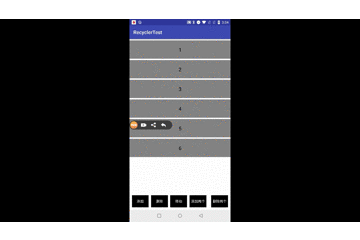
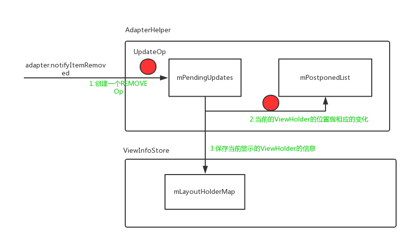
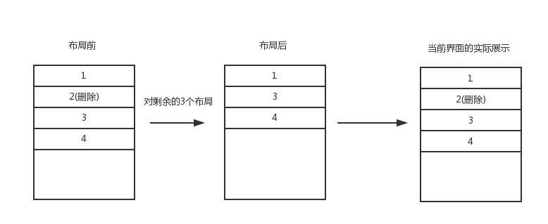

【草稿】

>本文是`RecyclerView深入分析系列第四篇文章`,内容主要是基于前三篇文章来叙述的，因此在阅读之前推荐看一下前3篇文章:

[RecylcerView的基本设计结构](RecylcerView的基本设计结构.md)

[RecyclerView的刷新机制](RecyclerView的刷新机制.md)

[RecyclerView的复用机制](RecyclerView的复用机制.md)

本文主要分析`RecyclerView删除动画`的实现原理(实现原理并不复杂)，不同类型动画的大体实现流程其实都是差不多的，所以对于添加、移动这种动画就不再做分析。因此主要目标是**理解清楚的是`RecyclerView`的动画源码运转流程**，此外顺带补充`RecyclerView的刷新机制`和`RecyclerView的复用机制`遗漏的一些点，使整个`RecyclerView`的分析更加完整。

# 删除动画

可以通过下面这两个方法触发`RecyclerView`的删除动画:

```
    //一个item的删除动画
    dataSource.removeAt(1)
    recyclerView.adapter.notifyItemRemoved(1)

    //多个item的删除动画
    dataSource.removeAt(1)
    dataSource.removeAt(1)
    recyclerView.adapter.notifyItemRangeRemoved(1,2)
```

下面这个图是设置10倍动画时长时删除动画的执行效果,可以先想一下这个动画时大致可以怎么实现:



接下来就结合前面几篇文章的内容并跟随源码来一块看一下`RecyclerView`是如何实现这个动画的:

`adapter.notifyItemRemoved(1)`会回调到`RecyclerViewDataObserver`: 

```
    public void onItemRangeRemoved(int positionStart, int itemCount) {
        if (mAdapterHelper.onItemRangeRemoved(positionStart, itemCount)) {
            triggerUpdateProcessor();
        }
    }
```

`onItemRangeRemoved()`其实一共做了两件事:

1. 添加一个`UpdateOp`到`AdapterHelper.mPendingUpdates`中
2. `triggerUpdateProcessor()`触发`RecyclerView`的重新`layout`，即它调用了`requestLayout()`

## AdapterHelper

这个类可以理解为是用来记录`adapter.notifyXXX`动作的，即每一个`Operation(添加、删除)`都会在这个类中有一个对应记录`UpdateOp`，`RecyclerView`在刷新布局时会检查这些`UpdateOp`，并做对应的操作。比如添加一个`Remove UpdateOp`:

```
    mPendingUpdates.add(obtainUpdateOp(UpdateOp.REMOVE, positionStart, itemCount, null));
    mExistingUpdateTypes |= UpdateOp.REMOVE;
```

在真正布局之前`UpdateOp`是存放在`mPendingUpdates`,表示这个`UpdateOp`还没有开始执行，这`RecyclerView`开始重新布局时，这个`UpdateOp`会被存入到`mPostponedList`,并执行布局之前的预处理。

## 保存动画前的现场(dispatchLayoutStep1)

在`AdapterHelper`保存了对应要做的操作后，`RecyclerView`会开始重新布局,这里直接从`dispatchLayoutStep1()`开始看，这个方法是`RecyclerView`布局的第一步:

>dispatchLayoutStep1():
```
    private void dispatchLayoutStep1() {
        ...
        processAdapterUpdatesAndSetAnimationFlags();
        ...
        if (mState.mRunSimpleAnimations) {
            ...
        }
        ...
    }
```

上面我标出了`Remove`动画主要执行的步骤, 先来看一下第一步`processAdapterUpdatesAndSetAnimationFlags()`所触发的操作，整个操作链比较长，就不一一跟了，它最终其实是调用到`AdapterHelper.postponeAndUpdateViewHolders()`:

```
//op其实是从mPendingUpdates中取出来的
private void postponeAndUpdateViewHolders(UpdateOp op) {
    mPostponedList.add(op);
    switch (op.cmd) {
        case UpdateOp.ADD:
            mCallback.offsetPositionsForAdd(op.positionStart, op.itemCount); break;
        case UpdateOp.MOVE:
            mCallback.offsetPositionsForMove(op.positionStart, op.itemCount); break;
        case UpdateOp.REMOVE:
            mCallback.offsetPositionsForRemovingLaidOutOrNewView(op.positionStart, op.itemCount); break;  
        case UpdateOp.UPDATE:
            mCallback.markViewHoldersUpdated(op.positionStart, op.itemCount, op.payload); break;    
        ...
    }
}
```

即这个方法做的事情就是把`UpdateOp`添加到`mPostponedList`中，并回调根据`op.cmd`来回调`mCallback`,其实这个`mCallback`是回调到了`RecyclerView`中:

```
 void offsetPositionRecordsForRemove(int positionStart, int itemCount, boolean applyToPreLayout) {
        final int positionEnd = positionStart + itemCount;
        final int childCount = mChildHelper.getUnfilteredChildCount();
        for (int i = 0; i < childCount; i++) {
            final ViewHolder holder = getChildViewHolderInt(mChildHelper.getUnfilteredChildAt(i));
            ...
            if (holder.mPosition >= positionEnd) {
                holder.offsetPosition(-itemCount, applyToPreLayout);
                mState.mStructureChanged = true;
            }
            ...
        }
        ...
    }
```

`offsetPositionRecordsForRemove`方法:**主要是把当前显示在界面上的`ViewHolder`的位置做对应的改变，即如果item位于删除的item之后，那么它的位置应该减一**

接下来继续看`dispatchLayoutStep1()`中的操作:

```
    if (mState.mRunSimpleAnimations) {
        int count = mChildHelper.getChildCount();
        for (int i = 0; i < count; ++i) {
            final ViewHolder holder = getChildViewHolderInt(mChildHelper.getChildAt(i));
            //根据当前的显示在界面上的ViewHolder的布局信息创建一个ItemHolderInfo
            final ItemHolderInfo animationInfo = mItemAnimator
                    .recordPreLayoutInformation(mState, holder,
                            ItemAnimator.buildAdapterChangeFlagsForAnimations(holder),
                            holder.getUnmodifiedPayloads());
            mViewInfoStore.addToPreLayout(holder, animationInfo); //把 holder对应的animationInfo保存到 mViewInfoStore中
            ...
        }
    }
```

即就做了两件事:

1. 为当前显示在界面上的每一个`ViewHolder`创建一个`ItemHolderInfo`，`ItemHolderInfo`其实就是保存了当前显示`itemview`的布局的`top、left`等信息
2. 拿着`ViewHolder`和其对应的`ItemHolderInfo`调用`mViewInfoStore.addToPreLayout(holder, animationInfo)`。 

`mViewInfoStore.addToPreLayout()`是核心，我们来重点看一下这个方法:

```
void addToPreLayout(RecyclerView.ViewHolder holder, RecyclerView.ItemAnimator.ItemHolderInfo info) {
    InfoRecord record = mLayoutHolderMap.get(holder);
    if (record == null) {
        record = InfoRecord.obtain();
        mLayoutHolderMap.put(holder, record);
    }
    record.preInfo = info;
    record.flags |= FLAG_PRE;
}
```

即把`holder 和 info`保存到`mLayoutHolderMap`中。可以理解为它是用来保存**动画执行前当前界面ViewHolder的信息**一个集合。

到这里大致理完了在执行`Remove动画`时`dispatchLayoutStep1()`的执行逻辑，这里我们再用一张图来总结一下以上的分析吧:



其实这些操作可以简单的理解为**保存动画前View的现场** 。其实这里有一次*预布局*, 不过这里就不讲了，因为它对整个删除动画的理解关系不大。接下来要做的就是**布局**

## 布局 (dispatchLayoutStep2)

这一步就是摆放当前`adapter`中剩余的Item，在本文的例子中，就是依次摆放剩余的5个Item。在前面的文章`RecyclerView的刷新机制`中，我们知道`LinearLayoutManager`会向`Recycler`要`View`来填充`RecyclerView`,所以`RecyclerView`中填几个`View`，其实和`Recycler`有很大的关系，因为`Recycler`不给`LinearLayoutManager`的话，`RecyclerView`中就不会有`View`填充。那`Recycler`给`LinearLayoutManager``View`的边界条件是什么呢？
我们来看一下`tryGetViewHolderForPositionByDeadline()`方法:

```
ViewHolder tryGetViewHolderForPositionByDeadline(int position, boolean dryRun, long deadlineNs) {
        if (position < 0 || position >= mState.getItemCount()) {
            throw new IndexOutOfBoundsException("Invalid item position " + position
                    + "(" + position + "). Item count:" + mState.getItemCount()
                    + exceptionLabel());
        }
}
```

即如果位置大于`mState.getItemCount()`,那么就不会再向`RecyclerView`中填充子View。而这个`mState.getItemCount()`一般就是`adapter`中当前数据源的数量。所以这一步的布局操作是这样的:



这时候你可能就有疑问了？  为什么实际的布局没有变化， 当然没有变化....因为还没有开始画....只是把View放到这这个位置而已, 所以接下来的动作就是把`2`来移除，从而使View的显示状态也变为当前的布局状态。


## 删除动画(dispatchLayoutStep3)

在`dispatchLayoutStep2()`中对于删除操作已经完成了重新的布局，接下来`dispatchLayoutStep3()`就会做删除动画，使剩余`子View`移动到正确的位置。我看来看一下这个方法:

```
private void dispatchLayoutStep3() {
    ...
    if (mState.mRunSimpleAnimations) {
        ...
        mViewInfoStore.process(mViewInfoProcessCallback); //触发动画的执行
    }

    mLayout.removeAndRecycleScrapInt(mRecycler);  // layout 结束后，回收掉 scrap状态的view
    ...
    if (mRecycler.mChangedScrap != null) {
        mRecycler.mChangedScrap.clear();  
    }
    ...
    mLayout.onLayoutCompleted(mState);
    ...
    mViewInfoStore.clear();
    ...
}
```

这一步`mViewInfoStore.process(mViewInfoProcessCallback)`执行了`删除动画`，其他的都是一些动画、布局完成后的一些处理工作。因此主要看一下`mViewInfoStore.process(mViewInfoProcessCallback)`:

```
 void process(ProcessCallback callback) {
        for (int index = mLayoutHolderMap.size() - 1; index >= 0; index--) {
            final RecyclerView.ViewHolder viewHolder = mLayoutHolderMap.keyAt(index);
            final InfoRecord record = mLayoutHolderMap.removeAt(index);
            if ((record.flags & FLAG_APPEAR_AND_DISAPPEAR) == FLAG_APPEAR_AND_DISAPPEAR) {
                callback.unused(viewHolder);
            } else if ((record.flags & FLAG_DISAPPEARED) != 0) {
                ...
                callback.processDisappeared(viewHolder, record.preInfo, record.postInfo);
            } 
            ...
            InfoRecord.recycle(record);
        }
    }
```

这一步就是遍历`mLayoutHolderMap`对其中的每一个ViewHolder做对应的动画。先分析被删除的那个`Item`的删除动画，这里`callback`会调到了`RecyclerView`:

### 执行被删除的Item的动画消失动画

```
private final ViewInfoStore.ProcessCallback mViewInfoProcessCallback =
        new ViewInfoStore.ProcessCallback() {
            @Override
            public void processDisappeared(ViewHolder viewHolder, @NonNull ItemHolderInfo info,@Nullable ItemHolderInfo postInfo) {
                mRecycler.unscrapView(viewHolder);   //从scrap集合中移除,
                animateDisappearance(viewHolder, info, postInfo);
            }
            ...
        }
}

void animateDisappearance(@NonNull ViewHolder holder, @NonNull ItemHolderInfo preLayoutInfo, @Nullable ItemHolderInfo postLayoutInfo) {
    addAnimatingView(holder);
    holder.setIsRecyclable(false);
    if (mItemAnimator.animateDisappearance(holder, preLayoutInfo, postLayoutInfo)) {
        postAnimationRunner();
    }
}
```

即先把这个`holder`给`unscrap`了，`animateDisappearance`中又把这个`Holder`attch到`RecyclerView`上(这是因为在`dispatchLayoutStep1`和`dispatchLayoutStep2`中已经对这个`Holder`做了Dettach)。然后调用了`mItemAnimator.animateDisappearance()`其执行这个删除动画， `mItemAnimator`是`RecyclerView`的动画实现者，它对应的是`DefaultItemAnimator`。继续看`animateDisappearance()`它其实最终调用到了`DefaultItemAnimator.animateRemove()`:

```
public boolean animateRemove(final RecyclerView.ViewHolder holder) {
    resetAnimation(holder);
    mPendingRemovals.add(holder);
    return true;
}
```

即，其实并没有执行动画，而是把这个`holder`放入了`mPendingRemovals`集合中，看样是要等下执行。

### 执行未被删除的Item的移动动画


