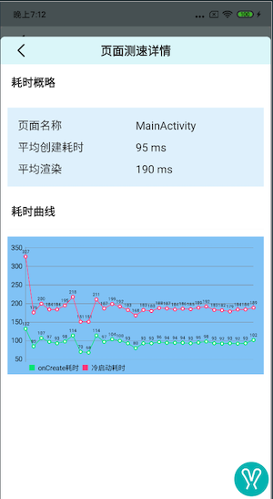

经过一段时间的调用和开发终于完成了[Rabbit](https://github.com/SusionSuc/Rabbit)**应用测速组件**的功能开发,本文就简单介绍一下这个组件的实现原理，目前这个组件主要包括下面功能:

1. 应用`Application.onCreate`耗时统计
2. 应用冷启动耗时统计
3. `Activity.onCreate`耗时
4. `Activity`首次渲染完成耗时
   
最终耗时统计结果如下:




>下面就一起来看一下它们的大概实现原理

## `Application.onCreate()`与`Activity.onCreate()`耗时统计

整个实现逻辑还是很简单的:

1. 编译应用时在`Application.onCreate()`和`Activity.onCreate()`方法中插入耗时统计代码。
2. SDK收集测速数据，然后展示。

>对于编译时的字节码插入本文就不做详细实现分析，具体实现可以参考**Rabbit**源码中的实现。

## 页面渲染耗时统计实现原理

>实现思路参考自:[Android自动化页面测速在美团的实践](https://tech.meituan.com/2018/07/12/autospeed.html)

手动为`Activity.setContentView()`设置的View上，添加一层自定义父View，用于计算绘制完成的时间:

```
public class ActivitySpeedMonitor extends FrameLayout {

    @Override
    protected void dispatchDraw(Canvas canvas) {
        super.dispatchDraw(canvas);
        RabbitTracerEventNotifier.eventNotifier.activityDrawFinish(getContext(), System.currentTimeMillis());
    }

    public static void wrapperViewOnActivityCreateEnd(Activity activity) {
        FrameLayout contentView = activity.findViewById(android.R.id.content);
        ViewGroup contentViewParent = (ViewGroup) contentView.getParent();

        if (contentView != null && contentViewParent != null) {
            ActivitySpeedMonitor newParent = new ActivitySpeedMonitor(contentView.getContext());
            if (contentView.getLayoutParams() != null) {
                newParent.setLayoutParams(contentView.getLayoutParams());
            }
            contentViewParent.removeView(contentView);
            newParent.addView(contentView);
            contentViewParent.addView(newParent);
        }
    }
}
```

上面`ActivitySpeedMonitor.wrapperViewOnActivityCreateEnd()`代码会在编译时插入在`Activity.onCreate`方法中:

```
public class TransformTestActivity extends AppCompatActivity {

    protected void onCreate(Bundle savedInstanceState) {
        ActivitySpeedMonitor.activityCreateStart(this);
        super.onCreate(savedInstanceState);
        this.setContentView(2131296286);
        ActivitySpeedMonitor.wrapperViewOnActivityCreateEnd(this);
    }

}
```

**渲染耗时**就定义为:

**`ViewGroup.dispatchDraw()执行完成时的时间点` - `Activity.onCreate开始执行的时间点`**

>**本文暂时只统计`Activity`首次渲染完成时间**, 对于加载数据，然后再渲染UI这种情况并没有做统计，实际上这个数据才是意义比较大的数据，后面会在`Rabbit`中组件实现这个功能。
