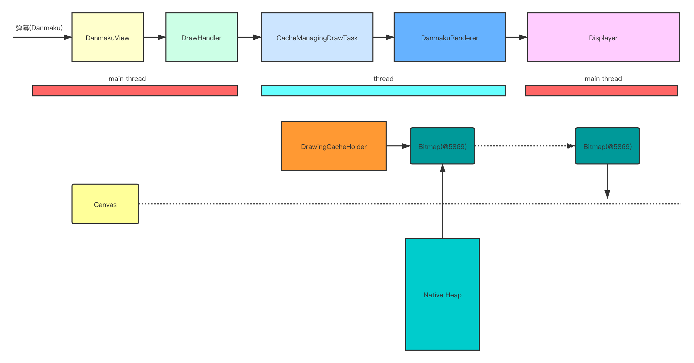

对于视频网站来说弹幕是一个十分常见的功能, 目前业界比较出名的弹幕库是B站的[DanmakuFlameMaster](https://github.com/bilibili/DanmakuFlameMaster)(不过很久没有更新了),这个弹幕库的功能还是十分完善和稳定的,它里面的弹幕主要分为两种:

1. 视频播放时用户实时发送的
2. 视频加载时服务端下发的弹幕集合

由于整个弹幕库涉及到的逻辑还是非常多的, 本文主要分析一下**用户发送一条从右向左滚动的弹幕**的实现逻辑(不涉及视频弹幕时间同步等相关逻辑):

>下图是用户发送一条弹幕时`DanmakuFlameMaster`的大致工作逻辑图:



>涉及到的各个类大致的作用

- `R2LDanmaku` : 一个弹幕对象, 里面包含x、y坐标, 缓存的`Bitmap`等属性
- `DanmakuView` : 用来承载弹幕显示的`ViewGroup`, 除了它之外还有`DanmakuSurfaceView`、`DanmakuTextureView`
- `DrawHandler` : 一个绑定了异步`HandlerThread`的`Handler`, 控制整个弹幕的显示逻辑
- `CacheManagingDrawTask` : 维护需要绘制的弹幕列表, 控制弹幕缓存逻辑
- `DrawingCacheHolder` : 弹幕缓存的实现，缓存的是`Bitmap`, 与`BaseDanmaku`绑定
- `DanmakuRenderer` : 对弹幕做一些过滤、碰撞检测、测量、布局、缓存等工作
- `Displayer` : 持有`Canvas`画布, 绘制弹幕

在向`DanmakuView`中添加弹幕时会触发弹幕的显示流程:

>DanmakuView.java
```
public void addDanmaku(BaseDanmaku item) {
    if (handler != null) {
        handler.addDanmaku(item);
    }
}
```

## DrawHandler调度引起DanmakuView的渲染

1. 将弹幕添加到`CacheManagingDrawTask`的弹幕集合`danmakuList`中
2. `CacheManagingDrawTask.CacheManager`创建弹幕缓存`DrawingCache`
3. 通过`Choreographer`来不断渲染`DanmakuView`

第一步其实就是把弹幕添加到一个集合中，这里就不细看了，直接看`DrawingCache.DrawingCacheHolder`的创建

### 创建弹幕缓存`DrawingCacheHolder`

**其实这里的缓存说白了就是一个`Bitmap`对象, 因为`DanmakuFlameMaster`的弹幕绘制的实现是 : 先把弹幕画在一个`Bitmap`上, 然后再把`Bitmap`绘制在`Canvas`上**

`CacheManagingDrawTask.CacheManager`里面有一个`HandlerThread`,他会异步创建`DrawingCache.DrawingCacheHolder`,不过在创建`DrawingCache`前，会先尝试从缓存池中复用(找有没有可以复用的Bitmap):

```
byte buildCache(BaseDanmaku item, boolean forceInsert) {

    ...

    DrawingCache cache = null;
    // 找有没有可以完全复用的弹幕，文字，宽，高，颜色等都相同
    BaseDanmaku danmaku = findReusableCache(item, true, mContext.cachingPolicy.maxTimesOfStrictReusableFinds); //完全复用
    if (danmaku != null) {
        cache = (DrawingCache) danmaku.cache;
    }
    if (cache != null) {
        ...
        cache.increaseReference();  //增加引用, 同屏上完全相同的弹幕时可以复用同一个缓存的
        item.cache = cache;
        mCacheManager.push(item, 0, forceInsert);
        return RESULT_SUCCESS;
    }

    // 找有没有差不多可以复用的弹幕
    danmaku = findReusableCache(item, false, mContext.cachingPolicy.maxTimesOfReusableFinds);
    if (danmaku != null) {
        cache = (DrawingCache) danmaku.cache;
    }
    if (cache != null) {
        danmaku.cache = null;
        cache = DanmakuUtils.buildDanmakuDrawingCache(item, mDisp, cache, mContext.cachingPolicy.bitsPerPixelOfCache);  //redraw
        item.cache = cache;
        mCacheManager.push(item, 0, forceInsert);
        return RESULT_SUCCESS;
    }
    ...
    cache = mCachePool.acquire();        //直接创建出来一个弹幕
    cache = DanmakuUtils.buildDanmakuDrawingCache(item, mDisp, cache, mContext.cachingPolicy.bitsPerPixelOfCache);
    item.cache = cache;
    boolean pushed = mCacheManager.push(item, sizeOf(item), forceInsert);
    ....
}
```

上面这个方法其实主要分为3步:

1. 寻找完全可以复用的弹幕，即内容、颜色等完全相同的, 同屏上完全相同的弹幕时可以复用同一个缓存的
2. 寻找差不多可以复用的，这里的差不多其实是指找到一个比要画的弹幕大的弹幕(当然要大在一定范围内的)
3. 没有缓存的话就创建一个

上面2、3两步都要走一个核心方法`DanmakuUtils.buildDanmakuDrawingCache()`:

```
DrawingCache buildDanmakuDrawingCache(BaseDanmaku danmaku, IDisplayer disp, DrawingCache cache, int bitsPerPixel) {
    ...
    cache.build((int) Math.ceil(danmaku.paintWidth), (int) Math.ceil(danmaku.paintHeight), disp.getDensityDpi(), false, bitsPerPixel);
    DrawingCacheHolder holder = cache.get();
    if (holder != null) {
        ...
        ((AbsDisplayer) disp).drawDanmaku(danmaku, holder.canvas, 0, 0, true);     //直接把内容画上去
        ...
    }
    return cache;
}
```

即先`build`,然后`draw`:

>`DrawingCache.build()`:

```
public void buildCache(int w, int h, int density, boolean checkSizeEquals, int bitsPerPixel) {
    boolean reuse = checkSizeEquals ? (w == width && h == height) : (w <= width && h <= height);
    if (reuse && bitmap != null) {
        bitmap.eraseColor(Color.TRANSPARENT);
        canvas.setBitmap(bitmap);
        recycleBitmapArray(); //一般没什么用
        return;
    }
    ...

    bitmap = NativeBitmapFactory.createBitmap(w, h, config);

    if (density > 0) {
        mDensity = density;
        bitmap.setDensity(density);
    }
    if (canvas == null){
        canvas = new Canvas(bitmap);
        canvas.setDensity(density);
    }else
    canvas.setBitmap(bitmap);
}
```

其实就是如果这个`DrawingCache`中有`Bitmap`的话，那么就擦干净。如果没有`Bitmap`,那么就在`native heap`上创建一个`Bitmap`,这个`Bitmap`会和`DrawingCache.DrawingCacheHolder`的`canvas`管关联起来。

**这里在`native heap`上创建`Bitmap`会减小`java heap`的压力，避免OOM**

>AbsDisplayer.drawDanmaku()

这个方法的调用逻辑挺长的，就不把源码展开分析了，其实最终是通过`DrawingCacheHolder.canvas`把弹幕画在了`DrawingCacheHolder.bitmap`上:

>SimpleTextCacheStuffer.java
```
@Override
public void drawDanmaku(BaseDanmaku danmaku, Canvas canvas...) {
    ...
    drawBackground(danmaku, canvas, _left, _top);
    ...
    drawText(danmaku, lines[0], canvas, left, top - paint.ascent(), paint, fromWorkerThread);
    ...
}
```

上面`build`和`draw`两步做的事简单来说就是: **在异步线程中给`Danmaku`准备好一个渲染完成的`Bitmap`**

ok, 走完上面这些步骤，其实一个绘制完成的弹幕的`Bitmap`就已经就绪了，接下来就是把这个`Bitmap`画到真正显示在平面上的画布`Canvas`上了

### 通过`Choreographer`来不断渲染`DanmakuView`

在最开始就已经知道`DrawHandler`用来控制整个弹幕逻辑，它会通过`Choreographer`来引起`DanmakuView`的渲染(`draw`):

```
private void updateInChoreographer() {
    ...
    Choreographer.getInstance().postFrameCallback(mFrameCallback);
    ...
    d = mDanmakuView.drawDanmakus();
    ...
}
```

`mFrameCallback`其实就是个套娃，即不断调用`updateInChoreographer`,`mDanmakuView.drawDanmakus()`其实是一个抽象方法，对于`DanmakuView`来说, 它会调用到`View.postInvalidateCompat()`,即触发`DanmakuView.onDraw()`, 从这里之后其实又有很复杂的逻辑, 也不把源码一一展开了, 最终调用到`DanmakuRenderer.accept()`:

```
//main thread
public int accept(BaseDanmaku drawItem) {
    ...
    // measure
    if (!drawItem.isMeasured()) {
        drawItem.measure(disp, false);
    }  
    ...
    // layout  算x, y坐标
    mDanmakusRetainer.fix(drawItem, disp, mVerifier);
    ...
    drawItem.draw(disp);
}
```

`measure()`这里就不看了，其实就是根据弹幕内容测量应该占多大空间; ` mDanmakusRetainer.fix()`最终会调用到`R2LDanmaku.layout()` :

```
public class R2LDanmaku extends BaseDanmaku {
    @Override
    public void layout(IDisplayer displayer, float x, float y) {
        if (mTimer != null) {
            long currMS = mTimer.currMillisecond;
            long deltaDuration = currMS - getActualTime();
            if (deltaDuration > 0 && deltaDuration < duration.value) {
                this.x = getAccurateLeft(displayer, currMS);   // 根据时间进度， 和当前显示器的宽度，来确定当前显示的x坐标
                if (!this.isShown()) {
                    this.y = y;
                    this.setVisibility(true);
                }
                mLastTime = currMS;
                return;
            }
            mLastTime = currMS;
        }
        ...
    }
}
```

y坐标其实是由更上一个层的类确定好的, `R2LDanmaku.layout`主要是确定x坐标的逻辑,他的核心算法是 : **根据时间进度，和当前显示器的宽度，来确定当前显示的x坐标**

接下来看怎么绘制一个弹幕的, 这里其实会调用到`AndroidDisplayer.draw()`

```
public int draw(BaseDanmaku danmaku) {
    
    boolean cacheDrawn = sStuffer.drawCache(danmaku, canvas, left, top, alphaPaint, mDisplayConfig.PAINT);
    int result = IRenderer.CACHE_RENDERING;
    if (!cacheDrawn) {
        ...
        drawDanmaku(danmaku, canvas, left, top, false); // 绘制bitmap
        result = IRenderer.TEXT_RENDERING;
    }   
}
```

首先这里的`canvas`是`DanmakuView.onDraw(canvas)`的`canvas`, `sStuffer.drawCache()`其实就是把前面画好的`Bitmap`画在这个`Canvas`上, 如果没有现存的`Bitmap`可以去画，直接把画到`Canvas`上。

**其实这里几乎90%的情况下都会走到`sStuffer.drawCache()`中**

>OK到这里就简单的分析完了整个实现流程，上面讲的可能不是很详细，不过基本流程都讲到了。(整个弹幕源码涉及到的点还是很多不，不过上面理解的这些其实就可以来实现一个弹幕库了)

# DanmakuSurfaceView

单独开辟一个`Surface`来处理弹幕的绘制操作，即绘制操作是可以在子线程(DrawHandler)，不会造成主线程的卡顿

```
public long drawDanmakus() {
    ...
    Canvas canvas = mSurfaceHolder.lockCanvas();
    ...
    RenderingState rs = handler.draw(canvas);

    mSurfaceHolder.unlockCanvasAndPost(canvas);

    ...
    return dtime;
}
```

# DanmakuTextureView

直接继承自TextureView, TextureView与View和SurfaceView的不同之处是 :

- 不同于SurfaceView, 它可以像普通View那样能被缩放、平移，也能加上动画
- 不同于普通View的硬件加速渲染,  TextureView不具有Display List，它们是通过一个称为`Layer Renderer`的对象以`Open GL`纹理的形式来绘制的, 不过依然要同步于主线程的绘制操作

# 简单的性能分析

将`DanmakuFlameMaster`的Demo运行1分钟后，通过`CPU Memory Profiler`可以看到 : **DanmakuView的Graphics占用内存比较多** , 其实主要原因是因为View硬件加速渲染时大量纹理由CPU同步到GPU消耗了大量的内存

那么如何优化呢？

个人感觉可以在现有的基础上使用`GLSurfaceView`或者`GLTextureView`通过`Open GL`来完成弹幕的渲染。


