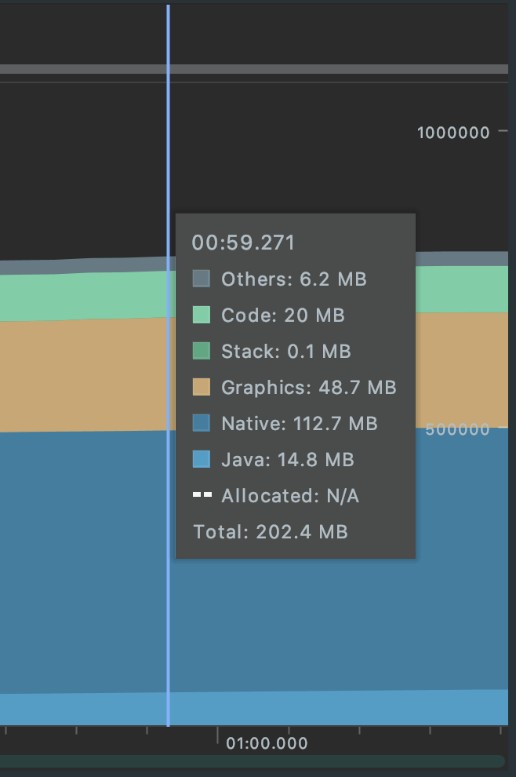
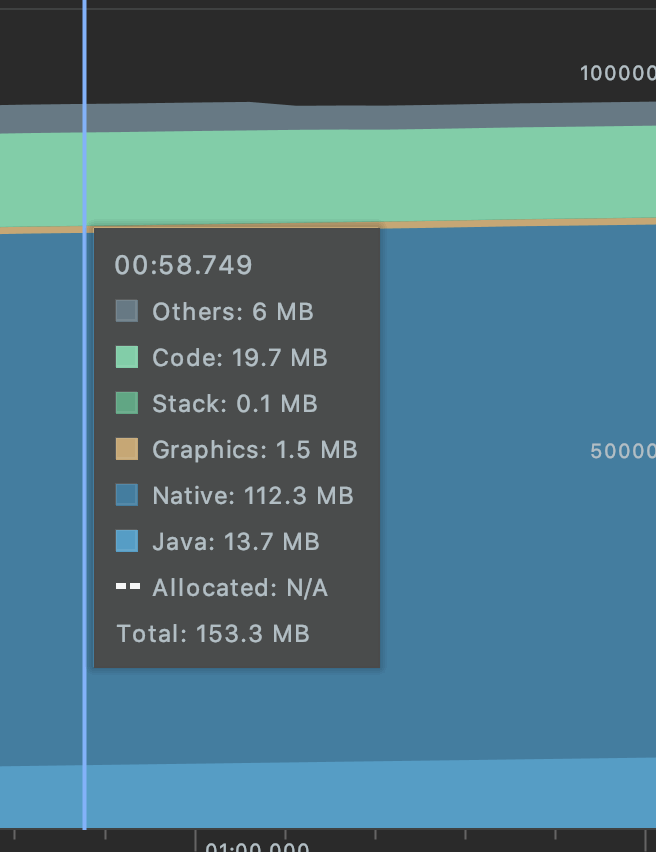
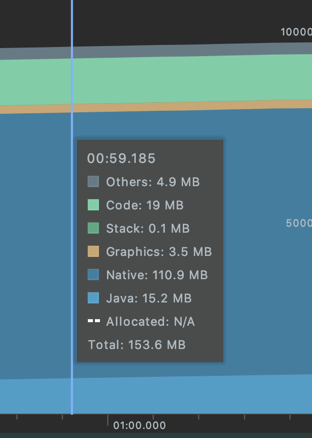

弹幕是一个十分常见的功能，本文将以[DanmakuFlameMaster](https://github.com/bilibili/DanmakuFlameMaster)基础, 分析弹幕的实现。

>关于弹幕的类型

`DanmakuFlameMaster`中显示的弹幕主要分为两种:

1. 视频播放时用户实时发送的
2. 视频加载时服务端下发的弹幕集合

# 弹幕整体工作流程

>本文只看用户实时发送的弹幕相关逻辑(其他逻辑还有很多),下面用户发送一条弹幕时`DanmakuFlameMaster`的大致工作逻辑图:


>涉及到的各个类大致的作用

- `Danmaku` : 描述一个弹幕对象
- `DanmakuView` : 用来承载弹幕显示的View, 除了它之外还有`DanmakuSurfaceView`、`DanmakuTextureView`
- `DrawHandler` : 在子线程中控制整个弹幕的显示逻辑，比如暂停、播放等；负责线程的切换 
- `CacheManagingDrawTask` : 维护弹幕列表，弹幕缓存逻辑
- `DrawingCacheHolder` : 弹幕缓存的实现，缓存的是Bitmap
- `Displayer` : 控制弹幕的显示

整个工作逻辑的入口是:

>DanmakuView.java
```
public void addDanmaku(BaseDanmaku item) {
    if (handler != null) {
        handler.addDanmaku(item);
    }
}
```

## 1. DrawHandler调度引起DanmakuView的渲染

其实这一步主要分为两个点:

1. 添加到弹幕集合`danmakuList`中
2. `CacheManagingDrawTask.CacheManager`创建弹幕缓存`DrawingCacheHolder`
3. 通过`Choreographer`来不断渲染`DanmakuView`

第一步其实就是添加到一个集合中，这里就不细看了，直接看`DrawingCacheHolder`的创建

### 创建弹幕缓存`DrawingCacheHolder`

`CacheManagingDrawTask.CacheManager`里面有一个`HandlerThread`,他会发起`DrawingCacheHolder`的异步创建:

>下面这个方法包含着整个弹幕的复用逻辑

```
private byte buildCache(BaseDanmaku item, boolean forceInsert) {

    if (!item.isMeasured()) { //测量弹幕的宽高，保证缓存的Bitmap大小正确
        item.measure(mDisp, true);
    }

    DrawingCache cache = null;
    try {
        // 找有没有可以完全复用的弹幕，文字，宽，高，颜色，。。。。。
        BaseDanmaku danmaku = findReusableCache(item, true, mContext.cachingPolicy.maxTimesOfStrictReusableFinds); //完全复用
        if (danmaku != null) {
            Log.d(Test.TAG, "fit cache ! strict mode : true");
            cache = (DrawingCache) danmaku.cache;
        }
        if (cache != null) {
            ...
            mCacheManager.push(item, 0, forceInsert);
            return RESULT_SUCCESS;
        }

        // 找有没有差不多可以复用的弹幕
        danmaku = findReusableCache(item, false, mContext.cachingPolicy.maxTimesOfReusableFinds);
        if (danmaku != null) {
            cache = (DrawingCache) danmaku.cache;
        }
        if (cache != null) {
            danmaku.cache = null;
            cache = DanmakuUtils.buildDanmakuDrawingCache(item, mDisp, cache, mContext.cachingPolicy.bitsPerPixelOfCache);  //redraw
            item.cache = cache;
            mCacheManager.push(item, 0, forceInsert);
            return RESULT_SUCCESS;
        }
        ...
        cache = mCachePool.acquire();        //直接创建出来一个弹幕
        cache = DanmakuUtils.buildDanmakuDrawingCache(item, mDisp, cache, mContext.cachingPolicy.bitsPerPixelOfCache);
        item.cache = cache;
        boolean pushed = mCacheManager.push(item, sizeOf(item), forceInsert);
        ....
    }
}
```

上面这个方法其实主要分为3步:

1. 寻找完全可以复用的弹幕，即内容、颜色等完全相同的
2. 寻找差不多可以复用的，这里的差不多其实是指找到一个比要画的弹幕大的弹幕(当然要大在一定范围内的)
3. 实在找不到就创建

上面2、3两步都要走一个核心方法`DanmakuUtils.buildDanmakuDrawingCache()`:

```
DrawingCache buildDanmakuDrawingCache(BaseDanmaku danmaku, IDisplayer disp, DrawingCache cache, int bitsPerPixel) {
    ...
    cache.build((int) Math.ceil(danmaku.paintWidth), (int) Math.ceil(danmaku.paintHeight), disp.getDensityDpi(), false, bitsPerPixel);
    DrawingCacheHolder holder = cache.get();
    if (holder != null) {
        ...
        //直接把内容画上去
        ((AbsDisplayer) disp).drawDanmaku(danmaku, holder.canvas, 0, 0, true);
        ...
    }
    return cache;
}
```

即先`build`,然后`draw`:

>`DrawingCache.build()`:

```
public void buildCache(int w, int h, int density, boolean checkSizeEquals, int bitsPerPixel) {
    boolean reuse = checkSizeEquals ? (w == width && h == height) : (w <= width && h <= height);
    if (reuse && bitmap != null) {
        bitmap.eraseColor(Color.TRANSPARENT);
        canvas.setBitmap(bitmap);
        recycleBitmapArray(); //一般没什么用
        return;
    }
    ...
    bitmap = NativeBitmapFactory.createBitmap(w, h, config);

    if (density > 0) {
        mDensity = density;
        bitmap.setDensity(density);
    }
    if (canvas == null){
        canvas = new Canvas(bitmap);
        canvas.setDensity(density);
    }else
    canvas.setBitmap(bitmap);
}
```

其实就是如果这个`cache`中有`Bitmap`的话，那么就擦干净。如果没有`Bitmap`,那么就在`native heap`上创建一个`Bitmap`,这个`Bitmap`会和`DrawingCacheHolder`的`canvas`管关联起来。

**这里在`native heap`上创建`Bitmap`会减小`java heap`的压力，避免OOM**

>AbsDisplayer.drawDanmaku()

这个方法其实调用的逻辑还是比较长的，就不一一分析了，其实最终是通过`DrawingCacheHolder.canvas`把弹幕画在了`DrawingCacheHolder.bitmap`上:

>SimpleTextCacheStuffer.java
```
@Override
public void drawDanmaku(BaseDanmaku danmaku, Canvas canvas...) {
    ...
    drawBackground(danmaku, canvas, _left, _top);
    ...
    drawText(danmaku, lines[0], canvas, left, top - paint.ascent(), paint, fromWorkerThread);
    ...
}
```

其实上面两步做的事就是 : **在异步线程中给`Danmaku`准备好一个渲染完成的`Bitmap`**


### 通过`Choreographer`来不断渲染`DanmakuView`

在最开始就已经知道`DrawHandler`用来控制整个弹幕逻辑，它会通过`Choreographer`来引起`DanmakuView`的渲染:

```
private void updateInChoreographer() {
    ...
    Choreographer.getInstance().postFrameCallback(mFrameCallback);
    ...
    d = mDanmakuView.drawDanmakus();
    ...
}
```

`mFrameCallback`其实就是个套娃，即不断调用`updateInChoreographer`,`mDanmakuView.drawDanmakus()`其实是一个抽象方法，它会调用到`View.postInvalidateCompat()`,即触发`DanmakuView.onDraw()`, 从这里之后其实又有很复杂的逻辑，这里就不继续跟了，其实接下来的调用流程会调用到`DanmakuRenderer.accept()`:

```
//main thread
public int accept(BaseDanmaku drawItem) {
    ...
    // measure
    if (!drawItem.isMeasured()) {
        drawItem.measure(disp, false);
    }  
    ...
    // layout  算x, y坐标
    mDanmakusRetainer.fix(drawItem, disp, mVerifier);
    ...
    drawItem.draw(disp);
}
```

`measure()`这里就不看了，其实就是根据弹幕内容测量应该占多大空间; ` mDanmakusRetainer.fix()`最终会调用到`Danmaku.layout()`, `Danmaku`其实是一个抽象类，这里我们看一下从右滚到左的弹幕时怎么计算自己的坐标的:

```
public class R2LDanmaku extends BaseDanmaku {
    @Override
    public void layout(IDisplayer displayer, float x, float y) {
        if (mTimer != null) {
            long currMS = mTimer.currMillisecond;
            long deltaDuration = currMS - getActualTime();
            if (deltaDuration > 0 && deltaDuration < duration.value) {
                this.x = getAccurateLeft(displayer, currMS);   // 根据时间进度， 和当前显示器的宽度，来确定当前显示的x坐标
                if (!this.isShown()) {
                    this.y = y;
                    this.setVisibility(true);
                }
                mLastTime = currMS;
                return;
            }
            mLastTime = currMS;
        }
        ...
    }
}
```

y坐标其实是由更上一个层的类确定好的, 这里其实主要是x坐标的逻辑,他的核心算法其实就是**根据时间进度，和当前显示器的宽度，来确定当前显示的x坐标**

接下来看怎么绘制一个弹幕的, 这里其实会调用到`AndroidDisplayer.draw()`

```
public int draw(BaseDanmaku danmaku) {
    
    boolean cacheDrawn = sStuffer.drawCache(danmaku, canvas, left, top, alphaPaint, mDisplayConfig.PAINT);
    int result = IRenderer.CACHE_RENDERING;
    if (!cacheDrawn) {
        ...
        drawDanmaku(danmaku, canvas, left, top, false); // 绘制bitmap
        result = IRenderer.TEXT_RENDERING;
    }   
}
```

首先这里的`canvas`是`DanmakuView.onDraw(canvas)`的`canvas`

`sStuffer.drawCache()`其实就是把前面画好的`Bitmap`画在这个`Canvas`上, 如果没有现存的`Bitmap`可以去画，那么就先画这个弹幕画到`Canvas`上。

**其实这里几乎90%的情况下都会走到`sStuffer.drawCache()`中**

>OK到这里就简单的分析完了整个实现流程，上面讲的可能不是很详细，不过基本流程都讲到了。(其实这里不好去讲的很细，因为代码还是很复杂的。。。详细讲的话写起来太多了。。。)


# DanmakuSurfaceView

其实就是单独开辟一个Surface来处理弹幕的绘制操作，即绘制操作是可以在子线程(DrawHandler)，不会造成主线程的卡顿

```
public long drawDanmakus() {
    ...
    Canvas canvas = mSurfaceHolder.lockCanvas();
    ...
    RenderingState rs = handler.draw(canvas);

    mSurfaceHolder.unlockCanvasAndPost(canvas);

    ...
    return dtime;
}
```

# DanmakuTextureView

直接继承自TextureView, TextureView与View和SurfaceView的不同之处是 :

- 不同于SurfaceView, 它可以像普通View那样能被缩放、平移，也能加上动画
- 不同于普通View的硬件加速渲染,  TextureView不具有Display List，它们是通过一个称为Layer Renderer的对象以Open GL纹理的形式来绘制的


# DanmakuView/DanmakuSurfaceView/DanmakuTextureView对比

`DanmakuFlameMaster`的Demo运行1分钟后，CPU Memory Profiler的统计情况 :





上面DanmakuView的Graphics占用内存比较多的原因应该是  ：View硬件加速渲染大量纹理由CPU同步到GPU所消耗的内存

- DanmakuView占用的内存(Graphics内存)比较高, 这主要是因为由于View的绘制在Android 4.0之后默认都会开启硬件加速，在大量弹幕的情况下会出现大量Bitmap纹理上传(CPU把数据同步给GPU)，这部分数据其实就是放在Graphics内存中
- DanmakuSurfaceView是纯软绘制，绘制的操作在子线程，不过由于它是独立于Activity的View Tree，因此在使用场景上可能比较受限
- DanmakuTextureView想较于DanmakuSurfaceView，可以直接放到Activity的View Tree中, 不过它只可以在支持硬件加速的Window中使用


