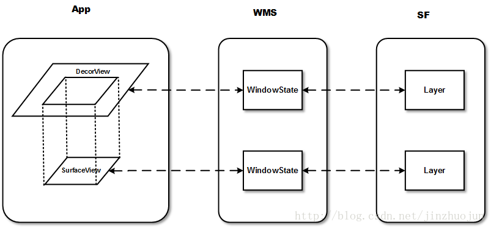

刚开始看这几个东西把我搞的晕头转向的.... 本文就来理一下它们的绘制原理:


# SurfaceView

Core: **使用独立Surface渲染, 可以在子线程中更新UI, 纯软绘制**

它继承自类View，因此它本质上是一个View。但与普通View不同的是，它有自己的Surface。我们知道，一般的Activity包含的多个View会组成View hierachy的树形结构，只有最顶层的DecorView，也就是根结点视图，才是对WMS可见的。这个DecorView在WMS中有一个对应的WindowState。相应地，在SF中对应的Layer。而SurfaceView自带一个Surface，这个Surface在WMS中有自己对应的WindowState，在SF中也会有自己的Layer。如下图所示：



由于是独立的Surface, 在7.0之前:

**对`SurfaceView`进行缩放操作时不会影响到其内显示的内容的**

不过在7.0之后, 做了优化:

```
 * <p class="note"><strong>Note:</strong> Starting in platform version
 * {@link android.os.Build.VERSION_CODES#N}, SurfaceView's window position is
 * updated synchronously with other View rendering. This means that translating
 * and scaling a SurfaceView on screen will not cause rendering artifacts. Such
 * artifacts may occur on previous versions of the platform when its window is
 * positioned asynchronously.</p>
```

即**对`SurfaceView`进行缩放操作时会影响到其内显示的内容的**

# TextureView

Core: **必须存在于硬件加速窗口中, 可以在子线程中更新UI, 以OpelGL纹理(`SurfaceTexture`)的形式硬件渲染, 缩放时内部的内容会跟随着缩放**

>它内部利用`SurfaceTexture`和`HardwareLayer`完成渲染。

`SurfaceTexture`可以理解为一个OpenGL纹理(它可以直接转为一个GL纹理),`HardwareLayer`在`TextureView.draw()`时会更新`SurfaceTexture`到`HardwareLayer`, `HardwareLayer`会交给当前的`ViewTree`的`DisplayListCanvas`来协同渲染,即你可以异步绘制,不过渲染时还是要跟随父视图的`DisplyList`一块渲染的。

## TextureView绘制流程梳理 

**Canvas -> SurfaceTexture**

>lockCanvas() -> Canvas和mNativeWindow(SurfaceTexture)绑定
```
public Canvas lockCanvas(Rect dirty) {
    if (!isAvailable()) return null;

    if (mCanvas == null) {
        mCanvas = new Canvas(); 
    }

    synchronized (mNativeWindowLock) {
        if (!nLockCanvas(mNativeWindow, mCanvas, dirty)) { 
            return null;
        }
    }
    mSaveCount = mCanvas.save();

    return mCanvas;
}
```

>unlockCanvasAndPost() -> 同步数据到SurfaceTexture, 触发绘制操作 draw()
```
public void unlockCanvasAndPost(Canvas canvas) {
    if (mCanvas != null && canvas == mCanvas) {
        canvas.restoreToCount(mSaveCount);
        mSaveCount = 0;

        synchronized (mNativeWindowLock) {
            nUnlockCanvasAndPost(mNativeWindow, mCanvas);
        }
    }
}
```

>draw()
```
@Override
public final void draw(Canvas canvas) {
    ...
    if (canvas.isHardwareAccelerated()) {
        DisplayListCanvas displayListCanvas = (DisplayListCanvas) canvas;

        HardwareLayer layer = getHardwareLayer();
        if (layer != null) {
            applyUpdate();  //更新SurfaceTexture到HardwareLayer
            applyTransformMatrix(); //应用当前的缩放的属性(ViewTree的缩放也会影响到TextureView)

            mLayer.setLayerPaint(mLayerPaint); // ensure layer paint is up to date
            displayListCanvas.drawHardwareLayer(layer);
        }
    }
}
```

# GLSurfaceView

Core : **拥有EGL绘制能力的`SurfaceView`**

它主要是在`SurfaceView`的基础上实现了一个GLThread（EGLContext创建GL环境所在线程即为GL线程），绘制的工作直接通过OpenGL来进行，绘制的内容默认情况下依旧是绘制到SurfaceView所提供的Surface上。


>EGLHelper.createSurface()
```
public boolean createSurface() {

    /*
        * Create an EGL surface we can render into.
        */
    GLSurfaceView view = mGLSurfaceViewWeakRef.get();
    if (view != null) {
        mEglSurface = view.mEGLWindowSurfaceFactory.createWindowSurface(mEgl,
                mEglDisplay, mEglConfig, view.getHolder()); //这个Holder就是SurfaceHolder
    } else {
        mEglSurface = null;
    }
}
```


>DefaultWindowSurfaceFactory.createWindowSurface()
```
public EGLSurface createWindowSurface(EGL10 egl, EGLDisplay display, EGLConfig config, Object nativeWindow) {
    EGLSurface result = null;
    try {
        result = egl.eglCreateWindowSurface(display, config, nativeWindow, null);
    } catch (IllegalArgumentException e) {
        // This exception indicates that the surface flinger surface
        // is not valid. This can happen if the surface flinger surface has
        // been torn down, but the application has not yet been
        // notified via SurfaceHolder.Callback.surfaceDestroyed.
        // In theory the application should be notified first,
        // but in practice sometimes it is not. See b/4588890
        Log.e(TAG, "eglCreateWindowSurface", e);
    }
    return result;
}
```

# GLTextureView

