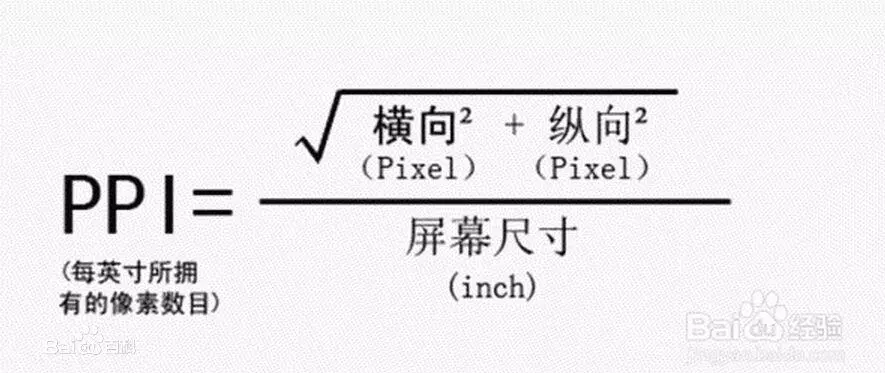

- [一些基础概念](#一些基础概念)
    - [屏幕尺寸](#屏幕尺寸)
        - [屏幕像素密度与屏幕分辨率](#屏幕像素密度与屏幕分辨率)
    - [Android中的屏幕尺寸相关概念](#android中的屏幕尺寸相关概念)
        - [dp](#dp)
        - [使用dp做屏幕适配会引发的问题](#使用dp做屏幕适配会引发的问题)
    - [如何解决dp适配所引发的问题呢？](#如何解决dp适配所引发的问题呢)
        - [解决的核心思想](#解决的核心思想)

>一直以来android屏幕尺寸相关的东西我都很薄弱，什么dpi, ppi, 英寸我都比较疑惑，本文主要是理清概念。以及为什么要做屏幕适配

# 一些基础概念

## 屏幕尺寸

屏幕尺寸指屏幕的对角线的长度，单位是英寸，1英寸=2.54厘米。这个值是利用手机屏幕的长和宽，然后利用勾股定理，就可以算出斜边的长了。即当你听到5英寸的屏幕时，你大概知道。这个手机大概是这么大: 手机对角线的长度为（2.54 * 5）12.5厘米。

### 屏幕像素密度与屏幕分辨率

屏幕像素密度，即每英寸屏幕所拥有的像素数，英文简称`ppi`(Pixels Per Inch)。

屏幕分辨率是指在横纵向上的像素点数，单位是px，1px=1个像素点

屏幕像素密度与屏幕尺寸和屏幕分辨率有关:

即在单一变化条件下，屏幕尺寸越小、分辨率越高则像素密度越大，反之越小。

那`dpi`又是什么呢？ 其实对Android而言，`dpi`等价于`ppi`。 具体解释可以参考这篇文章: 

https://blog.csdn.net/u010134087/article/details/54926403

## Android中的屏幕尺寸相关概念

### dp

dp是一种密度无关像素，对应于160dpi下像素的物理尺寸。它与 `1px` 的关系是 : `1dp = 1px * (dpi / 160)`。即`dp`会根据设备的`dpi`的不同而变化。

>sp的概念与dp类似，是用来表示字体大小的一个单位。

官方定义在160dpi下，1dip=1px，如果320dpi，则1dip=2px，以此类推。这里延伸出我们常说的一个密度,其实这里就可以理解为: (dpi / 160)。
常见的密度：

|     |  dpi/160       |    手机的dpi参数 |
|:-----|:-------:|------|
xxhdpi|3.0| 480dpi
xhdpi|2.0|320 dpi|
hdpi|1.5|   240dpi  |
mdpi|1.0（基准）|  160 dpi |
ldpi|0.75|120dpi

可能还是有点迷糊，我们来看`一加5T`手机的实际参数图:

所以 : 1dp = 2.51px 。 即在垂直方向上共有860dp,在水平方向上共有420dp。

- 为什么要使用dp来做适配？

一般设计在出图的时候只会给一个设计图，假如设计图的尺寸是固定的。那么在编写UI界面时，很多UI的尺寸就是按照这个设计图的尺寸来编写的。

假如说你使用的单位是px。一个button设计标记的宽尺寸是1000像素(px)。那在一些宽度不足1000像素(px)的手机上，那个这个button根本就不能完全显示出来。

因此Android官方推荐我们以dp为单位编写UI设计的。这是因为dp在不同的设备(dpi)会转化为不同的像素值。但是使用dp来做屏幕适配还是会有一些问题的:

### 使用dp做屏幕适配会引发的问题

我们先假设有两个设备:

设备1，屏幕宽度为 1080px，480DPI，屏幕总 dp 宽度为 1080 / (480 / 160) = 360dp

设备2，屏幕宽度为 1600px，560DPI，屏幕总 dp 宽度为 1600 / (560 / 160) = 457dp

那么如果对于一个view,它的`left margin`我们都设置为`100dp`。 那么这个view在这两个设备上渲染时是什么情况呢? 我们来看一下实际的渲染图:

即在同样设置`left marin`为100dp的情况下，在设备一上会感觉这个`left margin`比设备二的`left margin`要大。

## 如何解决dp适配所引发的问题呢？

对于这个问题的解决业界已经有了几种比较成熟的方案，比如: 

<a herf="https://mp.weixin.qq.com/s/d9QCoBP6kV9VSWvVldVVwA">今日头条适配方案</a>

<a herf="https://mp.weixin.qq.com/s/X-aL2vb4uEhqnLzU5wjc4Q">SmallestWidth限定符适配方案</a>

这两个方案会在下面的文章继续分析。我们先预先讨论一下这两个方案解决`dp适配引发的问题`的核心思想 :

### 解决的核心思想

首先我们定义一个概念 : `density = dpi / 160`, `dp = px * (dpi / 160)` 。 所以 1 dp = 1px * density

比如说我们的设计图纸宽是360dp。 那么对于宽为457dp的设备，我们希望`100dp`的尺寸在`360dp的宽`和`457dp的宽`展示的是一样的效果，即占整个屏幕的百分比都是一样的。

即写`100dp`，在`457dp的宽`的设备上应表现为`123dp`。那这个要怎么做到呢？

上面提的两种方案分别通过不同的方法来实现了这个解决方式。

