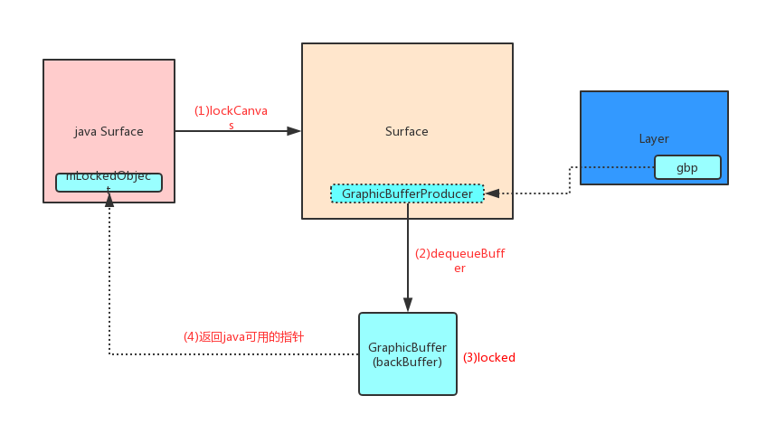

>本文内容接着上一篇文章[Android的UI显示原理之Surface的创建](Android的UI显示原理之Surface的创建.md)继续来看`Surface`渲染的大致过程。 

对于`Surface的渲染`可以转化为`ViewRootImpl`的渲染。因此我们从`ViewRootImpl.draw()`来看一下它的渲染逻辑。这个方法最终会调用到`ViewRootImpl.drawSoftward()`:

```
private boolean drawSoftware(Surface surface, AttachInfo attachInfo,...) {
    // Draw with software renderer.
    final Canvas canvas;
    ...
    canvas = mSurface.lockCanvas(dirty);  //step 1
    ...
    mView.draw(canvas);  //setp 2
    ...
    mSurface.unlockCanvasAndPost(canvas);  //step 3
}
```

`mView`是`ViewRootImpl`的根`View`。`mSurface`即为上一篇文章分析的所创建的`Surface`，它的实际对象在nativie层。

上面3步大致描绘了`ViewRootImpl`的绘制原理，本文就逐一分析这3步，来大致了解`ViewRootImpl`的渲染逻辑。


## mSurface.lockCanvas()

```
public Canvas lockCanvas(Rect inOutDirty){
    ...
    mLockedObject = nativeLockCanvas(mNativeObject, mCanvas, inOutDirty);
    return mCanvas;
}
```

这个方法会直接调用到native方法`nativeLockCanvas(mNativeObject, mCanvas, inOutDirty)`。

`mNativeObject`就是`Surface`创建时对应的native`Surface`指针，`inOutDirty`指明了`lock`的区域。

>android_view_Surface.cpp
```
static jlong nativeLockCanvas(JNIEnv* env, jclass clazz,jlong nativeObject, jobject canvasObj, jobject dirtyRectObj) {
    sp<Surface> surface(reinterpret_cast<Surface *>(nativeObject)); //转换指针
    ...
    Rect dirtyRect(Rect::EMPTY_RECT);
    Rect* dirtyRectPtr = NULL;

    //获取 lock 区域
    if (dirtyRectObj) {
        dirtyRect.left   = env->GetIntField(dirtyRectObj, gRectClassInfo.left);
        dirtyRect.top    = env->GetIntField(dirtyRectObj, gRectClassInfo.top);
        dirtyRect.right  = env->GetIntField(dirtyRectObj, gRectClassInfo.right);
        dirtyRect.bottom = env->GetIntField(dirtyRectObj, gRectClassInfo.bottom);
        dirtyRectPtr = &dirtyRect;
    }

    ANativeWindow_Buffer outBuffer;
    status_t err = surface->lock(&outBuffer, dirtyRectPtr);
    ...

    sp<Surface> lockedSurface(surface);
    return (jlong) lockedSurface.get(); //返回surface指针
}
```

这个方法主要新建了一个`Rect`对象，确定要`lock`的区域的参数，然后调用`surface->lock(&outBuffer, dirtyRectPtr)`:

>Surface.cpp
```
status_t Surface::lock(ANativeWindow_Buffer* outBuffer, ARect* inOutDirtyBounds){

    ANativeWindowBuffer* out; int fenceFd = -1;
    status_t err = dequeueBuffer(&out, &fenceFd);  //从 GraphicBufferProduce 中 拿出来一个 buffer 

    sp<GraphicBuffer> backBuffer(GraphicBuffer::getSelf(out));  // 构建一个 backbuffer

    status_t res = backBuffer->lockAsync(...);
}
```

可以看出`lock`方法，首先通过`dequeueBuffer`来获取一个`ANativeWindowBuffer`,然后利用它构造一个`GraphicBuffer`,它被称为`backBuffer`,然后调用它的`backBuffer->lockAsync(...)`,那么怎么获取一个`ANativeWindowBuffer`呢？

### dequeueBuffer()

>Surface.cpp
```

int Surface::dequeueBuffer(android_native_buffer_t** buffer, int* fenceFd) {

    ...
    status_t result = mGraphicBufferProducer->dequeueBuffer(&buf, &fence, reqWidth, reqHeight,
                                                            reqFormat, reqUsage, &mBufferAge,
                                                            enableFrameTimestamps ? &frameTimestamps
                                                                                  : nullptr);
    ...经过一系列的操作，buffer最终会指向&buf
}
```
我们上一篇文章中已经介绍过了`GraphicBufferProducer`，它是一个`Layer`的`graphic buffer producer`，`Layer`在绘制时，会从`GraphicBufferProducer`取出一个`GraphicBuffer`来绘制。所以可以理解为`GraphicBufferProducer`存放着一个`Layer`待绘制的一帧。`dequeueBuffer()`所做的事情就是:从`GraphicBufferProducer`取出一个`GraphicBuffer`。

至于`backBuffer->lockAsync(...)`所做的操作就不细看了，可以猜想就是把这个`GraphicBuffer`锁上，保证一个`GraphicBuffer`绘制操作的不可重入。

综上，`surface.lockCanvas()`的主要逻辑可以使用下面这张图来表示:



即`mSurface.lockCanvas`最终是lock了一个`GraphicBuffer`。继续看`mView.draw(canvas)`:

## mView.draw(canvas)

`View.draw(canvas)`所做的事情其实就是:根据`View`的状态来把带绘制的数据保存到`Canvas`。对`Canvas`我们到最后再来看一下它和`Surface`的关系。

## mSurface.unlockCanvasAndPost(canvas)

在`canvas`的绘制数据准备ok后，`Surface`就可以开始绘制了，而绘制操作的发起点就是`Surface.unlockCanvasAndPost()`方法,这个方法会调用到:

```
private void unlockSwCanvasAndPost(Canvas canvas) {
    ...
    try {
        nativeUnlockCanvasAndPost(mLockedObject, canvas); //mLockedObject其实就是native的那个surface
    } finally {
        nativeRelease(mLockedObject);
        mLockedObject = 0;
    }
}
```

继续看`nativeUnlockCanvasAndPost()`

>android_view_Surface.cpp
```
static void nativeUnlockCanvasAndPost(JNIEnv* env, jclass clazz,jlong nativeObject, jobject canvasObj) { 
    sp<Surface> surface(reinterpret_cast<Surface*>(nativeObject));
    ...
    // detach the canvas from the surface
    Canvas* nativeCanvas = GraphicsJNI::getNativeCanvas(env, canvasObj);  // 把java canvas指针转化为native 指针
    nativeCanvas->setBitmap(SkBitmap());

    // unlock surface
    status_t err = surface->unlockAndPost();
}
```

即调用了`surface->unlockAndPost()`:

>Surface.cpp
```
status_t Surface::unlockAndPost()
{
    ...
    int fd = -1;
    status_t err = mLockedBuffer->unlockAsync(&fd);

    err = queueBuffer(mLockedBuffer.get(), fd);

    mPostedBuffer = mLockedBuffer;
    mLockedBuffer = 0;
    return err;
}
```

这里`mLockedBuffer`其实就是前面的`backBuffer`。`mLockedBuffer->unlockAsync(&fd)`的操作其实很简单，就是解除`GraphicBuffer`的lock状态，主要看一下`queueBuffer(mLockedBuffer.get(), fd)`

>Surface.cpp
```
int Surface::queueBuffer(android_native_buffer_t* buffer, int fenceFd) {
    ...
    int i = getSlotFromBufferLocked(buffer); 
    ...
    IGraphicBufferProducer::QueueBufferOutput output;
    IGraphicBufferProducer::QueueBufferInput input(timestamp, isAutoTimestamp,
            static_cast<android_dataspace>(mDataSpace), crop, mScalingMode,
            mTransform ^ mStickyTransform, fence, mStickyTransform,
            mEnableFrameTimestamps);
    ...
    status_t err = mGraphicBufferProducer->queueBuffer(i, input, &output); 
    ...
    mQueueBufferCondition.broadcast();
    return err;
}
```

对于`input`和`output`这里先不做细追，**我猜测`input`中应该包含绘制的数据**。但`getSlotFromBufferLocked(buffer)`是干什么的呢？它其实就是获取真正的`GraphicBuffer`的在`mSlots`集合中真正的index:

>Surface.cpp
```
int Surface::getSlotFromBufferLocked(android_native_buffer_t* buffer) const {
    for (int i = 0; i < NUM_BUFFER_SLOTS; i++) {
        if (mSlots[i].buffer != NULL && mSlots[i].buffer->handle == buffer->handle) {
            return i;
        }
    }
    return BAD_VALUE;
}
```

对于`mSlots`集合，可以认为他就是按顺序保存`GraphicBuffer`的数组即可:

>Surface.h
```
    // mSlots stores the buffers that have been allocated for each buffer slot.
    // It is initialized to null pointers, and gets filled in with the result of
    // IGraphicBufferProducer::requestBuffer when the client dequeues a buffer from a
    // slot that has not yet been used. The buffer allocated to a slot will also
    // be replaced if the requested buffer usage or geometry differs from that
    // of the buffer allocated to a slot.
    BufferSlot mSlots[NUM_BUFFER_SLOTS];
```


继续看`mGraphicBufferProducer->queueBuffer(i, input, &output)`, 通过上一篇文章已经知道`mGraphicBufferProducer`是`BufferQueueProducer`的实例:

>BufferQueueProducer.cpp
```
status_t BufferQueueProducer::queueBuffer(int slot, const QueueBufferInput &input, QueueBufferOutput *output) { 

    //从input中获取一些列参数
    input.deflate(&requestedPresentTimestamp, &isAutoTimestamp, &dataSpace,
        &crop, &scalingMode, &transform, &acquireFence, &stickyTransform,
        &getFrameTimestamps);


    sp<IConsumerListener> frameAvailableListener;
    sp<IConsumerListener> frameReplacedListener;
    BufferItem item; //可以理解为一个待渲染的帧

    ...下面就是对item的一系列赋值操作

    item.mAcquireCalled = mSlots[slot].mAcquireCalled; 
    item.mGraphicBuffer = mSlots[slot].mGraphicBuffer; //根据slot获取GraphicBuffer。
    item.mCrop = crop;
    item.mTransform = transform &
            ~static_cast<uint32_t>(NATIVE_WINDOW_TRANSFORM_INVERSE_DISPLAY);
    item.mTransformToDisplayInverse =
            (transform & NATIVE_WINDOW_TRANSFORM_INVERSE_DISPLAY) != 0;
    item.mScalingMode = static_cast<uint32_t>(scalingMode);
    item.mTimestamp = requestedPresentTimestamp;
    item.mIsAutoTimestamp = isAutoTimestamp;
    
    ...

    if (frameAvailableListener != NULL) {
        frameAvailableListener->onFrameAvailable(item); //item是一个frame，准备完毕，要通知外界
    } else if (frameReplacedListener != NULL) {
        frameReplacedListener->onFrameReplaced(item);
    }

    addAndGetFrameTimestamps(&newFrameEventsEntry,etFrameTimestamps ? &output->frameTimestamps : nullptr);

    return NO_ERROR;
}
```

>其实从`queueBuffer()`可以看出,`mGraphicBufferProducer`中存放的都是可以被渲染的`GraphicBuffer`,这个`buffer`可能被渲染完毕，也可能处于待渲染状态。

`queueBuffer`的主要操作是根据输入参数完善一个`BufferItem`,然后通知外界去绘制这个`BufferItem`。这里这个`frameAvailableListener`是什么呢？有兴趣的同学可以去跟一下, 不过最终回到`BufferLayer.onFrameAvailable()`:

>BufferLayer.cpp
```
// ---------------------------------------------------------------------------
// Interface implementation for SurfaceFlingerConsumer::ContentsChangedListener
// ---------------------------------------------------------------------------
void BufferLayer::onFrameAvailable(const BufferItem& item) {
    ...
    mFlinger->signalLayerUpdate();
}
```

这个方法直接调用了`mFlinger->signalLayerUpdate()`,看样是要让`SurfaceFlinger`来渲染了:

>SurfaceFlinger.cpp
```
void SurfaceFlinger::signalLayerUpdate() {
    mEventQueue->invalidate();
}
```

至于`SurfaceFlinger`是如何渲染的，本文就不继续追踪了。用下面这张图总结一下`mSurface.unlockCanvasAndPost(canvas)`:

.png)


## Canvas与Surface

`Canvas`是一个绘图的工具类，其API提供了一系列绘图指令供开发者使用。根据绘制加速模式的不同，`Canvas`有软件`Canvas`与硬件`Canvas`只分。`Canvas`的绘图指令可以分为两个部分:

- 绘制指令:这些最常用的指令由一系列名为`drawXXX`的方法提供。他们用来实现实际的绘制行为，例如绘制点、线、圆以及方块等。
- 辅助指令:这些用于提供辅助功能的指令将会影响后续绘制指令的效果，如设置变换、裁剪区域等。`Canvas`还提供了`save`与`resotore`用于撤销一部分辅助指令的效果。

对于软件`Canvas`来说，其绘制目标是一个位图`Bitmap`。在`Surface.unlockAndPost`时，这个`Bitmap`所描述的内容会反映到`Surface`的`Buffer`中。可以用下面这张图来表示:


最后:

**欢迎关注我的[Android进阶计划](https://github.com/SusionSuc/AdvancedAndroid)看更多干货**

**欢迎关注我的微信公众号:susion随心**


>参考文章

- 《深入理解Android 卷3》


