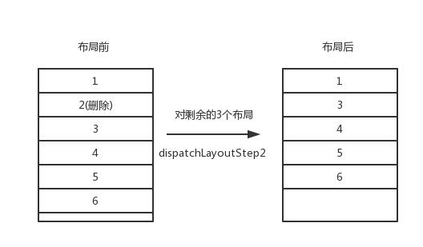
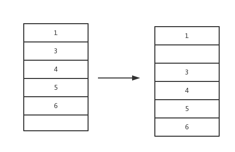

>本文是`RecyclerView源码分析系列第四篇文章`,内容主要是基于前三篇文章来叙述的，因此在阅读之前推荐看一下前3篇文章:

[RecylcerView的基本设计结构](RecylcerView的基本设计结构.md)

[RecyclerView的刷新机制](RecyclerView的刷新机制.md)

[RecyclerView的复用机制](RecyclerView的复用机制.md)

本文主要分析`RecyclerView删除动画`的实现原理,不同类型动画的大体实现流程其实都是差不多的，所以对于添加、交换这种动画就不再做分析。本文主要目标是**理解清楚的是`RecyclerViewItem删除动画`源码实现逻辑**。文章比较长。

可以通过下面这两个方法触发`RecyclerView`的删除动画:

```
    //一个item的删除动画
    dataSource.removeAt(1)
    recyclerView.adapter.notifyItemRemoved(1)

    //多个item的删除动画
    dataSource.removeAt(1)
    dataSource.removeAt(1)
    recyclerView.adapter.notifyItemRangeRemoved(1,2)
```

下面这个图是设置10倍动画时长时删除动画的执行效果,可以先预想一下这个动画时大致可以怎么实现:


接下来就结合前面几篇文章的内容并跟随源码来一块看一下`RecyclerView`是如何实现这个动画的:

`adapter.notifyItemRemoved(1)`会回调到`RecyclerViewDataObserver`: 

```
    public void onItemRangeRemoved(int positionStart, int itemCount) {
        if (mAdapterHelper.onItemRangeRemoved(positionStart, itemCount)) {
            triggerUpdateProcessor();
        }
    }
```

其实按照`onItemRangeRemoved()`这个方法可以将`Item删除动画`分为两个部分:

1. 添加一个`UpdateOp`到`AdapterHelper.mPendingUpdates`中。
2. `triggerUpdateProcessor()`调用了`requestLayout`, 即触发了`RecyclerView`的重新布局。

先来看`mAdapterHelper.onItemRangeRemoved(positionStart, itemCount)`:

## AdapterHelper

这个类可以理解为是用来记录`adapter.notifyXXX`动作的，即每一个`Operation(添加、删除)`都会在这个类中有一个对应记录`UpdateOp`，`RecyclerView`在布局时会检查这些`UpdateOp`，并做对应的操作。
`mAdapterHelper.onItemRangeRemoved`其实是添加一个`Remove UpdateOp`:

```
    mPendingUpdates.add(obtainUpdateOp(UpdateOp.REMOVE, positionStart, itemCount, null));
    mExistingUpdateTypes |= UpdateOp.REMOVE;
```
即把一个`Remove UpdateOp`添加到了`mPendingUpdates`集合中。

## RecyclerView.layout

在[RecyclerView的刷新机制](RecyclerView的刷新机制.md)中知道`RecyclerView`的布局一共分为3分步骤:`dispatchLayoutStep1()、dispatchLayoutStep2()、dispatchLayoutStep3()`，接下来我们就分析这3步中有关`Item删除动画`
的工作。


### dispatchLayoutStep1(保存动画现场)

直接从`dispatchLayoutStep1()`开始看，这个方法是`RecyclerView`布局的第一步:

>dispatchLayoutStep1():
```
    private void dispatchLayoutStep1() {
        ...
        processAdapterUpdatesAndSetAnimationFlags();
        ...
        if (mState.mRunSimpleAnimations) {
            ...
        }
        ...
    }
```

上面我只贴出了`Item删除动画`主要涉及到的部分, 先来看一下`processAdapterUpdatesAndSetAnimationFlags()`所触发的操作，整个操作链比较长，就不一一跟了，它最终其实是调用到`AdapterHelper.postponeAndUpdateViewHolders()`:

```
private void postponeAndUpdateViewHolders(UpdateOp op) {
    mPostponedList.add(op); //op其实是从mPendingUpdates中取出来的
    switch (op.cmd) {
        case UpdateOp.ADD:
            mCallback.offsetPositionsForAdd(op.positionStart, op.itemCount); break;
        case UpdateOp.MOVE:
            mCallback.offsetPositionsForMove(op.positionStart, op.itemCount); break;
        case UpdateOp.REMOVE:
            mCallback.offsetPositionsForRemovingLaidOutOrNewView(op.positionStart, op.itemCount); break;  
        case UpdateOp.UPDATE:
            mCallback.markViewHoldersUpdated(op.positionStart, op.itemCount, op.payload); break;    
        ...
    }
}
```

即这个方法做的事情就是把`mPendingUpdates中的UpdateOp`添加到`mPostponedList`中，并回调根据`op.cmd`来回调`mCallback`,其实这个`mCallback`是回调到了`RecyclerView`中:

```
 void offsetPositionRecordsForRemove(int positionStart, int itemCount, boolean applyToPreLayout) {
        final int positionEnd = positionStart + itemCount;
        final int childCount = mChildHelper.getUnfilteredChildCount();
        for (int i = 0; i < childCount; i++) {
            final ViewHolder holder = getChildViewHolderInt(mChildHelper.getUnfilteredChildAt(i));
            ...
            if (holder.mPosition >= positionEnd) {
                holder.offsetPosition(-itemCount, applyToPreLayout);
                mState.mStructureChanged = true;
            }
            ...
        }
        ...
    }
```

`offsetPositionRecordsForRemove`方法:**主要是把当前显示在界面上的`ViewHolder`的位置做对应的改变，即如果item位于删除的item之后，那么它的位置应该减一**，比如原来的位置是3现在变成了2。

接下来继续看`dispatchLayoutStep1()`中的操作:

```
    if (mState.mRunSimpleAnimations) {
        int count = mChildHelper.getChildCount();
        for (int i = 0; i < count; ++i) {
            final ViewHolder holder = getChildViewHolderInt(mChildHelper.getChildAt(i));
            //根据当前的显示在界面上的ViewHolder的布局信息创建一个ItemHolderInfo
            final ItemHolderInfo animationInfo = mItemAnimator
                    .recordPreLayoutInformation(mState, holder,
                            ItemAnimator.buildAdapterChangeFlagsForAnimations(holder),
                            holder.getUnmodifiedPayloads());
            mViewInfoStore.addToPreLayout(holder, animationInfo); //把 holder对应的animationInfo保存到 mViewInfoStore中
            ...
        }
    }
```

即就做了两件事:

1. 为当前显示在界面上的每一个`ViewHolder`创建一个`ItemHolderInfo`，`ItemHolderInfo`其实就是保存了当前显示`itemview`的布局的`top、left`等信息
2. 拿着`ViewHolder`和其对应的`ItemHolderInfo`调用`mViewInfoStore.addToPreLayout(holder, animationInfo)`。 

`mViewInfoStore.addToPreLayout()`就是把这些信息保存起来:

```
void addToPreLayout(RecyclerView.ViewHolder holder, RecyclerView.ItemAnimator.ItemHolderInfo info) {
    InfoRecord record = mLayoutHolderMap.get(holder);
    if (record == null) {
        record = InfoRecord.obtain();
        mLayoutHolderMap.put(holder, record);
    }
    record.preInfo = info;
    record.flags |= FLAG_PRE;
}
```

即把`holder 和 info`保存到`mLayoutHolderMap`中。可以理解为它是**用来保存动画执行前当前界面ViewHolder的信息**一个集合。

到这里大致理完了在执行`Items删除动画`时`AdapterHelper`和`dispatchLayoutStep1()`的执行逻辑，这里用一张图来总结一下:


其实这些操作可以简单的理解为**保存动画前View的现场** 。其实这里有一次*预布局*,预布局也是为了保存动画前的View信息,不过这里就不讲了。

## dispatchLayoutStep2

这一步就是摆放当前`adapter`中剩余的Item，在本文的例子中，就是依次摆放剩余的5个Item。在前面的文章`RecyclerView的刷新机制`中，我们知道`LinearLayoutManager`会向`Recycler`要`View`来填充`RecyclerView`,所以`RecyclerView`中填几个`View`，其实和`Recycler`有很大的关系，因为`Recycler`不给`LinearLayoutManager`的话，`RecyclerView`中就不会有`View`填充。那`Recycler`给`LinearLayoutManager``View`的边界条件是什么呢？
我们来看一下`tryGetViewHolderForPositionByDeadline()`方法:

```
ViewHolder tryGetViewHolderForPositionByDeadline(int position, boolean dryRun, long deadlineNs) {
        if (position < 0 || position >= mState.getItemCount()) {
            throw new IndexOutOfBoundsException("Invalid item position " + position
                    + "(" + position + "). Item count:" + mState.getItemCount()
                    + exceptionLabel());
        }
}
```

即如果位置大于`mState.getItemCount()`,那么就不会再向`RecyclerView`中填充子View。而这个`mState.getItemCount()`一般就是`adapter`中当前数据源的数量。所以经过这一步布局后，View的状态如下图:



这时你可能就有疑问了？ 动画呢？ 怎么直接成最终的模样了？别急，这一步只不过是布局，至于动画是怎么执行的我们继续往下看:

## dispatchLayoutStep3(执行删除动画)

在上一步中对删除操作已经完成了布局，接下来`dispatchLayoutStep3()`就会做删除动画:

```
private void dispatchLayoutStep3() {
    ...
    if (mState.mRunSimpleAnimations) {
        ...
        mViewInfoStore.process(mViewInfoProcessCallback); //触发动画的执行
    }
    ...
}
```

可以看到主要涉及到动画的是`mViewInfoStore.process()`, 其实这一步可以分为两个操作:

1. 先把`Item View`动画前的起始状态准备好
2. 执行动画使`Item View`到目标布局位置

下面我们来继续跟一下`mViewInfoStore.process()`这个方法

### 把`Item View`动画前的起始状态准备好

```
 void process(ProcessCallback callback) {
        for (int index = mLayoutHolderMap.size() - 1; index >= 0; index--) { //对mLayoutHolderMap中每一个Holder执行动画
            final RecyclerView.ViewHolder viewHolder = mLayoutHolderMap.keyAt(index);
            final InfoRecord record = mLayoutHolderMap.removeAt(index);
            if ((record.flags & FLAG_APPEAR_AND_DISAPPEAR) == FLAG_APPEAR_AND_DISAPPEAR) {
                callback.unused(viewHolder);
            } else if ((record.flags & FLAG_DISAPPEARED) != 0) {
                callback.processDisappeared(viewHolder, record.preInfo, record.postInfo);  //被删除的那个item会回调到这个地方
            }else if ((record.flags & FLAG_PRE_AND_POST) == FLAG_PRE_AND_POST) {
                callback.processPersistent(viewHolder, record.preInfo, record.postInfo);   //需要上移的item会回调到这个地方
            }  
            ...
            InfoRecord.recycle(record);
        }
    }
```

这一步就是遍历`mLayoutHolderMap`对其中的每一个ViewHolder做对应的动画。这里`callback`会调到了`RecyclerView`,`RecyclerView`会对每一个`Item`执行相应的动画:

```
ViewInfoStore.ProcessCallback mViewInfoProcessCallback =
        new ViewInfoStore.ProcessCallback() {
            @Override
            public void processDisappeared(ViewHolder viewHolder, @NonNull ItemHolderInfo info,@Nullable ItemHolderInfo postInfo) {
                mRecycler.unscrapView(viewHolder);   //从scrap集合中移除,
                animateDisappearance(viewHolder, info, postInfo);
            }

            @Override
            public void processPersistent(ViewHolder viewHolder, @NonNull ItemHolderInfo preInfo, @NonNull ItemHolderInfo postInfo) {
                ...
                if (mItemAnimator.animatePersistence(viewHolder, preInfo, postInfo)) {
                    postAnimationRunner();
                }
            }
            ...
        }
}
```

先来分析被删除那那个`Item`的消失动画:

#### 将Item的动画消失动画放入到`mPendingRemovals`待执行队列

```
void animateDisappearance(@NonNull ViewHolder holder, @NonNull ItemHolderInfo preLayoutInfo, @Nullable ItemHolderInfo postLayoutInfo) {
    addAnimatingView(holder);
    holder.setIsRecyclable(false);
    if (mItemAnimator.animateDisappearance(holder, preLayoutInfo, postLayoutInfo)) {
        postAnimationRunner();
    }
}
```

先把`Holder`attch到`RecyclerView`上(这是因为在`dispatchLayoutStep1`和`dispatchLayoutStep2`中已经对这个`Holder`做了Dettach)。即它又重新出现在了`RecyclerView`的布局中(位置当然还是未删除前的位置)。然后调用了`mItemAnimator.animateDisappearance()`其执行这个删除动画，`mItemAnimator`是`RecyclerView`的动画实现者，它对应的是`DefaultItemAnimator`。继续看`animateDisappearance()`它其实最终调用到了`DefaultItemAnimator.animateRemove()`:

```
public boolean animateRemove(final RecyclerView.ViewHolder holder) {
    resetAnimation(holder);
    mPendingRemovals.add(holder);
    return true;
}
```

即，其实并没有执行动画，而是把这个`holder`放入了`mPendingRemovals`集合中，看样是要等下执行。

### 将未被删除的Item的移动动画放入到`mPendingMoves`待执行队列

其实逻辑和上面差不多`DefaultItemAnimator.animatePersistence()`:

```
public boolean animatePersistence(@NonNull RecyclerView.ViewHolder viewHolder,@NonNull ItemHolderInfo preInfo, @NonNull ItemHolderInfo postInfo) {
    if (preInfo.left != postInfo.left || preInfo.top != postInfo.top) {  //和预布局的状态不同，则执行move动画
        return animateMove(viewHolder,preInfo.left, preInfo.top, postInfo.left, postInfo.top);
    }
    ...
}
```

`animateMove`的逻辑也很简单，就是根据偏移构造了一个`MoveInfo`然后添加到`mPendingMoves`中，也没有立刻执行:

```
public boolean animateMove(final RecyclerView.ViewHolder holder, int fromX, int fromY, int toX, int toY) {
    final View view = holder.itemView;
    fromX += (int) holder.itemView.getTranslationX();
    fromY += (int) holder.itemView.getTranslationY();
    resetAnimation(holder);
    int deltaX = toX - fromX;
    int deltaY = toY - fromY;
    if (deltaX == 0 && deltaY == 0) {
        dispatchMoveFinished(holder);
        return false;
    }
    if (deltaX != 0) {
        view.setTranslationX(-deltaX);  //设置他们的位置为负偏移！！！！！
    }
    if (deltaY != 0) {
        view.setTranslationY(-deltaY);  //设置他们的位置为负偏移！！！！！
    }
    mPendingMoves.add(new MoveInfo(holder, fromX, fromY, toX, toY));
    return true;
}
```

但要注意这一步把要做滚动动画的View的`TranslationX`和`TranslationY`都设置负的被删除的Item的高度，如下图



**即被删除的Item之后的Item都下移了**

### `postAnimationRunner()`执行所有的pending动画

上面一步操作已经把动画前的状态准备好了，`postAnimationRunner()`就是将上面`pendding`的动画开始执行:

//DefaultItemAnimator.java
```
    public void runPendingAnimations() {
        boolean removalsPending = !mPendingRemovals.isEmpty();
        ...
        for (RecyclerView.ViewHolder holder : mPendingRemovals) {
            animateRemoveImpl(holder); //执行pending的删除动画
        }
        mPendingRemovals.clear();

        if (!mPendingMoves.isEmpty()) { //执行pending的move动画
            final ArrayList<MoveInfo> moves = new ArrayList<>();
            moves.addAll(mPendingMoves);
            mMovesList.add(moves);
            mPendingMoves.clear();
            Runnable mover = new Runnable() {
                @Override
                public void run() {
                    for (MoveInfo moveInfo : moves) {
                        animateMoveImpl(moveInfo.holder, moveInfo.fromX, moveInfo.fromY,
                                moveInfo.toX, moveInfo.toY);
                    }
                    moves.clear();
                    mMovesList.remove(moves);
                }
            };
            if (removalsPending) {
                View view = moves.get(0).holder.itemView;
                ViewCompat.postOnAnimationDelayed(view, mover, getRemoveDuration());
            } else {
                mover.run();
            }
        }
        ...
    }
```

至于`animateRemoveImpl`和`animateMoveImpl`的源码具体我就不贴了，直接说一下它们做了什么操作吧:

1. `animateRemoveImpl` 把这个被Remove的Item做一个透明度由（1~0）的动画
2. `animateMoveImpl`把它们的`TranslationX`和`TranslationY`移动到0的位置。

我再贴一下删除动画的gif， 你感受一下是不是这个执行步骤:


>欢迎关注我的[Android进阶计划](https://github.com/SusionSuc/AdvancedAndroid)。看更多干货


