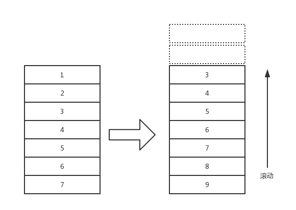
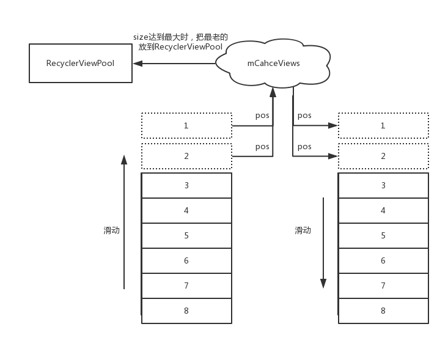

>上一篇文章分析[RecyclerView刷新机制](RecyclerView刷新机制.md)知道`LayoutManager`在布局`子View`时会向`Recycler`索要一个`ViewHolder`。但从`Recycler`中获取一个`ViewHolder`的前提是`Recycler`中要有`ViewHolder`。那`Recycler`中是如何有`ViewHolder`的呢？
>本文会分析两个问题:

1. `RecyclerView`的`View`是在什么时候放入到`Recycler`中的。以及在`Recycler`中是如何保存的。
2. `LayoutManager`在向`Recycler`获取`ViewHolder`时，`Recycler`寻找`ViewHolder`的逻辑是什么。

即`何时存、怎么存`和`何时取、怎么取`的问题。`何时取`已经很明显了:`LayoutManager`在布局`子View`时会从`Recycler`中获取`子View`。 所以本文要理清的是其他3个问题。在文章继续之前要知道`Recycler`管理的基本单元是`ViewHolder`，`LayoutManager`操作的基本单元是`View`，即`ViewHolder`的`itemview`。本文不会分析`RecyclerView`动画时`view`的复用逻辑。

为了接下来的内容更容易理解，先回顾一下`Recycler`的组成结构:


- `mChangedScrap` : 用来保存`RecyclerView`做动画时，被detach的`ViewHolder`。
- `mAttachedScrap` : 用来保存`RecyclerView`做数据刷新(`notify`)，被detach的`ViewHolder`
- `mCacheViews` : `Recycler`的一级`ViewHolder`缓存。
- `RecyclerViewPool` : `mCacheViews`集合中装满时，会放到这里。

先看一下如何从`Recycler`中取一个`ViewHolder`来复用。

# 从Recycler中获取一个ViewHolder的逻辑

`LayoutManager`会调用`Recycler.getViewForPosition(pos)`来获取一个指定位置(这个位置是子View布局所在的位置)的`view`。`getViewForPosition()`会调用`tryGetViewHolderForPositionByDeadline(position...)`, 这个方法是从`Recycler`中获取一个`View`的核心方法。它就是`如何从Recycler中获取一个ViewHolder`的逻辑，即`怎么取`, 方法太长, 我做了很多裁剪:
```
ViewHolder tryGetViewHolderForPositionByDeadline(int position, boolean dryRun, long deadlineNs) {
    ...
    if (mState.isPreLayout()) {     //动画相关
        holder = getChangedScrapViewForPosition(position);  //从缓存中拿吗？不应该不是缓存？
        fromScrapOrHiddenOrCache = holder != null;
    }
    // 1) Find by position from scrap/hidden list/cache
    if (holder == null) {
        holder = getScrapOrHiddenOrCachedHolderForPosition(position, dryRun); //从 attach 和 mCacheViews 中获取
        if (holder != null) {
            ... //校验这个holder是否可用
        }
    }
    if (holder == null) {
        ...
        final int type = mAdapter.getItemViewType(offsetPosition); //获取这个位置的数据的类型。  子Adapter复写的方法
        // 2) Find from scrap/cache via stable ids, if exists
        if (mAdapter.hasStableIds()) {    //stable id 就是标识一个viewholder的唯一性， 即使它做动画改变了位置
            holder = getScrapOrCachedViewForId(mAdapter.getItemId(offsetPosition),  //根据 stable id 从 scrap 和 mCacheViews中获取
                    type, dryRun);
            ....
        }
        if (holder == null && mViewCacheExtension != null) { // 从用户自定义的缓存集合中获取
            final View view = mViewCacheExtension
                    .getViewForPositionAndType(this, position, type);  //你返回的View要是RecyclerView.LayoutParams属性的
            if (view != null) {
                holder = getChildViewHolder(view);  //把它包装成一个ViewHolder
                ...
            }
        }
        if (holder == null) { // 从 RecyclerViewPool中获取
            holder = getRecycledViewPool().getRecycledView(type);
            ...
        }
        if (holder == null) { 
            ...
            //实在没有就会创建
            holder = mAdapter.createViewHolder(RecyclerView.this, type);
            ...
        }
    }
    ...
    boolean bound = false;
    if (mState.isPreLayout() && holder.isBound()) { //动画时不会想去调用 onBindData
        ...
    } else if (!holder.isBound() || holder.needsUpdate() || holder.isInvalid()) {
        ...
        final int offsetPosition = mAdapterHelper.findPositionOffset(position);
        bound = tryBindViewHolderByDeadline(holder, offsetPosition, position, deadlineNs);  //调用 bindData 方法
    }

    final ViewGroup.LayoutParams lp = holder.itemView.getLayoutParams();
    final LayoutParams rvLayoutParams;
    ...调整LayoutParams
    return holder;
}

```

即大致步骤是:

1. 如果执行了`RecyclerView`动画的话，尝试`根据position`从`mChangedScrap集合`中寻找一个`ViewHolder`
2. 尝试`根据position`从`scrap集合`、`hide的view集合`、`mCacheViews(一级缓存)`中寻找一个`ViewHolder` 
3. 根据`LayoutManager`的`position`更新到对应的`Adapter`的`position`。 (这两个`position`在大部分情况下都是相等的，不过在`子view删除或移动`时可能产生不对应的情况)
4. 根据`Adapter position`,调用`Adapter.getItemViewType()`来获取`ViewType`
5. 根据`stable id(用来表示ViewHolder的唯一，即使位置变化了)`从`scrap集合`和`mCacheViews(一级缓存)`中寻找一个`ViewHolder`
6. 根据`position和viewType`尝试从用户自定义的`mViewCacheExtension`中获取一个`ViewHolder`
7. 根据`ViewType`尝试从`RecyclerViewPool`中获取一个`ViewHolder`
8. 调用`mAdapter.createViewHolder()`来创建一个`ViewHolder`
9. 如果需要的话调用`mAdapter.bindViewHolder`来设置`ViewHolder`。
10. 调整`ViewHolder.itemview`的布局参数为`Recycler.LayoutPrams`，并返回Holder

虽然步骤很多，逻辑还是很简单的,即从几个缓存集合中获取`ViewHolder`，如果实在没有就创建。但比较疑惑的可能就是上述`ViewHolder缓存集合`中什么时候会保存`ViewHolder`。接下来分几个`RecyclerView`的具体情形，来一点一点弄明白这些`ViewHolder缓存集合`的问题。

## 情形一 : 由无到有

即一开始`RecyclerView`中没有任何数据，添加数据源后`adapter.notifyXXX`。状态变化如下图:


很明显在这种情形下`Recycler`中是不会存在任何可复用的`ViewHolder`。所以所有的`ViewHolder`都是新创建的。即会调用`Adapter.createViewHolder()和Adapter.bindViewHolder()`。那这些创建的`ViewHolder`会缓存起来吗？

这时候新创建的这些`ViewHolder`是不会被缓存起来的。 即在这种情形下: *Recycler只会通过Adapter创建ViewHolder,并且不会缓存这些新创建的ViewHolder*

## 情形二 : 在原有数据的情况下进行整体刷新

就是下面这种状态:


其实就是相当于用户在feed中做了下拉刷新。实现中的伪代码如下:
```
dataSource.clear()
dataSource.addAll(newList)
adapter.notifyDatasetChanged()
```

在这种情形下猜想`Recycler`肯定复用了老的卡片(卡片的类型不变)，那么问题是 : 在用户刷新时`旧ViewHolder`保存在哪里？ 如何调用`旧ViewHolder`的`Adapter.bindViewHolder()`来重新设置数据的？

其实在上一篇文章`Recycler刷新机制`中，`LinearLayoutManager`在确定好`布局锚点View`之后就会把当前`attach`在`RecyclerView`上的`子View`全部设置为`scrap状态`:

```
void onLayoutChildren(RecyclerView.Recycler recycler, RecyclerView.State state) {
    ...
    onAnchorReady(recycler, state, mAnchorInfo, firstLayoutDirection);  // RecyclerView指定锚点，要准备正式布局了
    detachAndScrapAttachedViews(recycler);   // 在开始布局时，把所有的View都设置为 scrap 状态
    ...
}
```

什么是scrap状态呢？ 在前面的文章其实已经解释过: ViewHolder被标记为`FLAG_TMP_DETACHED`状态，并且其`itemview`的`parent`被设置为`null`。

 `detachAndScrapAttachedViews`就是把所有的view保存到`Recycler`的`mAttachedScrap`集合中:

```
public void detachAndScrapAttachedViews(@NonNull Recycler recycler) {
    for (int i = getChildCount() - 1; i >= 0; i--) {
        final View v = getChildAt(i);
        scrapOrRecycleView(recycler, i, v);
    }
}
private void scrapOrRecycleView(Recycler recycler, int index, View view) {
    final ViewHolder viewHolder = getChildViewHolderInt(view);
    ...删去了一些判断逻辑
    detachViewAt(index);  //设置RecyclerView这个位置的view的parent为null， 并标记ViewHolder为FLAG_TMP_DETACHED
    recycler.scrapView(view); //添加到mAttachedScrap集合中  
    ...
}
```

**所以在这种情形下`LinearLayoutManager`在真正摆放`子View`之前，会把所有`旧的子View`按顺序保存到`Recycler`的`mAttachedScrap集合`中**

接下来继续看,`LinearLayoutManager`在布局时如何复用`mAttachedScrap集合`中的`ViewHolder`。 

前面已经说了`LinearLayoutManager`会当前布局子View的位置向`Recycler`要一个子View，即调用到`tryGetViewHolderForPositionByDeadline(position..)`。我们上面已经列出了这个方法的逻辑，其实在前面的第二步:

**尝试`根据position`从`scrap集合`、`hide的view集合`、`mCacheViews(一级缓存)`中寻找一个`ViewHolder`**

即从`mAttachedScrap`中就可以获得一个`ViewHolder`: 

```
ViewHolder getScrapOrHiddenOrCachedHolderForPosition(int position, boolean dryRun) {
    final int scrapCount = mAttachedScrap.size();
    for (int i = 0; i < scrapCount; i++) {
        final ViewHolder holder = mAttachedScrap.get(i);
        if (!holder.wasReturnedFromScrap() && holder.getLayoutPosition() == position
                && !holder.isInvalid() && (mState.mInPreLayout || !holder.isRemoved())) {
            holder.addFlags(ViewHolder.FLAG_RETURNED_FROM_SCRAP);
            return holder;
        }
    }
    ...
}
```

即如果`mAttachedScrap中holder`的位置和`入参position`相等，并且`holder`是有效的话这个`holder`就是可以复用的。所以综上所述，在情形二下所有的`ViewHolder`几乎都是复用`Recycler中mAttachedScrap集合`中的。
并且重新布局完毕后`Recycler`中是不存在可复用的`ViewHolder`的。


## 情形三 : 滚动复用

这个情形分析是在`情形二`的基础上向下滑动时`ViewHolder`的复用情况以及`Recycler`中`ViewHolder`的保存情况, 如下图:



在这种情况下滚出屏幕的View会优先保存到`mCacheViews`, 如果`mCacheViews`中保存满了，就会保存到`RecyclerViewPool`中。

在前一篇文章`RecyclerView刷新机制`中分析过，`RecyclerView`在滑动时会调用`LinearLayoutManager.fill()`方法来根据滚动的距离来向`RecyclerView`填充子View，其实在个方法在填充完子View之后就会把滚动出屏幕的View做回收:

```
int fill(RecyclerView.Recycler recycler, LayoutState layoutState,RecyclerView.State state, boolean stopOnFocusable) {
    ...
    int remainingSpace = layoutState.mAvailable + layoutState.mExtra;
    ...
    while ((layoutState.mInfinite || remainingSpace > 0) && layoutState.hasMore(state)) {
        ...
        layoutChunk(recycler, state, layoutState, layoutChunkResult); //填充一个子View

        if (layoutState.mScrollingOffset != LayoutState.SCROLLING_OFFSET_NaN) {
            layoutState.mScrollingOffset += layoutChunkResult.mConsumed;
            if (layoutState.mAvailable < 0) {
                layoutState.mScrollingOffset += layoutState.mAvailable;
            }
            recycleByLayoutState(recycler, layoutState); //根据滚动的距离来回收View
        }
    }
}
```

即`fill`每填充一个`子View`都会调用`recycleByLayoutState()`来回收一个`旧的子View`,这个方法在层层调用之后会调用到`Recycler.recycleViewHolderInternal()`。这个方法是`ViewHolder`回收的核心方法，不过逻辑很简单:

1. 检查`mCacheViews集合`中是否还有空位，如果有空位，则直接放到`mCacheViews集合`
2. 如果没有的话就把`mCacheViews集合`中最前面的`ViewHolder`拿出来放到`RecyclerViewPool`中，然后再把最新的这个ViewHolder放到`mCacheViews集合`
3. 如果没有成功缓存到`mCacheViews集合`中，就直接放到`RecyclerViewPool`

`mCacheViews集合`为什么要这样缓存? 看一下下面这张图 :



我是这样认为的，如上图，往上滑动一段距离，被滑动出去的`ViewHolder`会被缓存在`mCacheViews集合`,并且位置是被记录的。如果用户此时再下滑的话，可以参考文章开头的`从Recycler`中获取ViewHolder的逻辑:

1. 先按照位置从`mCacheViews集合`中获取
2. 按照`viewType`从`mCacheViews集合`中获取

上面对于`mCacheViews集合`两步操作，其实第一步就已经命中了缓存的`ViewHolder`。并且这时候都不需要调用`Adapter.bindViewHolder()`方法的。即是十分高效的。

**所以在普通的滚动复用的情况下，`ViewHolder`的复用主要来自于`mCacheViews集合`, 旧的`ViewHolder`会被放到`mCacheViews集合`, `mCacheViews集合`挤出来的更老的`ViewHolder`放到了`RecyclerViewPool`中**


到这里基本的复用情形都覆盖了，其他的就涉及到`RecyclerView动画`了。这些点在下一篇文章继续看。

>欢迎关注我的[Android进阶计划](https://github.com/SusionSuc/AdvancedAndroid)。看更多干货


