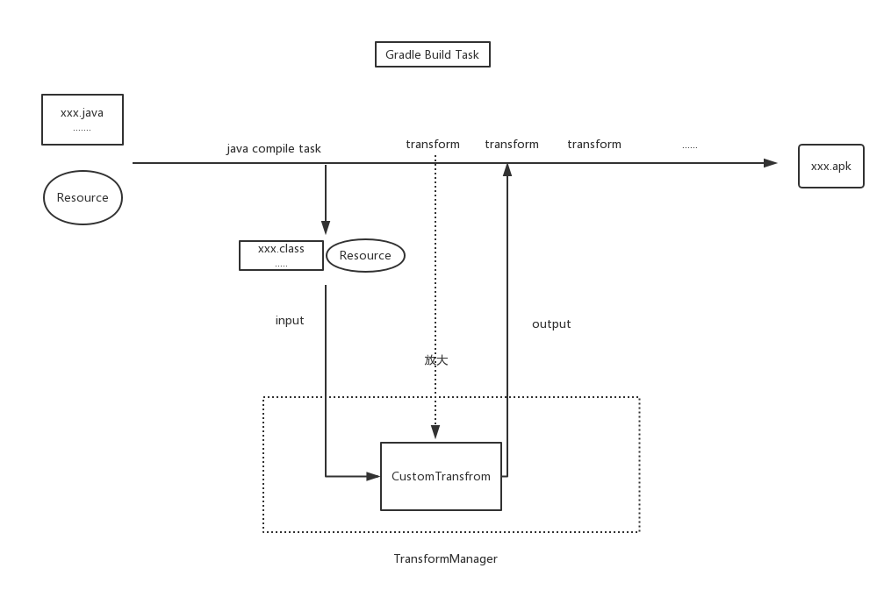

>文章来源自作者的Android进阶计划(https://github.com/SusionSuc/AdvancedAndroid)

在前面学习`WMRouter`和`ARouter`时都涉及到了`Transform API`。他们都利用`Transform`在编译生成class文件之后和生成dex文件之前来做一些事情，本文就具体了解一下`Gradle Transform API`。

# 什么是Transform

官方API文档: http://google.github.io/android-gradle-dsl/javadoc/2.1/com/android/build/api/transform/Transform.html

我们编译Android项目时，如果我们想拿到编译时产生的Class文件，并在生成Dex之前做一些处理，我们可以通过编写一个`Transform`来接收这些输入(编译产生的Class文件),并向已经产生的输入中添加一些东西。

我们可以通过Gradle插件来注册我们编写的`Transform`。注册后的`Transform`会被Gradle包装成一个`Gradle Task`，这个TransForm Task会在`java compile Task`执行完毕后运行。

对于编写`Transform`的API, 我们可以通过引入下面这个依赖来使用:

```
compile 'com.android.tools.build:gradle:2.3.3'  //版本应该在 2.x以上
```

先大致看一下`Transform`的执行流程图:



## Transform的使用场景

一般我们使用`Transform`会有下面两种场景

1. 我们需要对编译class文件做自定义的处理。
2. 我们需要读取编译产生的class文件，做一些其他事情，但是不需要修改它。

接下来我们就来看一下这些`Transform API`吧 :

## Transform API学习

我们编写一个自定义的transform需要继承`Transform`,它是一个抽象类, 我们这里先看一下`Transform`的抽象方法:

public abstract class Transform {
    public abstract String getName();

    public abstract Set<ContentType> getInputTypes();

    public abstract Set<? super Scope> getScopes();

    public abstract boolean isIncremental(); // 是否支持增量编译
}

`getName()`就是指定自定义的`Transform`的名字。


## 输入的类型

`Set<ContentType> getInputTypes()`是指明你自定义的这个`Transform`处理的输入类型，输入类型共有以下几种:

```
  enum DefaultContentType implements ContentType {
        /**
         * The content is compiled Java code. This can be in a Jar file or in a folder. If
         * in a folder, it is expected to in sub-folders matching package names.
         */
        CLASSES(0x01),

        /**
         * The content is standard Java resources.
         */
        RESOURCES(0x02);
    }
```

即分为class文件或者java资源。class文件来自于jar或者文件夹。资源就是标准的java资源。

## 输入文件所属的范围 Scope

`getScopes()`用来指明自定的`Transform`的输入文件所属的范围, 这是因为gradle是支持多工程编译的。总共有以下几种:

```
    /**
     * This indicates what the content represents, so that Transforms can apply to only part(s)
     * of the classes or resources that the build manipulates.
     */
    enum Scope implements ScopeType {
        /** Only the project content */
        PROJECT(0x01), //只是当前工程的代码
        /** Only the project's local dependencies (local jars) */
        PROJECT_LOCAL_DEPS(0x02), // 工程的本地jar
        /** Only the sub-projects. */
        SUB_PROJECTS(0x04),  // 只包含子工工程
        /** Only the sub-projects's local dependencies (local jars). */
        SUB_PROJECTS_LOCAL_DEPS(0x08),
        /** Only the external libraries */
        EXTERNAL_LIBRARIES(0x10),
        /** Code that is being tested by the current variant, including dependencies */
        TESTED_CODE(0x20),
        /** Local or remote dependencies that are provided-only */
        PROVIDED_ONLY(0x40);
    }
```

对于`getScopes()`的返回，其实`TransformManager`已经为我们定义了一些，比如:

```
    public static final Set<Scope> SCOPE_FULL_PROJECT = Sets.immutableEnumSet(
            Scope.PROJECT, Scope.PROJECT_LOCAL_DEPS, Scope.SUB_PROJECTS, Scope.SUB_PROJECTS_LOCAL_DEPS, Scope.EXTERNAL_LIBRARIES);
```

如果一个Transform不想处理任何输入，只是想查看输入的内容,那么只需在`getScopes()`返回一个空集合，在`getReferencedScopes()`返回想要接收的范围。

```
    public Set<? super Scope> getReferencedScopes() {
        return ImmutableSet.of();
    }
```

## transform()

它是`Transform`的关键方法:

```
  public void transform(@NonNull TransformInvocation transformInvocation) {}
```
它是一个空实现，`input`的内容将会打包成一个`TransformInvocation`对象，因为我们要想使用`input`,我们需要详细了解一下`TransformInvocation`参数。

### TransformInvocation

我们看一下这个类相关的API:

```
public interface TransformInvocation {

    Collection<TransformInput> getInputs(); // 输入作为 TransformInput 返回

    TransformOutputProvider getOutputProvider(); //TransformOutputProvider 可以用来创建输出内容

    boolean isIncremental();
}

public interface TransformInput {
    Collection<JarInput> getJarInputs();
    Collection<DirectoryInput> getDirectoryInputs();
}

public interface JarInput extends QualifiedContent {

    File getFile(); //jar文件

    Set<ContentType> getContentTypes(); // 是class还是resource

    Set<? super Scope> getScopes();  //属于Scope：
}

DirectoryInput与JarInput定义基本相同。

public interface TransformOutputProvider {
    //根据 name、ContentType、QualifiedContent.Scope返回对应的文件( jar / directory)
    File getContentLocation(String name, Set<QualifiedContent.ContentType> types, Set<? super QualifiedContent.Scope> scopes, Format format);
}
```

即我们可以通过`TransformInvocation`来获取输入,同时也获得了输出的功能。举个例子，

```
    public void transform(TransformInvocation invocation) {
        for (TransformInput input : invocation.getInputs()) {
            input.getJarInputs().parallelStream().forEach(jarInput -> {
            File src = jarInput.getFile();
            JarFile jarFile = new JarFile(file);
            Enumeration<JarEntry> entries = jarFile.entries();
            while (entries.hasMoreElements()) {
                JarEntry entry = entries.nextElement();
                //处理
            }
        }
    }
```

上面这段代码就是获取jar的输入，然后遍历每一个jar做一些自定义的处理。

我们在做完自定义的处理后，如果想自己输出一些东西怎么办？ 比如一个class文件,就可以通过`TransformOutputProvider`来完成。比如下面这段代码:

```
    File dest = invocation.getOutputProvider().getContentLocation("susion", TransformManager.CONTENT_CLASS, ImmutableSet.of(QualifiedContent.Scope.PROJECT), Format.DIRECTORY;
```

这段代码就是在本工程(`ImmutableSet.of(QualifiedContent.Scope.PROJECT)`)下产生一个目录(`Format.DIRECTORY`), 目录的名字是(`susion`),里面的内容是`TransformManager.CONTENT_CLASS`。

创建这个文件夹后，我们就可以向其中写入一些内容，比如class文件。

## 注册Transform

我们在了解`transform api`后，我们可以编写一个自定义的`Transform`。但是我们编写的这个`Transform`,如何在构建过程中生效呢？我们需要注册它

在自定义插件中注册它,然后在`build.gradle`中`apply`就可以了。

```
//MyCustomPlgin.groovy
public class MyCustomPlgin implements Plugin<Project> {

    @Override
    public void apply(Project project) {
        project.getExtensions().findByType(BaseExtension.class)
                .registerTransform(new MyCustomTransform());
    }
}
```

其实如果你包含了你编写的transform库，我们也可以直接在`build.gradle`中注册:

```
//在build.gradle中也是可以直接编写 groovy代码的。
project.extensions.findByType(BaseExtension.class).registerTransform(new MyCustomTransform());
```


## End

好，有关transform的基本使用都已经了解完毕。


