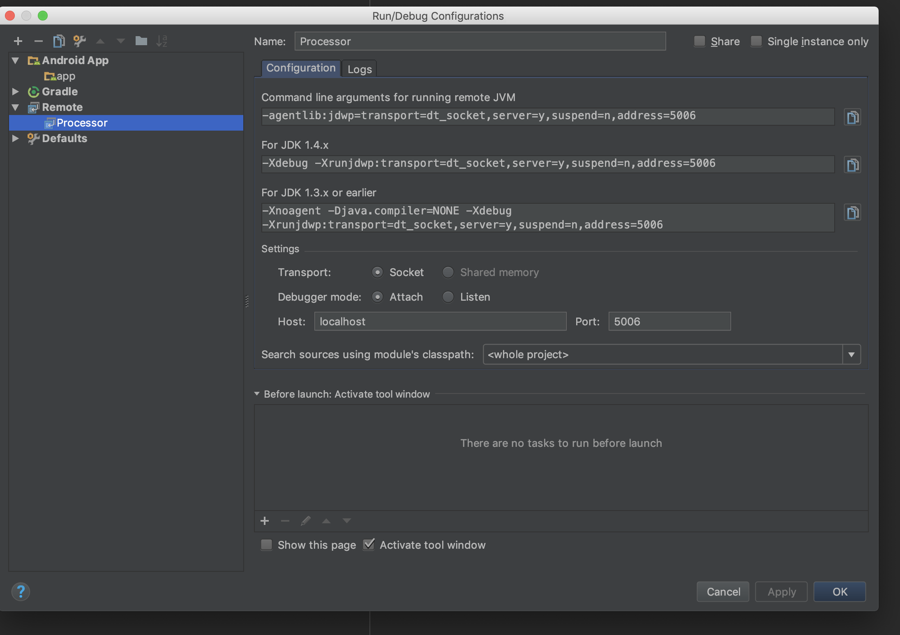

## 实战库ImplLoader介绍

当一个Android工程中如果已经使用不同的module来做业务隔离。那我们就可能有这种需求，module1想实例化一个module2的类,一般要怎么解决呢？

- `module1`依赖`module2`
-  把`module2`的这个类沉到底层库，然后`module1`和`module2`都使用这个底层库。
- ....等


下面来介绍一个库小库 : `ImplLoader`。可以很方便解决这个问题。只需这样使用即可:

1. 使用`@Impl`标记需要被加载的类
```
//`module2`中的类:
@Impl(name = "module2_text_view")
public class CommonView extends AppCompatTextView {

}
```

2. 使用 `ImplLoader.getImpl("module2_text_view")` 来获取这个类
```
public class Module1Page extends LinearLayout {
    public Module1Page(@NonNull Context context) {
        super(context);
        init();
    }

    private void init() {
        //根据name，获取需要加载的类
        View module1Tv = ImplLoader.getView(getContext(), "module2_text_view");
        addView(module1Tv);
    }
}
```

3. 初始化`ImplLoader`
```
    ImplLoader.init()
```


库的代码放在: https://github.com/SusionSuc/ImplLoader

## 为什么要写这个库 ?

*主要是为了练手* 

在阅读`WMRouter`和`ARouter`源码时发现这两个库都用到了`自定义注解`、`自定义gradle插件`、`Gradle Transfrom API`、`javapoet和asm库`。而我对于这些知识很多我只是了解个大概，或者压根就没听说过。
因此`ImplLoader`这个库主要是用来熟悉这个知识的。当然这个库的实现思路主要参考`WMRouter`和`ARouter`。

## 库的实现原理

用下面这种图概括一下: 


其实整个库代码并不多，不过实现起来用到的东西不少，如果一些你使用的不熟悉，可以先看一下:

>https://github.com/SusionSuc/AdvancedAndroid

这个库是用来总结我这两年Android所学和对自我提高的一个库。里面的文章我写的很用心，会一直频繁更新。

下面简单过一下`ImplLoader`的实现代码（只看主流程）:

### 定义`@Impl`注解

```
@Retention(RetentionPolicy.RUNTIME)
public @interface Impl {
    String name() default "";
}
```

### 编译时注解处理器`ImplAnnotationProcessor`, 扫描`@Impl`,并生成`ImplInfo_XXX.java`

```
    //ImplAnnotationProcessor.process()
    @Override
    public boolean process(Set<? extends TypeElement> annotations, RoundEnvironment roundEnv) {
        .....
        HashMap<String, ImplAnnotationInfo> implMap = new HashMap<>(); //用来保存扫描到的注解信息
        for (Element implElement : roundEnv.getElementsAnnotatedWith(Impl.class)) {
            ImplAnnotationInfo implAnnotationInfo = getImplAnnotationInfo((TypeElement) implElement);
            implMap.put(implAnnotationInfo.name, implAnnotationInfo);
        }

        //生成 ImplInfo_xxx.java
        new ImplClassProtocolGenerate(elementsUitls, filer).generateImplProtocolClass(implMap);

        return true;
    }

    //生成 ImplInfo_xxx.java
    void generateImplProtocolClass(HashMap<String, ImplAnnotationInfo> implMap) {
        TypeSpec.Builder implInfoSpec = getImplInfoSpec();
        MethodSpec.Builder implInfoMethodSpec = getImplInfoMethodSpec();
        for (String implName : implMap.keySet()) {
            CodeBlock registerBlock = getImplInfoInitCode(implMap.get(implName));
            implInfoMethodSpec.addCode(registerBlock);
        }
        implProtocolSpec.addMethod(implInfoMethodSpec.build());
        writeImplProtocolCode(implInfoSpec.build());
    }
```

### `Gradle Transfrom`扫描生成的`ImplInfo_XXX.java`文件，并生成`ImplLoaderHelp.class`
```
    //ImplLoaderTransform.java
    @Override
    public void transform(TransformInvocation transformInvocation) throws TransformException, InterruptedException, IOException {
        Set<String> implInfoClasses = new HashSet<>();
        for (TransformInput input : transformInvocation.getInputs()) {
            input.getJarInputs().forEach(jarInput -> {
                try {
                    File jarFile = jarInput.getFile();
                    File dst = transformInvocation.getOutputProvider().getContentLocation(
                            jarInput.getName(), jarInput.getContentTypes(), jarInput.getScopes(),
                            Format.JAR);
                    implInfoClasses.addAll(InsertImplInfoCode.getImplInfoClassesFromJar(jarFile));
                    FileUtils.copyFile(jarFile, dst);   //必须要把输入，copy到输出，不然接下来没有办法处理
                } catch (IOException e) {
                }
            });

            input.getDirectoryInputs().forEach(directoryInput -> {
                //......
            });
        }

        File dest = transformInvocation.getOutputProvider().getContentLocation(
                "ImplLoader", TransformManager.CONTENT_CLASS,
                ImmutableSet.of(QualifiedContent.Scope.PROJECT), Format.DIRECTORY);

        InsertImplInfoCode.insertImplInfoInitMethod(implInfoClasses, dest.getAbsolutePath());
    }


     // 新产生一个类
    public static void insertImplInfoInitMethod(Set<String> implInfoClasses, String outputDirPath) {
        .....
        ClassWriter writer = new ClassWriter(ClassWriter.COMPUTE_FRAMES | ClassWriter.COMPUTE_MAXS);
        ClassVisitor cv = new ClassVisitor(Opcodes.ASM5, writer) {};
        String className = ProtocolConstants.IMPL_LOADER_HELP_CLASS.replace('.', '/');
        cv.visit(50, Opcodes.ACC_PUBLIC, className, null, "java/lang/Object", null);
        MethodVisitor mv = cv.visitMethod(Opcodes.ACC_PUBLIC | Opcodes.ACC_STATIC,ProtocolConstants.IMPL_LOADER_HELP_INIT_METHOD, "()V", null, null);
        mv.visitCode();

        for (String clazz : implInfoClasses) {
            mv.visitMethodInsn(Opcodes.INVOKESTATIC, clazz.replace('.', '/'),
                    ProtocolConstants.IMPL_INFO_CLASS_INIT_METHOD,
                    "()V",
                    false);
        }
        mv.visitMaxs(0, 0);
        mv.visitInsn(Opcodes.RETURN);
        mv.visitEnd();
        cv.visitEnd();
        File dest = new File(outputDirPath, className + SdkConstants.DOT_CLASS);
        dest.getParentFile().mkdirs();
        new FileOutputStream(dest).write(writer.toByteArray());
    }
```

### 运行时反射实例化`ImplLoaderHelp.class`，并调用`init`方法，来加载`@Impl`注册的类

```
object ImplLoader {

    //保存 @Impl注册的类
    private val implMap = HashMap<String, Class<*>>()

    @JvmStatic
    fun init() {
        try {
            Class.forName(ProtocolConstants.IMPL_LOADER_HELP_CLASS)
                    .getMethod(ProtocolConstants.IMPL_LOADER_HELP_INIT_METHOD)
                    .invoke(null)
        } catch (e: Exception) {}
    }

    //在生成的 ImplInfo_XX.java文件中会调用
    fun registerImpl(implName: String, implClass: Class<*>) {
        implMap.put(implName, implClass)
    }

    ... 获取实例相关方法....
}
```

## 实现过程中遇到的一些问题

### 注解处理器库的创建

整个项目我是建了一个`AndroidProject`。因为注解库只会在编译的时候用到，因此我单独建了一个`Android Library`库，用来存放注解处理相关代码。可是在写的时候，发现找不到`javax.annotation`下注解相关类。后来发现原因是新建的`Android Library`是不会包含这写库的，需要新建一个`Java Library`

### 如何调试注解处理器 和 Gradle Transfrom

注解处理器代码编写完了？怎么调试呢？ 具体参考 : https://blog.csdn.net/jeasonlzy/article/details/74273851 这篇文章，我把如何调试注解处理器这段搬过来:

1. 在项目根目录下的gradle.properties中添加如下两行配置

```
org.gradle.daemon=true //记得把创建项目自动创建写的那个注释掉
org.gradle.jvmargs=-agentlib:jdwp=transport=dt_socket,server=y,suspend=n,address=5006
```

2. 打开运行配置，添加一个远程调试如下， 其中name可以任意取，port端口号就是上面一步指定的端口号。



3. 切换运行配置到切换刚刚创建的processor，然后点击debug按钮


4. 最后，在我们需要调试的地方打上断点，然后再次点击编译按钮（小锤子按钮），即可进入断点

*上面这4步也适用于调试Gradle Transform*

### 上传自定义的 Gradle Transform插件到本地目录然后引用

编写完成`Gradle Transform Plugin`之后我怎么使用了？上传到`maven`然后依赖？ 不太现实，因为我要一直调试。最后决定这样解决:

1. 把插件上传到工程下的一个目录(作为maven仓库)

```
apply plugin : 'maven'

group 'com.susion.loaderplugin'
version '0.0.1'

uploadArchives {
    repositories {
        flatDir {
            name "../localRepo"
            dir "../localRepo/libs"
        }
    }
}
```


2. 在主工程的`build.gradle`引入本地maven库

```
buildscript {
    repositories {
        flatDir {
            name 'localRepo'
            dir "localRepo/libs/implloader"
        }   
    }
    dependencies {
        classpath 'com.susion.loaderplugin:loaderplugin:0.0.1'
    }
}
```

3. 在demo引入插件

```
apply plugin: 'com.susion.loaderplugin'
```

经过这样操作后，整个插件开发将会非常方便。

### 支持kotlin

对于java文件，如果要处理其中的注解，我们可以这样引入我们的注解处理器:

```
    annotationProcessor project(":compiler")
```

但是当我在module中创建了一个`kotlin`文件，并标记`@Impl`后我发现。我自定义的注解处理器并不能扫描到`kotlin`文件上的注解。如果想要让注解处理器在kotlin文件上生效需要对带有kotlin代码的工程，加上kotlin的注解处理插件:

```
apply plugin: 'kotlin-kapt'  //引入 kotlin kapt

dependencies {
    .....
    kapt project(':compiler')
}
```

### 库的上传

决定将库上传到`maven`，但因为`ImplLoader`的实现涉及到4个库 `loaderplugin`、`loadercore`、`annotation-interface`和`compiler`。因此想要使用一个统一的脚本来上传这4个库到`binary`

首先在主项目的`build.gradle`中引入`binary`插件依赖
```
buildscript {
    repositories {
        jcenter()
        mavenCentral()
    }
    dependencies {  
        .....
        classpath 'com.github.dcendents:android-maven-gradle-plugin:latest.release'
        classpath 'com.jfrog.bintray.gradle:gradle-bintray-plugin:1.6'

    }
}
```

使用下面这个脚本统一做上传:

```
apply plugin: 'com.github.dcendents.android-maven'
apply plugin: 'com.jfrog.bintray'

group = "com.susion.implloader"
version = "1.0.0"

//一些敏感的信息放在 local.properties 中
def getPropertyFromLocalProperties(key) {
    File file = project.rootProject.file('local.properties')
    if (file.exists()) {
        Properties properties = new Properties()
        properties.load(file.newDataInputStream())
        return properties.getProperty(key)
    }
}

bintray {
    user = getPropertyFromLocalProperties("bintray.user")  
    key = getPropertyFromLocalProperties("bintray.apikey")
    configurations = ['archives']
    pkg {
        repo = 'maven'
        name = "${project.group}:${project.name}"
        userOrg = "${project.name}"
        licenses = ['Apache-2.0']
        websiteUrl = 'https://github.com/SusionSuc'
        vcsUrl = ''
        publish = true
    }
}
```

即每个库的 artifactedId为:`project.name`。

最后在对于的module中使用这个脚本即可。

还有一些小问题这里先不讲述了。欢迎关注我的 : https://github.com/SusionSuc/AdvancedAndroid
