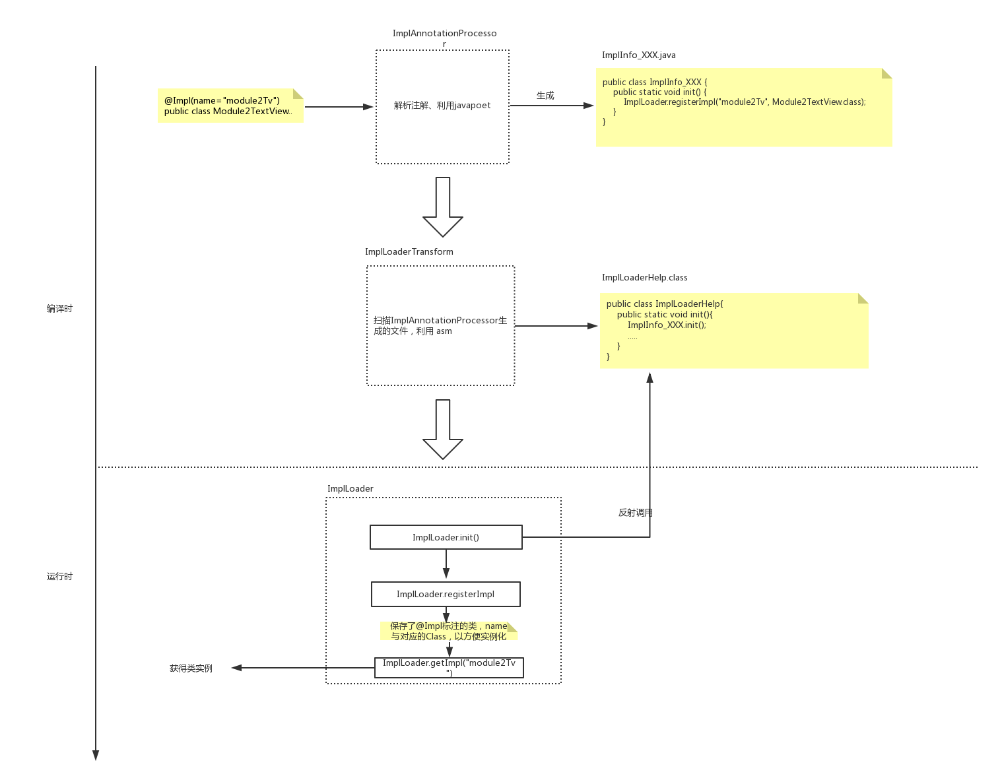

## ImplLoader介绍

当一个Android工程中如果已经使用不同的module来做工程隔离。那我们就可能有这种需求，module1想实例化一个module2的类,一般要怎么解决呢？

1. `module1`依赖`module2`
2. 把`module2`的这个类沉到底层库，然后`module1`和`module2`都使用这个底层库。
3. ....等


下面来介绍一个库`ImplLoader` : https://github.com/SusionSuc/ImplLoader, 可以很方便解决这个问题。只需这样使用即可:

1. 使用`@Impl`标记需要被加载的类
```
//`module2`中的类:
@Impl(name = "module2__text_view")
public class CommonView extends AppCompatTextView {

}
```

2. 使用 `ImplLoader.getImpl("module2__text_view")` 来获取这个类
```
public class Module1Page extends LinearLayout {
    public Module1Page(@NonNull Context context) {
        super(context);
        init();
    }

    private void init() {
        //根据name，获取需要加载的类
        View module1Tv = ImplLoader.getView(getContext(), "common_view");
        addView(module1Tv);
    }
}
```

3. 初始化`ImplLoader`
```
    ImplLoader.init()
```

## 为什么要写这个库 ?

*主要是为了练手* 

在阅读`WMRouter`和`ARouter`源码时发现这两个库都用到了`自定义注解`、`自定义gradle插件`、`Gradle Transfrom API`、`javapoet和asm库`。而我对于这些知识很多我只是了解个大概，或者压根就没听说过。
因此`ImplLoader`这个库主要是用来熟悉这个知识的。当然这个库的实现思路是参考`WMRouter`和`ARouter`的。

## 库的实现原理

用下面这种图概括一下: 



其实整个库代码并不多，不过实现起来用到的东西不少，如果一些你使用的不熟悉，可以先看一下:

>https://github.com/SusionSuc/AdvancedAndroid

这个库是我用来记录一些我学习的Android的一些知识的文章，里面的文章我写的很用心，会一直频繁更新。


下面简单过一下`ImplLoader`的实现代码:

### 定义`@Impl`注解

```
 */
@Retention(RetentionPolicy.RUNTIME)
public @interface Impl {
    String name() default "";
}
```

### 编译编译时注解处理器,扫描`@Impl`,并生成`ImplInfo_XXX.java`

```
    //直接贴 `process`方法
    @Override
    public boolean process(Set<? extends TypeElement> annotations, RoundEnvironment roundEnv) {

        if (annotations == null || annotations.isEmpty()) {
            return false;
        }

        informMsg("注解处理器运行.......................................");

        HashMap<String, ImplAnnotationInfo> implMap = new HashMap<>();

        for (Element implElement : roundEnv.getElementsAnnotatedWith(Impl.class)) {

            if (implElement.getKind() != ElementKind.CLASS) {
                informError(implElement, "@Impl 只能注解在类上！注解失效！");
                continue;
            }

            ImplAnnotationInfo implAnnotationInfo = getImplAnnotationInfo((TypeElement) implElement);

            if (implAnnotationInfo == null) continue;

            implMap.put(implAnnotationInfo.name, implAnnotationInfo);
        }

        new ImplClassProtocolGenerate(elementsUitls, filer).generateImplProtocolClass(implMap);

        informMsg("注解处理器运行结束.......................................");

        return true;
    }
```

