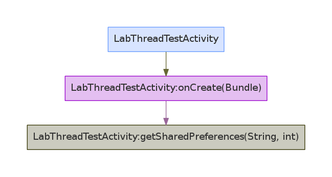

>本文继续分析[booster](https://github.com/didi/booster)的实现原理。

#  多线程优化 [booster-transform-thread](https://github.com/didi/booster/tree/master/booster-transform-thread)

对于这个组件官方是这样描述的: **对于开发者来说，线程管理一直是个头疼的问题，特别是第三方 SDK 中的线程，过多的线程可能会导致内存不足，然而幸运的是，这些问题都能通过 Booster 来解决。**

那booster是如何解决的呢? 其实实现思路类似上一篇文章[booster分析-修复系统bug](booster分析-修复系统bug.md)。即通过`gradle transform`在编译时做字节码插桩,来实现代码的动态替换(整个booster框架大部分功能的实现都是这个原理)。

那么来看一下`booster`到底如何优化了多线程管理吧。

## 给线程设置名称，便于代码追踪和bug修复

一般一个比较成熟的应用在运行时后台都会有很多线程在跑，为了便于线程的管理。 booster在编译时强制给应用程序运行时的线程(不论是自己开启的还是三方库开启的)都**起了一个名字**。这样无论是bug的定位，还是线程的调试都方便了不少。

**`booster` 在编译时通过修改字节码文件动态给`HandlerThread`、`Timer`、`AsyncTask`、`Thread`、`ThreadPoolExecutor`等开启的线程都起了名字。**

比如，所有的`Thread`在`start()`之前:

>ThreadTransformer.java
```
private fun MethodInsnNode.transformInvokeVirtual(context: TransformContext, klass: ClassNode, method: MethodNode) {
    if (context.klassPool.get("java/lang/Thread").isAssignableFrom(this.owner)) {
        when ("${this.name}${this.desc}") {
            "start()V" -> {
                method.instructions.insertBefore(this, LdcInsnNode(makeThreadName(klass.className)))
                method.instructions.insertBefore(this, MethodInsnNode(Opcodes.INVOKESTATIC, SHADOW_THREAD, "setThreadName", "(Ljava/lang/Thread;Ljava/lang/String;)Ljava/lang/Thread;", false))
        
            }
        }
    }
}
```

即在`Thread.start()`之前调用了`ShadowThread.setThreadName()`:

```
public class ShadowThread {
     public static Thread setThreadName(final Thread t, final String prefix) {
        t.setName(makeThreadName(t.getName(), prefix));
        return t;
    }

    public static String makeThreadName(final String name, final String prefix) {
        return name == null ? prefix : (name.startsWith(MARK) ? name : (prefix + "#" + name));
    }

}
```

举个例子:

```
class ThreadTest {

    private val TAG = "Booster-Thread"

    fun test(){
       Thread({
            Log.d(TAG, "thread name : ${Thread.currentThread().name}")
        }).start()

    }
}
```

上面代码经过`booster`优化后log输入的线程名为:

```
D/Booster-Thread: thread name : ​com.susion.boostertest.thread.ThreadTest
```

即线程的名字改为 : **包+类名**, 而没有优化前名称是:

```
D/Booster-Thread: thread name : Thread-2
```

经过`booster`优化后确实更容易识别线程了。  **我们写多线程代码时还是给线程起个规范点的名字比较好**

## 设置线程池的 `allowCoreThreadTimeOut(true)`

先来回顾一下线程池的构造函数:

```
public ThreadPoolExecutor(int corePoolSize,
                              int maximumPoolSize,
                              long keepAliveTime,
                              TimeUnit unit,
                              BlockingQueue<Runnable> workQueue)
```

`keepAliveTime参数`是用来设置线程的超时时长，当线程的闲置时长超过这个时间时线程就会被回收，但是这个策略并不会应用在核心线程上。

**但当对线程池设置`allowCoreThreadTimeOut(true)`时，核心线程也会被回收退出。**

`booster`通过对字节码的动态替换，对应用中所有的线程池都设置了`allowCoreThreadTimeOut(true)`, 这样可以保证线程资源及时回收, 比如:

>ThreadTransformer.java
```
private fun MethodInsnNode.transformInvokeStatic(context: TransformContext, klass: ClassNode, method: MethodNode) {
    when (this.owner) {
        "java/util/concurrent/Executors" -> {
            when (this.name) {
                "newCachedThreadPool",
                "newFixedThreadPool",
                "newSingleThreadExecutor",
                "newSingleThreadScheduledExecutor",
                "newScheduledThreadPool" -> {
                    val r = this.desc.lastIndexOf(')')
                    val name = this.name.replace("new", "newOptimized")
                    val desc = "${this.desc.substring(0, r)}Ljava/lang/String;${this.desc.substring(r)}"

                    this.owner = “com/didiglobal/booster/instrument/ShadowExecutors”
                    this.name = name
                    this.desc = desc
                    method.instructions.insertBefore(this, LdcInsnNode(makeThreadName(klass.className)))
                }
            }
        }
    }
}
```

即将`Executors.newCachedThreadPool()`等方法都替换为`ShadowExecutors.newOptimizedXXX`方法:

>ShadowExecutors.java
```
public static ExecutorService newOptimizedCachedThreadPool() {
    final ThreadPoolExecutor executor = new ThreadPoolExecutor(0, Integer.MAX_VALUE, 60L, TimeUnit.SECONDS, new SynchronousQueue<Runnable>(), Executors.defaultThreadFactory());
    executor.allowCoreThreadTimeOut(true);
    return executor;
}
```

# 性能瓶颈检测 booster-transform-lint

这个组件通过编译时的lint检查来找出一些在应用中调用可能阻塞UI线程的API,如：I/O API 等。主要有两个特点:

1. 支持自定义检查API列表。
2. 对于查找到的有问题的API可以产生一张调用图便于查看与定位。

## 实现原理

### 指定检查方法

首先指定一些受检查的方法:

>LintTransformer.java
```
class LintTransformer : ClassTransformer {

    override fun onPreTransform(context: TransformContext) {
        ...
        val parser = SAXParserFactory.newInstance().newSAXParser()
        context.artifacts.get(ArtifactManager.MERGED_MANIFESTS).forEach { manifest ->
            val handler = ComponentHandler()
            parser.parse(manifest, handler)
            // Attach component entry points to graph ROOT
            mapOf(
                Pair(handler.applications, APPLICATION_ENTRY_POINTS),
                Pair(handler.activities, ACTIVITY_ENTRY_POINTS),
                Pair(handler.services, SERVICE_ENTRY_POINTS),
                Pair(handler.receivers, RECEIVER_ENTRY_POINTS),
                Pair(handler.providers, PROVIDER_ENTRY_POINTS)
            ).forEach { components, entryPoints ->
                components.forEach { component ->
                    entryPoints.map {
                        CallGraph.Node(component.replace('.', '/'), it.name, it.desc)
                    }.forEach {
                        globalBuilder.addEdge(CallGraph.ROOT, it) // 所有的分析点
                    }
                }
            }
        }
    }
}
```

它检查的方法有:

>constant.kt
```
/**
 * Main/UI thread entry point of Application
 */
internal val APPLICATION_ENTRY_POINTS = arrayOf(
        "onConfigurationChanged(Landroid/content/res/Configuration;)V",
        "onCreate()V",
        "onLowMemory()V",
        "onTerminate()V",
        "onTrimMemory(I)V"
).map(EntryPoint.Companion::valueOf).toSet()

/**
 * Main/UI thread entry point of Activity
 */
internal val ACTIVITY_ENTRY_POINTS = arrayOf(
        // <editor-fold desc="public methods of Activity">
        "onActionModeFinished(Landroid/view/ActionMode;)V",
        "onActionModeStarted(Landroid/view/ActionMode;)V",
        "onActivityReenter(ILandroid/content/Intent;)V",
        "onAttachFragment(Landroid/app/Fragment;)V",
        "onAttachedToWindow()V",
....
```

即`Aplication/Activity/Service/BroadcastReceiver/ContentProvider`等相关API。

### 根据定义好的lint API列表来检查有没有调用敏感的API

```
  override fun onPostTransform(context: TransformContext) {
        val graph = globalBuilder.build()
        ...
        // Analyse global call graph and separate each chain to individual graph
        graph[CallGraph.ROOT].forEach { node ->
            graph.analyse(context, node, listOf(CallGraph.ROOT, node), lints) { chain ->
                val builder = graphBuilders.getOrPut(node.type) {
                    CallGraph.Builder().setTitle(node.type.replace('/', '.'))
                }
                chain.toEdges().forEach { edge ->
                    builder.addEdges(edge)
                }
            }
        }
  }
```

`analyse()`用来检查当前API是否命中了Lint检查列表。如果命中就会加入到dot文件绘图节点中。

`booster`默认定义的敏感API有:

```
/**
 * Sensitive APIs
 */
internal val LINT_APIS = setOf(
        ...
        "android/graphics/BitmapFactory.decodeFile(Ljava/lang/String;)Landroid/graphics/Bitmap;",
        "android/graphics/BitmapFactory.decodeFileDescriptor(Ljava/io/FileDescriptor;)Landroid/graphics/Bitmap;",
        "android/graphics/BitmapFactory.decodeFileDescriptor(Ljava/io/FileDescriptor;Landroid/graphics/Rect;Landroid/graphics/BitmapFactory\$Options;)Landroid/graphics/Bitmap;",
        "android/graphics/BitmapFactory.decodeResource(Landroid/content/res/Resources;I)Landroid/graphics/Bitmap;",
        "android/graphics/BitmapFactory.decodeResource(Landroid/content/res/Resources;ILandroid/graphics/BitmapFactory\$Options;)Landroid/graphics/Bitmap;",
        "android/graphics/BitmapFactory.decodeResourceStream(Landroid/content/res/Resources;Landroid/util/TypedValue;Ljava/io/InputStream;Landroid/graphics/Rect;Landroid/graphics/BitmapFactory\$Options;)Landroid/graphics/Bitmap;",
        "android/graphics/BitmapFactory.decodeStream(Ljava/io/InputStream;)Landroid/graphics/Bitmap;",
        "android/graphics/BitmapFactory.decodeStream(Ljava/io/InputStream;Landroid/graphics/Rect;Landroid/graphics/BitmapFactory\$Options;)Landroid/graphics/Bitmap;"
        // </editor-fold>
).map(Node.Companion::valueOf).toSet()
```
即主要是一些可能导致主线程卡顿的API。

## 检测Demo

比如有下面这个类:

```
class LabThreadTestActivity : AppCompatActivity() {

    override fun onCreate(savedInstanceState: Bundle?) {
        super.onCreate(savedInstanceState)
        setContentView(R.layout.activity_lab_thread_test)

        val test1 = getSharedPreferences("default", Context.MODE_PRIVATE).edit().putBoolean("test",true).commit()
//        val test2 = getSharedPreferences("default", Context.MODE_PRIVATE).edit().putBoolean("test",true).apply()
    }
}
```

经过`booster-transform-lint`检查后会生成`com.susion.boostertest.thread.LabThreadTestActivity.dot`文件。这个文件转为png图片如下:




更多分享见[AdvancedAndroid](https://github.com/SusionSuc/AdvancedAndroid)


