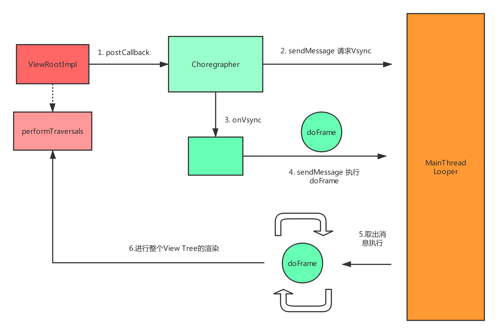
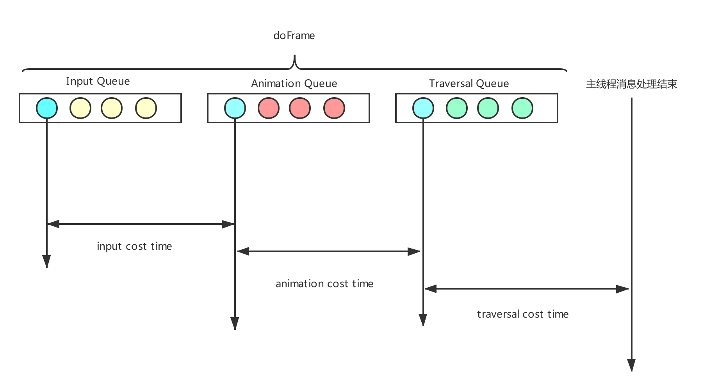

- [监控主线程的消息循环](#监控主线程的消息循环)
- [Choreographer与主线程Looper-MessageQueue的关联](#choreographer与主线程looper-messagequeue的关联)
- [利用Choreographer监听应用FPS](#利用choreographer监听应用fps)
- [FPS计算](#fps计算)
- [总结](#总结)


流畅度是页面在滑动、渲染等过程中的体验, Android系统要求每一帧都要在16.67ms内绘制完成, 即每秒绘制60帧(大部分手机的刷新频率都在60Hz)。本文所说的应用的流畅度监控就是指监控应用每秒刷新的帧率(FPS)。

在Andorid中监控FPS一般使用`Choreographer`来实现,`Choreographer`主要是用来协调动画、输入和绘制事件运行的,它通过接收`Vsync`信号来调度应用下一帧渲染时的动作。

>我前面写过一篇分析`Choreographer`工作原理的文章:[Choreographer工作逻辑总结](Choreographer工作逻辑总结.md),继续阅读之前可以看这篇文章来回顾一下`Choreographer`。理解`Choreographer`的工作原理后,监控应用FPS的原理也就很好理解了。

`github`上有很多应用FPS监控相关的代码。而本文所讲的FPS监控原理基本参考:[Matrix](https://github.com/Tencent/matrix)的实现。`Matrix`的实现还是和大部分FPS监控原理不同的。下面我们就一块来看一下大致实现逻辑:

## 监控主线程的消息循环

我们知道主线程的`Looper-MessageQueue`只有在有消息的时候才会运行,在没有消息的时候`Looper-MessageQueue`实际上是暂停的，在手机"静止"时监控FPS是没有什么意义的, 因为这时应用根本就没有做任何事,这时的FPS应该恒为60FPS。`Matrix`只有在主线程`Looper-MessageQueue`运行时才会监控应用的FPS。那么如何监听主线程在"**运行**"呢?

在`Looper.java`中我们可以看到这样一段代码:

```
public static void loop() {
    for (;;) {
         Message msg = queue.next(); // might block
        final Printer logging = me.mLogging;
        if (logging != null) {
            logging.println(">>>>> Dispatching to " + msg.target + " " +
                    msg.callback + ": " + msg.what);
        }

        ...
        if (logging != null) {
            logging.println("<<<<< Finished to " + msg.target + " " + msg.callback);
        }
    }
}
```

即主线程在处理消息的时候会打"log",并且这个"log"格式还特别,我们可以利用上面这个"log"的特殊格式来监听主线程的消息循环是否在处理消息:

```
mOriginPrinter = RabbitReflectHelper.reflectField<Printer>(Looper.getMainLooper(), "mLogging")

mHookedPrinter = Printer { x ->

    mOriginPrinter?.println(x)

    if (!enable) return@Printer

    val dispatch = x[0] == '>' || x[0] == '<'

    if (dispatch) {
        notifyListenerLooperProcessMsg(x[0] == '>')
    }
}

Looper.getMainLooper().setMessageLogging(mHookedPrinter)
```

即上面代理了`Looper`中的`Printer`,然后根据`x[0] == '>'`来判断主线程的运行状态,并把主线程的运行状态通知给观察者:

```
private fun notifyListenerLooperProcessMsg(start: Boolean) {
    mHandleEventListeners.forEach {
        if (start) {
            it.onMessageLooperStartHandleMessage()
        } else {
            it.onMessageLooperStopHandleMessage()
        }
    }
}
```

## Choreographer与主线程Looper-MessageQueue的关联

Choreographer的运行与主线程Looper-MessageQueue有什么关联呢？ 这样个要从Android中的UI渲染逻辑说起:

>对于Android屏幕渲染的原理可以看一下这篇文章: [Android屏幕刷新机制](https://www.jianshu.com/p/0d00cb85fdf3)

实际上可以直接把`ViewRootImpl.scheduleTraversals()`当做Android界面绘制的起点,那这个方法与`Choreographer`和`Looper-MessageQueue`有什么关联呢？我们粗略的浏览一下源码:

>ViewRootImpl.java
```
void scheduleTraversals() {
     mChoreographer.postCallback(Choreographer.CALLBACK_TRAVERSAL, mTraversalRunnable, null);
}
```

`Choreographer.postCallback()`会调用到下面代码:

>Choreographer.java
```
mCallbackQueues[callbackType].addCallbackLocked(dueTime, action, token); // 把事件添加到Queue中

Message msg = mHandler.obtainMessage(MSG_DO_SCHEDULE_VSYNC);
msg.setAsynchronous(true);
mHandler.sendMessageAtFrontOfQueue(msg);
```

`MSG_DO_SCHEDULE_VSYNC`消息会使`Choreographer`去请求接收`Vsync`信号:

```
@Override
public void onVsync(long timestampNanos, int builtInDisplayId, int frame) {

    ....
    Message msg = Message.obtain(mHandler, this);
    msg.setAsynchronous(true);
    mHandler.sendMessageAtTime(msg, timestampNanos / TimeUtils.NANOS_PER_MS);
}

@Override
public void run() {
    mHavePendingVsync = false;
    doFrame(mTimestampNanos, mFrame);
}
```

即`Choreographer`在接收到`Vsync`信号后会向主线程消息循环中发送一个消息，这个消息在运行的时候会调用`doFrame()`:

```
void doFrame(long frameTimeNanos, int frame) {
    ...

    doCallbacks(Choreographer.CALLBACK_INPUT, frameTimeNanos);

    doCallbacks(Choreographer.CALLBACK_ANIMATION, frameTimeNanos);

    doCallbacks(Choreographer.CALLBACK_TRAVERSAL, frameTimeNanos);

    doCallbacks(Choreographer.CALLBACK_COMMIT, frameTimeNanos);
}
```

>`Choreographer`中存在着4种类型的`Queue`,`doFrame`会依次从这4种`Queue`中取出所有可以执行的事件来处理。

上面`doCallbacks(Choreographer.CALLBACK_TRAVERSAL, frameTimeNanos)`就会运行前面在`ViewRootImpl`中提交的`mTraversalRunnable`,`mTraversalRunnable`会执行到`performTraversals()`。而`performTraversals`就会执行到我们熟悉的`View.measure(),layout(),draw()`

上面这一系列调用总结如下图:



即 **`Choregrapher.doFrame()`必然是运行在主线程的消息循环中的!** , 所以`Matrix`在主线程开始处理消息时才会利用`Choreographer`监听应用FPS。

## 利用Choreographer监听应用FPS

`Matrix`监听应用的FPS并没有利用`Choreographer.postFrameCallback()`, 为了能够更详细的监控一帧内的事件，`Matrix`会在主线程消息循环开始处理消息时做下面操作:

```
private fun insertCallbackToChoreographerQueue() {
    ...
    addCallbackToQueue(CALLBACK_INPUT, Runnable {
        inputEventCostTimeNs = System.nanoTime()
    })

    addCallbackToQueue(CALLBACK_ANIMATION, Runnable {
        inputEventCostTimeNs = System.nanoTime() - inputEventCostTimeNs
        animationEventCostTimeNs = System.nanoTime()
    })

    addCallbackToQueue(CALLBACK_TRAVERSAL, Runnable {
        animationEventCostTimeNs = System.nanoTime() - animationEventCostTimeNs
        traversalEventCostTimeNs = System.nanoTime()
    })
}
```

`addCallbackToQueue()`就是通过反射向`Choreographer`指定的**队列最前端**中插入了一个`Runnable`(具体源码我就不展示了)。结合前面对`Choreographer`的理解，`Choreographer.doFrame()`时会依次运行这里插入的`Runnable`。而这里插入的`Runnable`的作用是**统计`Choreographer.doFrame()`在一帧中分别处理不同事件所消耗的时间**, 大概原理如下图所示:




>其实这些事件处理时间的统计可以为我们的界面流畅度监控提供更多的数据，不过本文的FPS监控并没有用到这些值。

所以在主线程处理完消息时我们就可以计算出一帧中各个事件的耗时:

```
override fun onMessageLooperStopHandleMessage() {
        endMonitorChoreographerDoFrame()
}

fun endMonitorChoreographerDoFrame() {
    ...

    startMonitorDoFrame = false
    oneFrameEndTime = System.nanoTime()
    traversalEventCostTimeNs = System.nanoTime() - traversalEventCostTimeNs

    val oneFrameCostNs = oneFrameEndTime - oneFrameStartTime
    val inputCost = inputEventCostTimeNs
    val animationCost = animationEventCostTimeNs
    val traversalCost = traversalEventCostTimeNs

    frameListeners.forEach {
        it.doFrame(
            oneFrameCostNs,
            inputCost,
            animationCost,
            traversalCost
        )
    }
}
```

即 **上面分别算出了各个事件的耗时然后通知观察者这一帧的处理细节。**

## FPS计算

对于应用的FPS我们可以每166ms(十帧)计算一次，即每166ms实际渲染了几帧,计算方法如下:

```
override fun doFrame(frameCostNs: Long, inputCostNs: Long, animationCostNs: Long, traversalCostNs: Long){
    
    val costUnitFrameNumber = (frameCostNs / frameIntervalNs) + 1

    totalFrameNs += (costUnitFrameNumber * frameIntervalNs)
    totalFrameNumber += 1

    val durationNs = totalFrameNs - lastTotalFrameNs
    val collectFrame = totalFrameNumber - lastTotalFrameNumber

    if (durationNs >= 10 * 16666666) {
        val fps = min(60f, collectFrame * 6f)
        Rabbit.uiManager.updateUiFromAsynThread(RabbitUiManager.MSA_UPDATE_FPS, fps)
        lastTotalFrameNs = totalFrameNs
        lastTotalFrameNumber = totalFrameNumber
    }

}
```


## 总结

不过`Matrix`的流畅度监控也是有缺陷的 : **如果其他线程卡顿了主线程，那么这个卡顿是监控不到的。**

到这里就基本叙述完了了`Matrix`监控应用FPS的总体思路, 不过里面还是涉及到很多的细节的。如果你想了解这些细节可以查看[RabbitFPSMonitor](https://github.com/SusionSuc/Rabbit/blob/master/library/src/main/java/com/susion/rabbit/trace/frame/RabbitFPSMonitor.kt)。

>[Rabbit](https://github.com/SusionSuc/Rabbit)是目前我一直在维护的库,欢迎关注 ！

>当然也欢迎关注我的Android进阶计划[AdvancedAndroid](https://github.com/SusionSuc/AdvancedAndroid)