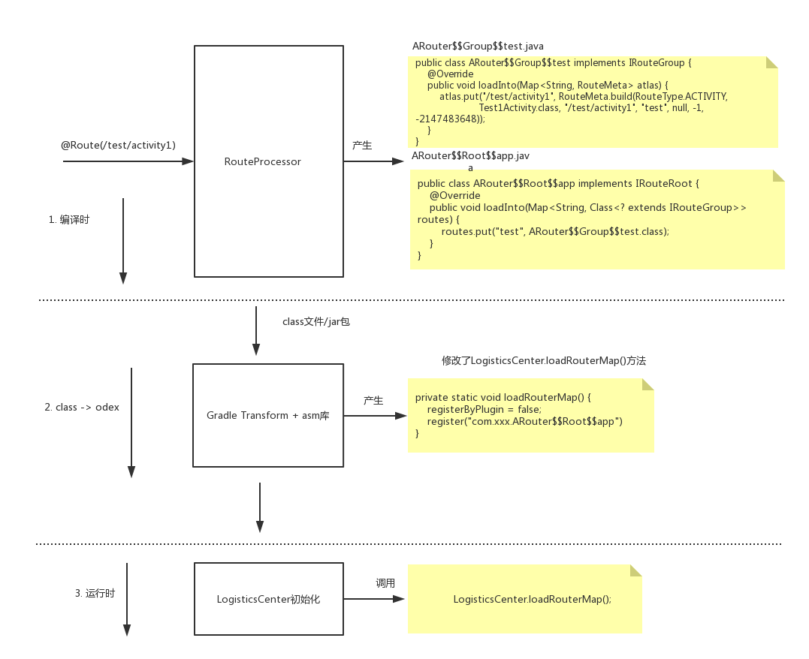

>文章是作者学习`ARouter`的源码的重点纪要。 ARouter官方文档 : https://github.com/alibaba/ARouter/blob/master/README_CN.md

我前面其实已经分析过`WMRouter`的路由节点的生成原理: https://www.jianshu.com/p/116adb143970

其实`ARouter`的路由表的生成的步骤和`WMRouter`差不多,也是使用 : `注解处理` , `Gradle Transfrom API`, `javapoet`, `asm`。再贴一下相关文章技术文章以便了解:

注解 : https://blog.csdn.net/jeasonlzy/article/details/74273851
javapoet : https://blog.csdn.net/qq_18242391/article/details/77018155
gradle Transfrom api : https://www.jianshu.com/p/37df81365edf

我们来继续看`ARouter`的路由节点的生成原理, 我们先来看`@Route`的注解扫描处理器:

```
public class RouteProcessor extends AbstractProcessor {
  
    private Map<String, Set<RouteMeta>> groupMap = new HashMap<>(); // ModuleName and routeMeta.
    private Map<String, String> rootMap = new TreeMap<>();        // Map of root metas, used for generate class file in order.

    @Override public boolean process(Set<? extends TypeElement> annotations, RoundEnvironment roundEnv) {
        for (Element element : routeElements) {
            Route route = element.getAnnotation(Route.class);
            RouteMeta routeMeta;
            // 根据 @Route 的注解信息，生成一个 RouteMeta对象。
           categories(routeMeta);  //把这个 RouteMeta放到 groupMap 中， key 为组名   
        }

        //atlas参数
        ParameterSpec groupParamSpec = ParameterSpec.builder(inputMapTypeOfGroup, "atlas").build();

        for (Map.Entry<String, Set<RouteMeta>> entry : groupMap.entrySet()) {
            // 每个组，都要生成 loadInto 方法
            MethodSpec.Builder loadIntoMethodOfGroupBuilder = MethodSpec.methodBuilder(“loadInto”)
                .addAnnotation(Override.class)
                .addModifiers(PUBLIC)
                .addParameter(groupParamSpec);


            // 产生 RouteMeta的注入方法 , 比如 -> 
            //atlas.put("/test/activity4", RouteMeta.build(RouteType.ACTIVITY, Test4Activity.class, "/test/activity4", "test", null, -1, -2147483648));
            loadIntoMethodOfGroupBuilder.addStatement(
                    "atlas.put($S, $T.build($T." + routeMeta.getType() + ", $T.class, $S, $S, " + (StringUtils.isEmpty(mapBody) ? null : ("new java.util.HashMap<String, Integer>(){{" + mapBodyBuilder.toString() + "}}")) + ", " + routeMeta.getPriority() + ", " + routeMeta.getExtra() + "))",
                    routeMeta.getPath(),
                    routeMetaCn,
                    routeTypeCn,
                    className,
                    routeMeta.getPath().toLowerCase(),
                    routeMeta.getGroup().toLowerCase());

            // 生成对应的组的文件，比如 :  ARouter$$Group$$test.java
            String groupFileName = "ARouter$$Group$$" + groupName;
            JavaFile.builder(PACKAGE_OF_GENERATE_FILE,
                    TypeSpec.classBuilder(groupFileName)
                            .addJavadoc(WARNING_TIPS)
                            .addSuperinterface(ClassName.get(type_IRouteGroup))
                            .addModifiers(PUBLIC)
                            .addMethod(loadIntoMethodOfGroupBuilder.build())
                            .build()
            ).build().writeTo(mFiler);

            rootMap.put(groupName, groupFileName); //把路由组文件信息保存起来
        }

        //加载每个路由组的类
        if (MapUtils.isNotEmpty(rootMap)) {
            for (Map.Entry<String, String> entry : rootMap.entrySet()) {
                loadIntoMethodOfRootBuilder.addStatement("routes.put($S, $T.class)", entry.getKey(), ClassName.get(PACKAGE_OF_GENERATE_FILE, entry.getValue()));
            }
        }

        //ARouter$$Root$$app.loadInto(Map<String, Class<? extends IRouteGroup>> routes) 方法
        MethodSpec.Builder loadIntoMethodOfRootBuilder = MethodSpec.methodBuilder(METHOD_LOAD_INTO)
                .addAnnotation(Override.class)
                .addModifiers(PUBLIC)
                .addParameter(rootParamSpec);
        
        // 加载每个路由组的类
        String rootFileName = “ARouter$$Root$$” + moduleName;
        JavaFile.builder(PACKAGE_OF_GENERATE_FILE,
                TypeSpec.classBuilder(rootFileName)
                        .addJavadoc(WARNING_TIPS)
                        .addSuperinterface(ClassName.get(elements.getTypeElement(ITROUTE_ROOT)))
                        .addModifiers(PUBLIC)
                        .addMethod(loadIntoMethodOfRootBuilder.build())
                        .build()
        ).build().writeTo(mFiler);
    }
}
```

这里我不做详细解释了(注释写的很清楚了),我们这里直接举一个例子，比如我们这样标记了一个界面:

```
@Route(path = "/test/activity1")
public class Test1Activity extends AppCompatActivity {
}
```

那么按照`RouteProcessor`处理后将会生成以下类文件:

ARouter$$Group$$test.java

```
public class ARouter$$Group$$test implements IRouteGroup {
  @Override
  public void loadInto(Map<String, RouteMeta> atlas) {
    atlas.put("/test/activity1", RouteMeta.build(RouteType.ACTIVITY, Test1Activity.class, "/test/activity1", "test", null, -1, -2147483648));
  }
}
```

ARouter$$Root$$app.java:

```
public class ARouter$$Root$$app implements IRouteRoot {
  @Override
  public void loadInto(Map<String, Class<? extends IRouteGroup>> routes) {
    routes.put("test", ARouter$$Group$$test.class);
  }
}
```

参照上面这两个文件和`RouteProcessor`,应该大致可以理解。好，对应注册`路由表与组`的文件已经生成，那么这些文件是如何在`ARouter`运行的时候加载到内存的呢？

猜测：这些产生的类文件，在运行的时候，应该会被实例化，然后动态注册到`Warehouse`中。其实实现方式类似于`WMRouter`，也是`gradle Transfrom api`和`asm`, 下面来看一下 :


打开`ARouter`找到 gradle 插件。首先在插件启动的时候:

```
public class PluginLaunch implements Plugin<Project> {

    @Override
    public void apply(Project project) {
        def isApp = project.plugins.hasPlugin(AppPlugin)
        if (isApp) {
            ....
            ArrayList<ScanSetting> list = new ArrayList<>(3)
            list.add(new ScanSetting('IRouteRoot'))
            list.add(new ScanSetting('IInterceptorGroup'))
            list.add(new ScanSetting('IProviderGroup'))
            RegisterTransform.registerList = list
            //register this plugin
            android.registerTransform(new RegisterTransform(project))
        }
    }
}
```

可以看到会注册`RegisterTransform`,并把`RegisterTransform.registerList`,加入几个`ScanSetting`定义的接口, 比如`IRouteRoot`。(注意,上面 ARouter$$Root$$app 实现的就是这个接口)

```
class RegisterTransform extends Transform {
    static ArrayList<ScanSetting> registerList

    @Override
    void transform(Context context, Collection<TransformInput> inputs, Collection<TransformInput> referencedInputs, TransformOutputProvider outputProvider, boolean isIncremental) {
        inputs.each { TransformInput input ->
            input.jarInputs.each { JarInput jarInput -> // 扫描jar包
                ....
                File src = jarInput.file // input file
                File dest = outputProvider.getContentLocation(destName + "_" + hexName, jarInput.contentTypes, jarInput.scopes, Format.JAR) // output file

                if (ScanUtil.shouldProcessPreDexJar(src.absolutePath)) { 
                    ScanUtil.scanJar(src, dest)
                }
            }
            input.directoryInputs.each { DirectoryInput directoryInput -> // 扫描指定目录
                ......
                ScanUtil.scanClass(file)
                ....
            }
        }
    }
}

static void scanJar(File jarFile, File destFile) {
    if (jarFile) {
        def file = new JarFile(jarFile)
        Enumeration enumeration = file.entries()
        while (enumeration.hasMoreElements()) {
            String entryName = (JarEntry) enumeration.nextElement().getName()
            if (entryName.startsWith("com/alibaba/android/arouter/routes/")) {   //扫描这个目录下的文件
                //如果这个文件实现了`RegisterTransform.registerList`的接口，就把这个类保存下来(保存类名)  
                scanClass(File file) // 使用 asm库，来访问class文件，完成这个操作
            } 
            ....
        }
    }
}

//scanClass(File file) 最终会调用下面的 visit方法
void visit(int version, int access, String name, String signature,String superName, String[] interfaces) {
    super.visit(version, access, name, signature, superName, interfaces)
    RegisterTransform.registerList.each { ext ->
        if (ext.interfaceName && interfaces != null) {
            interfaces.each { itName ->
                if (itName == ext.interfaceName) {
                    ext.classList.add(name)  // 其实就是把 "com/alibaba/android/arouter/routes/" 目录下的文件加入到  RegisterTransform.registerList集合中
                }
            }
        }
    }
}
```

好经过上面的一顿操作，`RegisterTransform.registerList`已经保存了实现了`IRouteRoot`接口的类集合。

```
if (fileContainsInitClass) {
    registerList.each { ext ->
       RegisterCodeGenerator.insertInitCodeTo(ext)
    }
}
```

`RegisterCodeGenerator.insertInitCodeTo(ext)`这里不仔细追了，其实就是通过`asm`库最终把路由表的初始化代码插入到了`com/alibaba/android/arouter/core/LogisticsCenter.loadRouterMap`方法中:

```
/**
* arouter-auto-register plugin will generate code inside this method
* call this method to register all Routers, Interceptors and Providers
*/
private static void loadRouterMap() {
    registerByPlugin = false;
    //auto generate register code by gradle plugin: arouter-auto-register
    register("com.xxx.ARouter$$Root$$app")
}
```

看一下`register()`方法:

```
private static void register(String className) {
    ...
    if (!TextUtils.isEmpty(className)) {
        try {
            Class<?> clazz = Class.forName(className);
            Object obj = clazz.getConstructor().newInstance();
            if (obj instanceof IRouteRoot) {
                obj.loadInto(Warehouse.groupsIndex);
            }
        }
    }
    ...
}
```
实例化`ARouter$$Group$$test`这种实现了`IRouteRoot`接口的类，然后把传入路由表，添加路由信息。

到这里`@Route`注册的页面，在程序运行时都以`RouteMeta`的形式放到了路由表中。方便路由使用。

一图胜千言, 我们用一张图来总结一下上面所做的操作:




