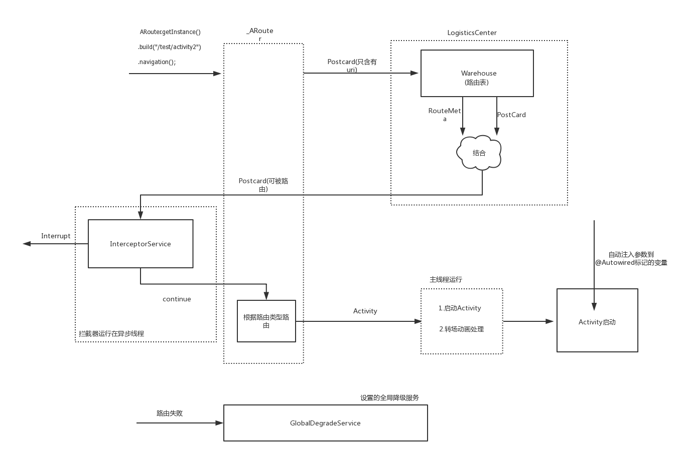

先通过一张图来了解`ARouter`的路由过程以及相关类:



本文先不对路由表的生成做详细了解，也不对`InterceptorService`、`GlobalDegradeService`的加载做仔细分析，我们就先根据源码来大致看一遍路由的基本过程。

解释一下上图中涉及到的几个类:

`Postcard`: 封装了路由信息，包括路由的目标uri、路由参数、路由的目标页面等

`LogisticsCenter`: 维护路由表，完善一个`Postcard`(即找到其路由的目标页面)等。

`_ARouter`: 路由流程的控制类，负责组合路由逻辑。

`InterceptorService`: 维护路由的拦截器，由`_ARouter`调度。

`GlobalDegradeService`:路由失败的全局降级服务。

下面从代码来看一下整个路由过程 :

## 基本路由流程

在`ARouter`中如果使用一个 `@Route(path = "/test/activity1")`注解标注在了一个`Activity`上，那么这个`Activity`就是可被路由的。我们可以通过调用下面代码实现页面跳转:

```
    ARouter.getInstance()
                .build("/test/activity1")
                .navigation(context, new NavigationCallback());
```

`ARouter`只是一个门面类，实际功能的实现是由`_ARouter`完成的。来看一下`_ARouter.navigation()`, 这个方法控制路由的核心逻辑:

```
   protected Object navigation(final Context context, final Postcard postcard, final int requestCode, final NavigationCallback callback) {
        try {
            LogisticsCenter.completion(postcard); //装配 postcard
        } catch (NoRouteFoundException ex) {
            logger.warning(Consts.TAG, ex.getMessage());

            if (null != callback) {
                callback.onLost(postcard); //页面降级
            } else {   
                DegradeService degradeService = ARouter.getInstance().navigation(DegradeService.class);
                degradeService.onLost(context, postcard); //全局降级
            }
            return null;
        }

        if (null != callback) callback.onFound(postcard);

        ...这里其实可以不执行拦截器

        //新开线程，异步执行拦截器
        interceptorService.doInterceptions(postcard, new InterceptorCallback() {
    
            @Override public void onContinue(Postcard postcard) {
                _navigation(context, postcard, requestCode, callback);
            }

            @Override public void onInterrupt(Throwable exception) {
                callback.onInterrupt(postcard);
            }
        });
        return null;
    }
```

即

1. 对于一个路由的`Postcard`，首先使用`LogisticsCenter`完善它(路由参数、路由目标界面等)

2. 对于错误的路由，回调局部降级和全局降级方法

3. 执行拦截器

4. 真正开始路由`_navigation()`

### LogisticsCenter 装配 Postcard

```
    public synchronized static void completion(Postcard postcard) {
        //从路由表中获取该路由的 RouteMeta 
        RouteMeta routeMeta = Warehouse.routes.get(postcard.getPath());

        if (null == routeMeta) {   //路由表中不存在就尝试加载
            Class<? extends IRouteGroup> groupMeta = Warehouse.groupsIndex.get(postcard.getGroup());  //首先把这次路由对应的路由组的表加载出来
            if (null == groupMeta) { //uri不属于某个组
                throw new NoRouteFoundException(TAG + "There is no route match the path [" + postcard.getPath() + "], in group [" + postcard.getGroup() + "]");
            } else {
                try {
                    IRouteGroup iGroupInstance = groupMeta.getConstructor().newInstance();  //实例化路由组
                    iGroupInstance.loadInto(Warehouse.routes);  //把这个组的路由信息添加到 Warehouse.routes中
                    Warehouse.groupsIndex.remove(postcard.getGroup()); 
                } catch (Exception e) {
                    throw new HandlerException(TAG + "Fatal exception when loading group meta. [" + e.getMessage() + "]");
                }
                
                completion(postcard);  //路由组加载完后，重新路由
            }
        } else {
            //使用RouteMeta来完善 Postcard
            postcard.setDestination(routeMeta.getDestination()); // destination,比如Acitivity
            postcard.setType(routeMeta.getType());
            ....
            postcard.withString(ARouter.RAW_URI, postcard.getUri().toString());
            ...
        }
    }
```

`_ARouter`中的路由表其实就是一些静态的map :

`Warehouse.groupsIndex` : 它的类型是 `Map<String, Class<? extends IRouteGroup>>`。存放着路由组对应的类，这些类都是在编译期动态生成的。

`Warehouse.routes` : 类型是 `Map<String, RouteMeta>`。即一个理由path对应一个`RouteMeta`。上面已经看到，它是按组来懒加载的。

来总结一下这个方法的主要流程:

1. 尝试从路由表`Warehouse.routes`根据`postcard.getPath()`获取对应的路由信息`RouteMeta`。(`RouteMeta`是根据注解生成的)。
2. 如果不存在`RouteMeta`，则加载`postcard.getPath()`对应的路由组表`Warehouse.groupsIndex`。如果根本不存在对应的组，则路由失败。
3. 实例化`Warehouse.groupsIndex`, 然后把表内的信息加载到`Warehouse.routes`表中，再次调用`completion()`
4. 获取到`postcard.getPath()`对应的`RouteMeta`,使用`RouteMeta`完善`Postcard`

上面可能对于`Warehouse.routes`是如何加载一个组的路由信息有疑惑，我们这里看一下源码中一个动态生成的路由组:

```
public class ARouter$$Group$$test implements IRouteGroup {
  @Override
  public void loadInto(Map<String, RouteMeta> atlas) {
    atlas.put("/test/activity1", RouteMeta.build(RouteType.ACTIVITY, Test1Activity.class, "/test/activity1", "test", -1, -2147483648));
    atlas.put("/test/activity2", RouteMeta.build(RouteType.ACTIVITY, Test2Activity.class, "/test/activity2", "test", -1, -2147483648));
  }
}
```

即`loadInto()`实际上是把路由信息放入到`Warehouse.routes`中。


## 执行拦截器

```
@Route(path = "/arouter/service/interceptor") 
public class InterceptorServiceImpl implements InterceptorService {

    @Override
    public void doInterceptions(final Postcard postcard, final InterceptorCallback callback) {
        if (null != Warehouse.interceptors && Warehouse.interceptors.size() > 0) {
            ..确保拦截器初始化完毕
            LogisticsCenter.executor.execute(new Runnable() {
                @Override
                public void run() {
                    //依次执行每一个拦截器
                    _excute(0, interceptorCounter, postcard);
                }
            });
        } else {
            callback.onContinue(postcard);
        }
    }
}
```

`@Route(path = "/arouter/service/interceptor")`标注，其实这个拦截器会在运行时动态加载。可以看到大致逻辑就是:

*在异步线程中依次执行每一个拦截器*。其实在这里可以看出`ARouter`的拦截器是全局的，即每一次路由如果不设置不被拦截的标志，则都会把拦截器走一遍。

在Postcard组装完毕和拦截器执行完毕后，就会调用`_navigation()`

```
private Object _navigation(final Context context, final Postcard postcard, final int requestCode, final NavigationCallback callback) {
        final Context currentContext = null == context ? mContext : context;
        switch (postcard.getType()) {
            case ACTIVITY:
                // intent中设置一些信息。
                // Navigation in main looper.
                runInMainThread(new Runnable() {
                    @Override
                    public void run() {
                        startActivity(requestCode, currentContext, intent, postcard, callback);
                    }
                });
                break;
            case ...
        }
        return null;
    }
```

到这里，一次Activity的路由算是完成了。


