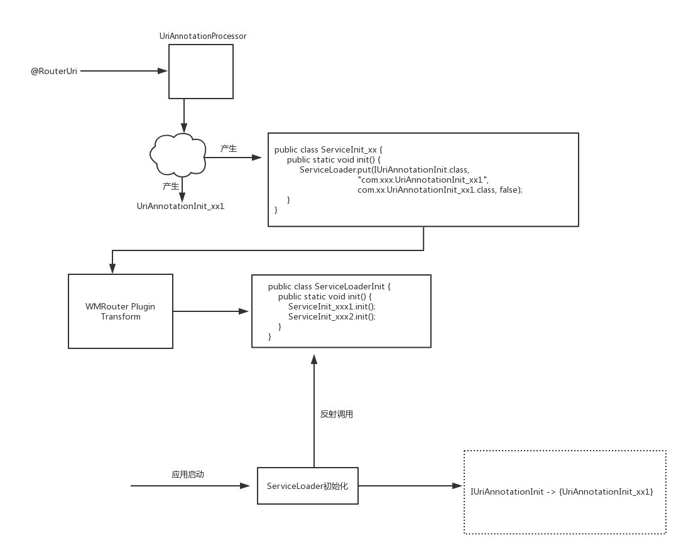

>文章来源自作者的Android进阶计划(https://github.com/SusionSuc/AdvancedAndroid)

在继续阅读源码前，我们需要先了解一下`ServiceLoader`这个概念。`WMRouter`中的`ServiceLoader`类似于`java spi`, 了解`java spi`可以看一下下面这篇文章:

>https://www.jianshu.com/p/deeb39ccdc53

## ServiceLoader

先来说一下`SerciceLoader`的基本功能:

1. 保存接口与实现类的对应关系。 注意，这个关系是一对多。
2. 可以实例化一个实现类，返回给调用方使用。

我们这里主要看一下`WMRouter`中是如何实现`SerciceLoader`中保存接口与实现类的对应关系的, 我们看一下`ServiceLoader`的初始化方法:

```
    void doInit() {
       Class.forName(“com.sankuai.waimai.router.generated.ServiceLoaderInit”).getMethod("init").invoke(null);
    }
```

即初始化的时候反射调用了`ServiceLoaderInit.init()`方法。我全局搜索了一下这个类并没有发现它的声明，最后发现这个类是使用`Gradle Transform API`和`ams库`动态生成的。对于`Gradle Transform API`可以大致看一下下面这个文章了解一下:

>https://www.jianshu.com/p/37df81365edf ; ams库是一可以操作class文件的库，可以自行百度一下。

下面我们来看一下`WMRouter`的 gradle transform插件，是如何生成`ServiceLoaderInit`这个类的。

### WMRouterPlugin

官方是这样描述它的作用的 : 将注解生成器生成的初始化类汇总到`ServiceLoader.init`，运行时直接调用`ServiceLoader.init`。 从而完成`SerciceLoader`的初始化。

这里我大致描述一下这个插件的工作逻辑:

1. 扫描编译生成的class文件夹或者jar包的指定目录 : com/sankuai/waimai/router/generated/service, 收集目录下的类并保存起来 (这个类其实就是`ServiceInit_xxx1`这种类)
2. 使用`asm`生成`ServiceLoaderInit`类，并调用前面扫描到的类的`init`方法。

即最终产生如下代码：

```
    public class ServiceLoaderInit {
        public static void init() {
            ServiceInit_xxx1.init();
            ServiceInit_xxx2.init();
        }
    }
```

到这里就有疑问了，从开始分析到现在我们并没有看到`ServiceInit_xxx1`这种类是如何生成的呢。那它是在哪里生成的呢？

### ServiceInit_xx的生成

#### 怎么生成的？

>在上一篇文章已经了解到`UriAnnotationProcessor`在编译时会扫描`@RouterUri`,并且会生成`UriAnnotationInit_xx1`这种类，`UriAnnotationInit_xx1.init`方法就是接收一个`UriAnnotationHandler`实例，然后调用它的`register`方法。

其实`UriAnnotationProcessor`在扫描`@RouterUri`生成`UriAnnotationInit_xx1`类的同时，还会生成一个类,就是`ServiceInit_xx`:

```
  public void buildHandlerInitClass(CodeBlock code, String genClassName, String handlerClassName, String interfaceName) {
        .... // 生成 UriAnnotationInit_xx1 代码
        String fullImplName = Const.GEN_PKG + Const.DOT + genClassName;
        String className = "ServiceInit" + Const.SPLITTER + hash(genClassName);
        new ServiceInitClassBuilder(className)
                .putDirectly(interfaceName, fullImplName, fullImplName, false)
                .build();
    }
```

我们看一下`ServiceInitClassBuilder`的`putDirectly`和`build`方法:

```
  public class ServiceInitClassBuilder {
        ...
        public ServiceInitClassBuilder putDirectly(String interfaceName, String key, String implementName, boolean singleton) {
            builder.addStatement("$T.put($T.class, $S, $L.class, $L)",
                    serviceLoaderClass, className(interfaceName), key, implementName, singleton);
            return this;
        }

        public void build() {
            MethodSpec methodSpec = MethodSpec.methodBuilder(Const.INIT_METHOD)
                    .addModifiers(Modifier.PUBLIC, Modifier.STATIC)
                    .returns(TypeName.VOID)
                    .addCode(this.builder.build())
                    .build();

            TypeSpec typeSpec = TypeSpec.classBuilder(this.className)
                    .addModifiers(Modifier.PUBLIC)
                    .addMethod(methodSpec)
                    .build();

            JavaFile.builder(“com.sankuai.waimai.router.generated.service”, typeSpec)
                    .build()
                    .writeTo(filer);
        }
```

其实就是会把下面代码生成到`com/sankuai/waimai/router/generated/service`文件夹下:

```
public class ServiceInit_xx1 {
  public static void init() {
       ServiceLoader.put(IUriAnnotationInit.class, "com.xxx.UriAnnotationInit_xx1", com.xx.UriAnnotationInit_xx1.class, false);
  }
}
```
可以看到 `ServiceInit_xx1.init`的作用就是把`接口`与`实现类`的关系保存到`ServiceLoader`中。

`WMRouter`的transform插件会扫描`com/sankuai/waimai/router/generated/service`下的类。即会扫描到`ServiceInit_xx1`这个类，然后按照刚开始所说的生成调用其`init()`的代码:

```
    public class ServiceLoaderInit {
        public static void init() {
            ServiceInit_xxx1.init();
            ServiceInit_xxx2.init();
        }
    }
```

综上所述，`ServiceLoaderInit.init`被调用后，`SerciceLoader`中就保存了`IUriAnnotationInit`的接口实现类`UriAnnotationInit_xx1`。(这里有点晕，可以仔细理一下。。。)

接下来的问题就是`IUriAnnotationInit`的实现类`UriAnnotationInit_xx1`的`init`方法在什么时候调用呢 ？

### UriAnnotationInit_xx1.init的调用时机

其实`UriAnnotationInit_xx1.init`就是为了把前面经过`UriAnnotationProcessor`生成的路由节点信息注册到`UriAnnotationHandler`中。我们来看一下`UriAnnotationHandler`的初始化方法:

```
   protected void initAnnotationConfig() {
        RouterComponents.loadAnnotation(this, IUriAnnotationInit.class);
    }
```

上面的代码最终会调用到这里:

```
    List<? extends AnnotationInit<T>> services = ServiceLoader.load(clazz).getAll();
    for (AnnotationInit<T> service : services) {
        service.init(handler);
    }
```
即会通过`SerciceLoader`来获取`IUriAnnotationInit`的实现类，并调用其`init`方法。

前面我们已经分析过了`SerciceLoader`在初始化时，就已经把`IUriAnnotationInit`与其实现类的关系保存起来了。所以上面的`service.init(handler)`实际上就是调用下面的代码

```
//IUriAnnotationInit的实现类
public class UriAnnotationInit_xx1 implements IUriAnnotationInit {
    public void init(UriAnnotationHandler handler) {
        handler.register("", "", "/jump_activity_1", "com.sankuai.waimai.router.demo.basic.TestBasicActivity", false);
    }
```
结合我们前面所了解的，即，这样就完成了`UriAnnotationHandler`中生成路由的`UriHandler`

为了便于理解，我们用下面这张图总结一下上面的过程:




## ServiceLoader中更强大的功能

其实上面只是使用了`SerciceLoader`的一部分功能，我们来`WMRouter`中一种更方便的加载接口实现类的方式。

### @RouterService

java 中的spi机制需要我们在 `META-INF/services`规范好接口与实现类的关系，`WMRouter`中提供`@RouterService`,来简化了这个操作。我们来看一下这个注解是如何使用的:

比如在一个项目中有3个库: interface、lib1、lib2

```
//定义在interface库中
public abstract class LibraryModule {
    public abstract String getModuleName();
}

//定义在lib1中
@RouterService(interfaces = LibraryModule.class)
public class LibraryModule1 extends LibraryModule {
}

//定义在lib2
@RouterService(interfaces = LibraryModule.class)
public class LibraryModule2 extends LibraryModule {
}
```

`WMRouter`中有一个`ServiceAnnotationProcessor`负责处理`RouterService`注解，它会把标记了这个注解的类，生成`ServiceInit_xx`, 即

```
public class ServiceInit_f3649d9f5ff15a62b844e64ca8434259 {
  public static void init() {
      ServiceLoader.put(IUriAnnotationInit.class, "xxx",xxx.class, false);
  }
}
```

这样再由`WMRouter`的插件转换生成 `ServiceLoaderInit.init()`中的调用代码。就达到在运行时把`LibraryModule`的实现注入到`SerciceLoader`中，从而我们可以获得不同库的实现。

*这个特性非常有用，比如一个业务库的代码需要被另一个业务库复用，这时候，我们就可以使用这个机制，从而使两个业务库不耦合的情况下，调用对方功能* 赞！

关于`SerciceLoader`的更多特性，大家可以自行了解，这里就不介绍了。


