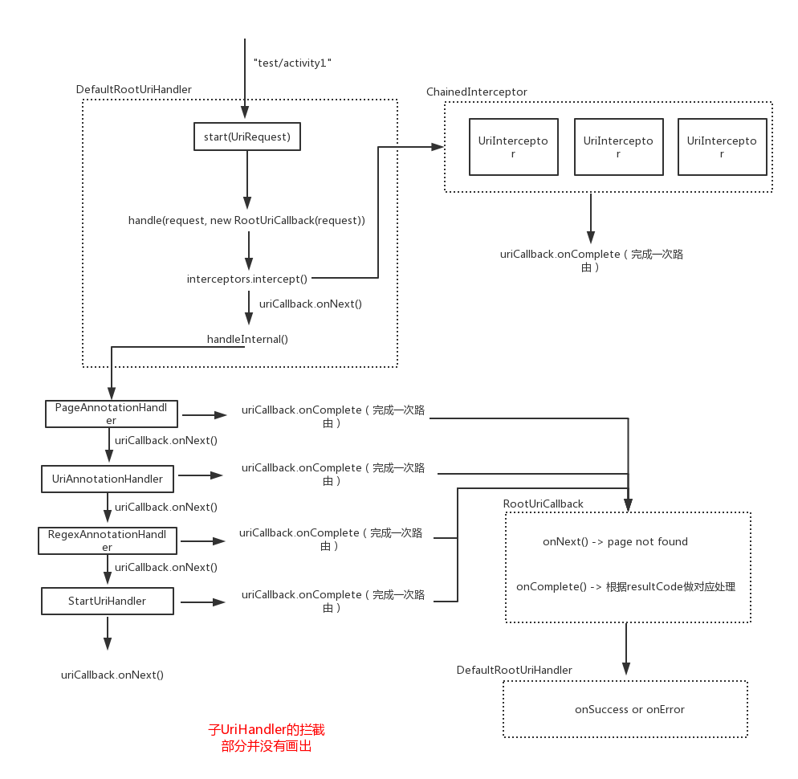

本文整理一下`WMRouter`的基本路由逻辑，并剖析相关路由类的设计。

# 基本元素

先来简单理解一下`WMRouter`路由过程中的几个基本构成元素 :

`UriRequest` : 封装了一个路由请求

`UriInterceptor` : 代表一个拦截器，可以对一个`UriRequest`进行拦截，通过`UriCallback`来告诉拦截结果。

`UriCallback` : Uri处理的一个统一回调。 回调它的`onNext`方法代表继续处理、回调它的`onComplete`代表这次路由请求处理完毕。

# UriHandler (定义基本的路由逻辑)

`WMRouter`中，对于每一个或每一类`Uri`都会有一个`UriHandler`来处理，`UriHandler`定义了处理一个`Uri`的基本逻辑。

```
public abstract class UriHandler {

    //拦截器列表
    protected ChainedInterceptor mInterceptor;

    //添加拦截器
    public UriHandler addInterceptor(@NonNull UriInterceptor interceptor) {
        ....
    }

    //Uri处理的基本流程, 
    public void handle(@NonNull final UriRequest request, @NonNull final UriCallback callback) {
        ...
    }

    // 是否要处理给定的URI
    protected abstract boolean shouldHandle(@NonNull UriRequest request);

    //子UriHandler需要写的处理逻辑
    protected abstract void handleInternal(@NonNull UriRequest request, @NonNull UriCallback callback);
}

```

`UriHandler`在对一个`Uri`处理时，会调用`handle`方法，因此我们可以通过这个方法理清一个Uri被路由的基本处理过程

```
    //处理URI。通常不需要覆写本方法。
    public void handle(@NonNull final UriRequest request, @NonNull final UriCallback callback) {
        if (shouldHandle(request)) { //是否可以处理这个 uri  request
            if (mInterceptor != null && !request.isSkipInterceptors()) {
                mInterceptor.intercept(request, new UriCallback() { 
                    @Override public void onNext() {
                        handleInternal(request, callback);
                    }
                    @Override public void onComplete(int result) {
                        callback.onComplete(result);
                    }
                });
            } else {
                handleInternal(request, callback);
            }
        } else {
            callback.onNext();
        }
    }
```

OK，在`WMRouter`中一个`uri`被处理的基本逻辑可用用下图表示 : 

.png)

所以，定义一个基本的处理`Uri`的类应继承自`UriHandler`,并复写`handle`方法。

## ChainedInterceptor

上面源码你会发现`UriHandler`中的拦截器类型是`ChainedInterceptor`,并不是`UriInterceptor`。那 `ChainedInterceptor` 是一个什么样的拦截器呢 ？:

```
public class ChainedInterceptor implements UriInterceptor{
    private final List<UriInterceptor> mInterceptors = new LinkedList<>();
}
```

即也是一个拦截器, 不过它含有一个拦截器列表。那么这个拦截器是如何工作的呢？看一下它的`intercept()`方法 :

```
    public void intercept(@NonNull UriRequest request, @NonNull UriCallback callback) {
        next(mInterceptors.iterator(), request, callback);    
    }

    private void next(@NonNull final Iterator<UriInterceptor> iterator, @NonNull final UriRequest request, @NonNull final UriCallback callback) {
        if (iterator.hasNext()) {  //对于链上的每一个 interceptor 都要调用一遍它的 intercept 方法
            iterator.next().intercept(request, new UriCallback() {
                @Override public void onNext() {
                    next(iterator, request, callback);
                }
                @Override public void onComplete(int resultCode) {
                    callback.onComplete(resultCode);
                }
            });
        } else {
            callback.onNext();
        }
    }
```
即，依次遍历每一个`UriInterceptor`,调用其`intercept`方法。

## ChainedHandler

概念和`ChainedInterceptor`类似，它其实也是一个`UriHandler`, 也含有一个`UriHandler`列表，在其`handleInternal`方法中，会依次调用`UriHandler.handle()`。

```
    @Override
    protected void handleInternal(@NonNull final UriRequest request, @NonNull final UriCallback callback) {
        next(mHandlers.iterator(), request, callback);
    }

    private void next(@NonNull final Iterator<UriHandler> iterator, @NonNull final UriRequest request,
                      @NonNull final UriCallback callback) {
        if (iterator.hasNext()) {
            UriHandler t = iterator.next();
            t.handle(request, new UriCallback() {
                @Override
                public void onNext() {
                    next(iterator, request, callback);
                }
                @Override
                public void onComplete(int resultCode) {
                    callback.onComplete(resultCode);
                }
            });
        } else {
            callback.onNext();
        }
    }
```

上面我们了解了`WMRouter`中路由的基本组成元素`UriRequest`、`UriHandler`、`UriInterceptor`、`ChainedHandler`、`ChainedInterceptor`。那`WMRouter`是如何使用这些基本元素来搭建一个路由框架的呢 ？

## RootUriHandler (路由的起点)

它继承自`ChainedHandler`,提供`startUri(UriRequest)`并传入`RootUriCallback`来作为一次路由的起点:

```
    public void startUri(@NonNull UriRequest request) {
        ...
        handle(request, new RootUriCallback(request));
    }

    protected class RootUriCallback implements UriCallback {
        private final UriRequest mRequest;
        ... 

        @Override public void onNext() {
            onComplete(CODE_NOT_FOUND);
        }
        
        @Override public void onComplete(int resultCode) {
            switch (resultCode) {
                case CODE_REDIRECT:   // 重定向，重新跳转
                    startUri(mRequest);
                    break;
                case CODE_SUCCESS:
                    mRequest.putField(UriRequest.FIELD_RESULT_CODE, resultCode);
                    onSuccess(mRequest); //全局路由成功回调
                    break;
                default:
                    mRequest.putField(UriRequest.FIELD_RESULT_CODE, resultCode);
                    onError(mRequest, resultCode); //全局路由失败回调
                    break;
            }
        }
    }
```

在`WMRouter`中路由的起点`UriHandler`为`DefaultRootUriHandler`,它继承自`RootUriHandler`, 这个`UriHandler`在起始时添加了下面4个子`UriHandler` :

```
    public DefaultRootUriHandler(Context context,@Nullable String defaultScheme, @Nullable String defaultHost) {

        addChildHandler(createPageAnnotationHandler(), 300);    // 处理@RouterPage注解定义的内部页面跳转
      
        addChildHandler(createUriAnnotationHandler(defaultScheme, defaultHost), 200);   //处理@RouterUri注解定义的URI跳转，
       
        addChildHandler(createRegexAnnotationHandler(), 100); //处理@RouterRegex注解定义的uri

        addChildHandler(new StartUriHandler(), -100); //支持Android原生隐士跳转
    }
```

这几个子`UriHandler`当然也是继承自`UriHandler`, 这里每一个子`UriHandler`都是一个`ChainedHandler`,即都会含有很多`UriHandler`。

那如何开始一次路由呢？ 即使用 `DefaultRootUriHandler.startUri(UriRequest)`。 `DefaultRootUriHandler`就会把这个`UriRequest`依次分发给其子`UriHandler`。
一旦有一个`UriHandler`处理或者这个`UriInterceptor`拦截。那么这次路由请求就结束了。

所以整个路由框架大体路由架构如下图所示 :




下一节我们会看一下 `PageAnnotationHandler`、`UriAnnotationHandler`是如何生成的 : [路由节点的动态生成](路由节点的动态生成.md)

>欢迎Star我的[Android进阶计划](https://github.com/SusionSuc/AdvancedAndroid),看更多干货。