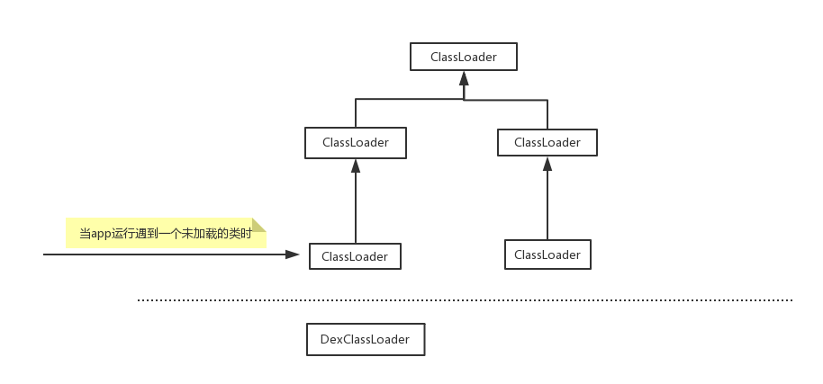

本文主要来看一下在插件化技术中，实现宿主运行时使用插件`apk`类、资源等原理。(宿主即我们的主apk。插件apk即可以被加载的插件模块)。本文所谈的实现引用自: <a href="https://github.com/didi/VirtualAPK">VirtualApk</a>

另外欢迎关注我的<a href="https://github.com/SusionSuc/AdvancedAndroid">Android进阶计划</a>， 好，开始:

## 插件apk中resource访问

插件化技术应该实现: 对于插件中的资源在插件中仍然可以使用`R.xxx.xx`的方式来使用。但是要知道插件是在apk安装后加载的。我们日常访问资源都是使用`context.getResources()`。很明显，这个`Resources`中是不会包含插件中的资源的。那么如何解决这个问题呢？

我们先来回顾一下Android中的资源分类, Android中的资源分为两大类 : 可直接访问的资源、无法直接访问的原生资源。

- 直接访问资源 : 这些资源可以使用 R.xx.xx 进行访问, 都保存在res目录下, 在编译的时候, 会自动生成R.java 资源索引文件。
- 原生资源 : 这些资源存放在assets下, 不能使用R类进行访问, 只能通过 AssetManager 以二进制流形式读取资源。

先来回顾一下`AssetManager`和`Resources`:

### Resources

在Android中我们可以通过这个类来访问我们应用程序的资源。我们知道`Android`在构建过程中会为每个资源生产一个符号(就是我们编码过程中的各种资源id)文件`R.java`。`Resources`提供了许多方法，允许我们通过id来访问资源。比如:

```
int getColor(int id, Resourcess.Theme theme)  返回与特定资源ID关联的主题颜色整数。
```

### AssetManager

`AssetManager`是比`Resources`更低一级的实现。`Resources`可以使用`AssetManager`来构造的。`Resources`提供给开发者一个十分方便的访问应用程序资源的方式。不过对于原生资源(assets目录下)就没有办法访问了。`AssetManager`允许我们可以直接访问这些资源文件。
比如对于应用程序`assets`目录下的文件，我们就可以通过`AssetManager`来访问:

```
InputStream open(String fileName, int accessMode)
```

*所以我们是不是把插件中的资源放到`AssetManager`,然后新构造一个Resouce就OK了呢？*

插件`apk`的Resources我们可以通过`AssetManager.addAssetPath(apkPath)`来加入到`AssetManager`中。我们来看一下这个方法:

```
    /**
     * Add an additional set of assets to the asset manager.  This can be
     * either a directory or ZIP file.  Not for use by applications.  Returns
     * the cookie of the added asset, or 0 on failure.
     * {@hide}
     */
    public final int addAssetPath(String path) {
        return  addAssetPathInternal(path, false); //最终会调用到native的方法。
    }
```

但是只是添加到`AssetManager`中是不行的，这是因为我们日常开发访问的是`Resources`的API,那么如何让`Resources`含有插件的资源列表呢？我们可以使用`AssetManager`来新构造一个`Resources`:

```
    /**
     * Create a new Resources object on top of an existing set of assets in an AssetManager.
     */
    @Deprecated
    public Resources(AssetManager assets, DisplayMetrics metrics, Configuration config) {
        .....
        mResourcesImpl = new ResourcesImpl(assets, metrics, config, new DisplayAdjustments());
    }
```

即通过`new Resources(assetManager, hostResources.getDisplayMetrics(), hostResources.getConfiguration())`。我们就可以把上面add到`AssetManager`的插件资源和原有的`apk`资源整合成一个`Resources`。

那么接下来，我们只要让插件在获得资源时，是从上面这个整合过的`Resources`中获取就可以完成在插件中直接访问插件资源了。上面解析的三步实现伪代码如下:

```
    Resources hostResources = hostContext.getResources(); //hostContext是宿主的context，这个资源是在编译时就确定好的。
    AssetManager assetManager = hostResources.getAssets(); //拿到宿主的 AssetManager
    assetManager.addAssetPath(apkPath)  // 这一步需要通过反射来完成
    Resources newResources = new Resources(assetManager, hostResources.getDisplayMetrics(), hostResources.getConfiguration()); //整合宿主资源和插件资源为一个资源
    ......
    替换插件中访问的Resources为新整合的Resources : 由于在插件中也是通过`context.getResources()`来获取Resources。因此我们只需要hook插件对`Resources`的获取，返回我们整合过的 newResources即可。
```

通过上面的步骤，就可以实现插件中使用插件的资源，并且由于新的资源是整合过的，其实也可以实现在宿主中使用插件的资源。

不过使用这个方式是存在一些问题的:

1. `AssetManager.addAssetPath(apkPath)`这个方法需要反射调用
2. `new Resources()`官方API是指明不允许的
3. 不同厂商对于资源`Resource`的构造是不同的。


## 插件APK中类的加载

如果在宿主中需要访问插件的一个类`AActivity.class`。如果你在直接访问肯定会抛类找不到异常的，这是因为这个类根本就不能被`Classloader`加载，它找不到。那么如何让插件中的类可以被`Classloader`的加载呢? 这涉及到类的动态加载的问题。

我们还是先来回顾一下`Classloader`的相关知识。在Android中存在两种类加载器 : `DexClassLoader`和`PathClassLoader`,他们俩的不同之处是:

- DexClassLoader可以加载jar/apk/dex，可以从SD卡中加载未安装的apk
- PathClassLoader只能加载系统中已经安装过的apk

如果你对Android中的类加载过程还不是很了解，推荐看一下这篇文章 : https://www.jianshu.com/p/a620e368389a

所以我们可以通过`DexClassLoader`来加载插件apk中的类:

```
    DexClassLoader loader = new DexClassLoader(apk.getAbsolutePath(), dexOutputPath, libsDir.getAbsolutePath(), parent);
```

可以加载插件apk的类的`DexClassLoader`已经构造完成了, 那么有什么用呢？要知道当app运行时，遇到一个未加载的插件类时，由于类加载的`双亲委派模型`，并不会到我们创建的这个`DexClassLoader`中去寻找未加载的类:



如上图，即对于未加载的类，在寻找可以加载这个类的`Classloader`时，根本不会在我们新建的这个`DexClassLoader`中寻找。那怎么办呢？有两种思路:

第一 : hook类加载过程，如果没有找到要加载的类，就手动调用新建的`DexClassLoader`来尝试加载这个类

第二 : 当我们在使用`context.getClassLoader()`方法是你会发现，你拿到的是`PathClassLoader`。

```
public class PathClassLoader extends BaseDexClassLoader 
```

即`PathClassLoader`是`BaseDexClassLoader`的子类。我们来看一下`BaseDexClassLoader`是如何加载一个未加载的类的:

```
    //BaseDexClassLoader.findClass()
    protected Class<?> findClass(String name) throws ClassNotFoundException {       
        ......
        Class c = pathList.findClass(name, suppressedExceptions);
        ......
    }

    //pathList的类型
    pathList = new DexPathList(this, dexPath, librarySearchPath, null);

    //DexPathList.java
    final class DexPathList {
        private Element[] dexElements;
    }
```

即是在`pathList`中去寻找类。我们知道`DexClassLoader`也继承自`BaseDexClassLoader`。肯定也存在`pathList`。所以如果我们把`DexClassLoader`的`pathList`加在`PathClassLoader`的`pathList`中。那么app在运行时不就相当于会从我们构造的`DexClassLoader`中寻找类了？

因此第二种方法就是把我们自己创建的`DexClassLoader`的`pathList`整合到可被搜寻的`Classloader`的`pathList`上,下面是主要代码实现思路:

```
    baseClassLoader = context.getClassLoader();
    Object baseDexElements = getDexElements(getPathList(baseClassLoader));  //获取pathList
    Object newDexElements = getDexElements(getPathList(dexClassLoader));
    Object allDexElements = combineArray(baseDexElements, newDexElements); //结合两个pathList，生成一个新的 DexElements 数组
    Object pathList = getPathList(baseClassLoader);   
    Reflector.with(pathList).field("dexElements").set(allDexElements); //把BaseClassLoader的pathList的 DexElements 替换为结合过的新的 DexElements
```

经过上面的操作，App运行时就可以加载插件中的类了。


## 插件APK四大组件相关信息的解析

上面关于插件的资源和类加载的问题都大致分析了一下。不过还有一个十分重要的问题我们需要来看一下，那就是插件中的四大组件，如何被宿主使用呢? 我们知道Android对于四大组件的处理是有特殊逻辑的，比如`Activity`必须在`AndroidManifest`文件中注册，并且自系统层面还有一系列校验机制。
不过本小节我们先不看如何实现宿主使用插件的四大组件的细节。我们先来看一下，如何把插件apk的四大相关信息给解析出来。这是实现宿主使用插件的四大组件的基础。那么怎么解析呢？

其实Android提供了`PackageParser`,这个类主要用于对Android apk文件的解析。它会把一个`apk`解析成`PackageParser.Package`对象:

```
  PackageParser.Package parsedPackage = PackageParser().parsePackage(context, apkFile, PackageParser.PARSE_MUST_BE_APK);
```

### PackageParser.Package

我们来看一下解析出来的`PackageParser.Package`都有什么:

```
 public final static class Package {
    ......
    public final ArrayList<Permission> permissions = new ArrayList<Permission>(0);
    public final ArrayList<PermissionGroup> permissionGroups = new ArrayList<PermissionGroup>(0);
    public final ArrayList<Activity> activities = new ArrayList<Activity>(0);
    public final ArrayList<Activity> receivers = new ArrayList<Activity>(0);
    public final ArrayList<Provider> providers = new ArrayList<Provider>(0);
    public final ArrayList<Service> services = new ArrayList<Service>(0);   
    ...... 
 }
```

一个`PackageParser.Package`中除了上面列举的四大组件相关信息，还有一些签名啦等等(也可以猜测这个类解析出的信息主要来源自`AndroidManifest.xml`)。

但需要注意的是，这里的`Activity`可不是我们理解的那个`Activity`,我们来看一下这个类的声明:

```
    public final static class Activity extends Component<ActivityIntentInfo> {
        public final ActivityInfo info; //在程序运行时用来表示一个activity的信息
    }

    public static class Component<II extends IntentInfo> {
        public final Package owner;
        public final ArrayList<II> intents;
        public final String className;
        public Bundle metaData;
    }

    public final static class ActivityIntentInfo extends IntentInfo {
        public final Activity activity;
    }

    public static class IntentInfo extends IntentFilter
```

通过大致了解上面4个类的继承结构以及与我们所了解的Android相关知识相结合，这里的`Component`是用来表示一个组件(常说的四大组件)。它持有着组件的类信息、intent信息等。
`Provider`、`Service`的结构基本与`Activity`相同。

即，通过`PackageParser`我们可以解析出一个`apk`中的四大组件、权限、包签名等信息。

>上文中其实有很多Android源码，这里推荐一个可以很方便、快速查看Android源码的网站: http://androidxref.com/ 。具体怎么快速查看可以参考这篇文章 : https://blog.csdn.net/qq_34908107/article/details/78421212

最后，欢迎关注我的<a href="https://github.com/SusionSuc/AdvancedAndroid">Android进阶计划</a>。提出批评与指导，一起进步。