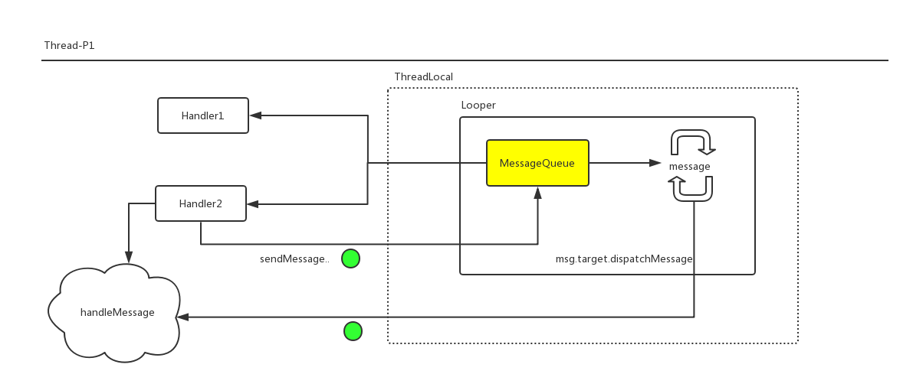

>这也是`Android`中老生常谈的一个话题了，它本身并不是很复杂，可是面试官比较喜欢问。本文就从源码再简单的理一下这个机制。也可以说是理一下`Handler`、`Looper`、`MessageQueue`之间的关系。

## 单线程中的消息处理机制的实现

首先我们以`Looper.java`源码中给出的一个例子来分析一下在单线程中如何使用这个机制:

```
class LooperThread extends Thread {
      public Handler mHandler;

      public void run() {
          Looper.prepare();
          mHandler = new Handler() {
              public void handleMessage(Message msg) {
                  // process incoming messages here
              }
          };
          Looper.loop();
      }

 }
```

### Looper.prepare()
上面只涉及到`Handler`和`Looper`，`MessageQueue`呢？我们来看一下`Looper.prepare()`:

```
private static void prepare(boolean quitAllowed) {
    ...
    sThreadLocal.set(new Looper(quitAllowed));
}
```

很简单，即`new Looper`，然后把它放到`ThreadLocal<Looper>`中(ThreadLocal<Looper>保存在线程的私有map中)。继续看一下`Looper的构造方法`:

```
private Looper(boolean quitAllowed) {
    mQueue = new MessageQueue(quitAllowed);
    ...
}
```
即，在这里`MessageQueue`作为`Looper`的成员变量被初始化了。所以 **一个Looper对应一个MessageQueue** 。 ok，到这里`Looper.prepare()`所涉及的逻辑以及浏览完毕，继续看一下`new Handler()`:

### new Handler()

```
mLooper = Looper.myLooper();
if (mLooper == null) {
    throw new RuntimeException("Can't create handler inside thread that has not called Looper.prepare()");
}
mQueue = mLooper.mQueue;
```

`Handler`会持有一个`Looper`, 那我们看一下这个`Looper`来自于哪里: `Looper.myLooper()`

```
public static @Nullable Looper myLooper() {
    return sThreadLocal.get();
}
```

即会从当前线程的私有map中取出`ThreadLocal<Looper>`。所以`Handler`默认持有当前线程的`Looper`的引用。如果当前线程没有`Looper`，那么`Handler`就会构造失败，抛出异常。其实可以在构造`Handler`时指定一个`Looper`,下面会讲到这个。

在持有当前线程的`Looper`的引用同时，`Handler`在构造时也会获取`Looper`的成员变量`MessageQueue`，并持有它。 如果你在一个线程中同时`new多个Handler`的话，那他们的关系如下图所示:


即:

1. `Looper`和`MessageQueue`存放在当前线程的`ThreadLocal`中
2. `Handler`持有当前线程的`Looper`和`MessageQueue`。

### Looper.loop()

这个方法可以说是核心了:

```
public static void loop( ) {
    final Looper me = myLooper();
    //...
    final MessageQueue queue = me.mQueue;
    //...
    for (;;) {
        Message msg = queue.next(); // might block
        //…
        msg.target.dispatchMessage(msg);
        //...
    }
}
```

即`Looper`不断检查`MessageQueue`中是否有消息`Message`，并调用`msg.target.dispatchMessage(msg)`处理这个消息。 那`msg.target`是什么呢？其实它是`Handler`的引用。

`msg.target.dispatchMessage(msg)`会导致`Handler.handleMessage()`的调用，其实到这里`单线程中的消息处理机制模型`已经有了一个大致的轮廓了，接下来就需要弄清楚

1. `msg.target`是在哪里赋值的?
2. 消息是如何插入到`MessageQueue`中的?

### 发送一个消息

以`Handler`发送一个最简单的消息为例:

```
handler.sendEmptyMessage(0)
```

这个方法最终调用到的核心逻辑是:

```
public boolean sendMessageAtTime(Message msg, long uptimeMillis) {
    MessageQueue queue = mQueue;
    if (queue == null) {
        RuntimeException e = new RuntimeException(
                this + " sendMessageAtTime() called with no mQueue");
        Log.w("Looper", e.getMessage(), e);
        return false;
    }
    return enqueueMessage(queue, msg, uptimeMillis);
}

private boolean enqueueMessage(MessageQueue queue, Message msg, long uptimeMillis) {
    msg.target = this;
    if (mAsynchronous) {
        msg.setAsynchronous(true);
    }
    return queue.enqueueMessage(msg, uptimeMillis);
}
```

即`Handler`会把`Message`的`target`设置为自己，并把消息放入到当前线程的`MessageQueue`中。

这样`Looper.loop()`方法中就可以从`MessageQueue`中取出消息，并把消息发送到`msg.target(Handler)`去处理，其实`msg.target.dispatchMessage(msg)`会调用`Handler.handleMessage()`方法。

到这里就完成了整个`消息处理模型`的分析。其实 **整个`Android主线程的UI更新`都是建立在这个模型之上的**

用下面这个图总结一下整个运行机制:




## 多线程中的消息处理机制的应用

举一个最典型的例子: 在下载线程中完成了下载，通知主线程更新UI。怎么做呢？ 

明白了上面`Handler/MessageQueue/Looper`的关系后，我们只需要往主线程的`MessageQueue`中发送一个更新UI的`Message`即可，那怎么往主线程发消息呢？

### 指定Handler所依附的Looper

对，只需要在构造Hander时把主线程的Looper传递给它即可:

```
    downLoadHandler = Handler(Looper.getMainLooper())
```

这样`downLoadHandler.sendEmptyMessage(2)`就会发送到主线程的`MessageQueue`中。`handler.handleMessage()`也将会在主线程中回调。

其实更简单的是在主线程中保存一个`Handler`成员变量，子线程直接拿这个`Handler`发消息即可。

但在多线程使用`Handler`时因为涉及到线程切换和异步，要注意内存泄漏和对象可用性检查。比如在更新UI时`Activity`是`finish`状态，这时候就需要你的`update`是否可以继续执行等。

## 线程通信

运用这个模型我们可以很方便的进行线程通信:

1. 需要通信的两个线程都建立`Looper`
2. 双方分别持有对方的handler，然后互相发送消息

欢迎关注我的[Android进阶计划](https://github.com/SusionSuc/AdvancedAndroid)看更多干货


