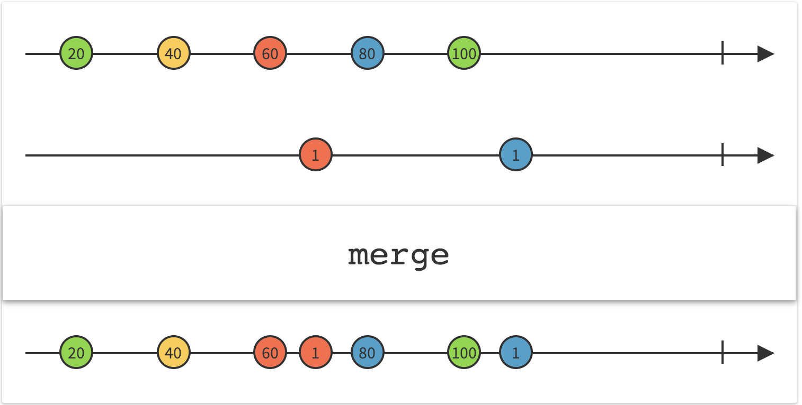

>[RxJava](https://github.com/ReactiveX/RxJava)/[RxAndroid](https://github.com/ReactiveX/RxAndroid):是一个在 Java VM 上使用可观测的序列来组成异步的、基于事件的程序的库。大家在项目中或多或少都可能用到这个库，本文我总结一下在我们的项目中常用的API。本文基于`RxAndroid version 1.2`


# Do操作符

`RxJava`中有许多`doXXX`操作符。这些操作符一般是用来注册一个`Action`，这些`Action`会在`XXX`事件发生时调用。比如`doOnSubscribe`会在`Observable`被`subscribe()`时调用。下面这张图是官方描述的`Do`的执行时机:


下面来介绍一下一些我常用到的`Do`:

## doOnSubscribe和doOnUnsubscribe

这两个操作符我常用来操作`loading view`的状态，比如一个网络请求:

```
xxxApi
    .getUser()
    .doOnSubscribe{
        ..展示loading
    }
    .doOnUnsubscribe{
        ..隐藏loading
    }
    .subscribe(...)  
```

原因是 : **可以很正确的管理loading状态不会出错，不用考虑各种出错条件下loading的管理**。

`doOnSubscribe/doOnUnsubscribe`分别会在`Observable`被`subscribe()`和`unsubscribe()`时调用。而`Observable`的`onComplete()/onError()`都会导致`unsubscribe`的调用，因此`doOnSubscribe/doOnUnsubscribe`完全可以作为一个`Observable`生命周期开始与结束的监听，确保两端的对应事件状态不会出错，比如loading状态。

## doOnNext

我们一般会在`Observer`的`onNext()`回调中来对一个`Observable`做数据正常发射的处理。不过我们一般会在业务层写这个`Observer`。但如果我有一些操作不想写在业务层，而是想做一个统一的处理怎么办呢？更直白的说法是 : 我的统一操作不依赖于特定的数据类型，而只需要一些共有的参数。 比如我想对所有带图片link的数据做预加载操作:

这里我有两个不同类型的`Observable`:

```
    fun getVendors() : Observable<List<Vendor>>{
        return  xxxApi
                .getVendors()
                .doOnNext{vendors->
                    PreLoadImageHelper(vendors[0].image)
                }
    }

    fun getNotes():Observable<List<Note>>{
      return  xxxApi
                .getNotes()
                .doOnNext{notes->
                    PreLoadImageHelper(notes[0].image)
                }
    }
```

上面`doOnNext`会在`Observable`的`onNext()`之前调用。 关键是: **`PreLoadImageHelper`不需要与任何特定类型绑定，只需要接收一个String即可**

# merge 与 zip

## zip

`zip`可以把多种类型`Observable`的输出结果做一个组合，然和转化为另外一种类型的`Observable`继续发出。对于多个`Observable`的处理是按照顺序进行的。但是一旦有一个`Observable`出现`error`那么整个`zip`操作将无法继续,所以在使用时需要注意这种情况的发生,可以使用`onErrorResumeNext()`来防止一个接口爆掉导致其他接口受影响的case。

比如我要`zip`两个网络请求接口的数据:

```
    //true 代表处理出错, false代表处理正常。 onErrorResumeNext来处理接口异常情况。
    Observable<String> req1 = createSimpleObservable("1", true).onErrorResumeNext(new Func1<Throwable, Observable<? extends String>>() {
        @Override
        public Observable<? extends String> call(Throwable throwable) {
            return Observable.just(null);
        }
    });
    Observable<String> req2 = createSimpleObservable("2", false);

    Observable.zip(req1, req2 new Func3<String, String, String, Object>() {
            @Override
            public Object call(String s, String s2, String s3) {
                Log.d(TAG, "req1: " + s);
                Log.d(TAG, "req2 : " + s2);
                return s + s2;
            }
        }).subscribe(new MyObserver<>());
```

## merge 与 mergeDelayError

`merge`类似于`zip`, 不过它不会做数据的转换操作，只是简单的按照顺序`merge`多个`Observable`。不过当任意一个`Observable`出现`error`时，都会终止`merge`操作。如果不希望这种处理，可以使用`mergeDelayError`,当一个`Observable`出现错误是不会
打断其他`Observable`的执行，并在事件的最后派发`error`事件，如下图:



比如发射3个网络请求:

```
    //true表示会error,  false 表示不会error

    Observable<String> req1 = createSimpleObservable("1", false, 1000L).doOnError{...};

    Observable<String> req2 = createSimpleObservable("2", true, 1000L).doOnError{...}; 

    Observable<String> req3 = createSimpleObservable("3", false, 1000L).doOnError{...};

    Observable.mergeDelayError(req1, req2, req3).subscribe(new MyObserver());
```

# compose 与 transformer

来看一下它的声明:

```
public <R> Observable<R> compose(Transformer<? super T, ? extends R> transformer) {
    return ((Transformer<T, R>) transformer).call(this);
}
```

看方法可以理解为: `compose`使用一个`Transformer`将一种类型的`Observable<T>`装换为另一种类型`Observable<R>`。 通过`compose`我们可以实现**一系列操作符的复用，并且还可以保证链式调用不被打断**。

比如在Android中常用的把网络请求放到后台的操作:

```
observable.subscribeOn(Schedulers.io).observeOn(AndroidSchedulers.mainThread())
```

如果对于每一个网络请求的`Observable`我们都写一遍这个会很烦。`compose`提供了一种不错的解决思路:

```
class BackgroundShcedulers<T> : Observable.Transformer<T, T> {
    override fun call(t: Observable<T>): Observable<T> {
        return t.subscribeOn(Schedulers.io()).observeOn(AndroidSchedulers.mainThread())
    }
}

reqObservable.compose(BackgroundShcedulers<String>()) //不会断掉链式调用
```

其实除了复用多个操作符，还可以抽取一个`Transformer`来做某一个单一的工作,比如:

```
fun getNotes():Observable<List<Note>>{
    return repo.getNotes(..)
                .compose(PreLoadNoteImageTransformer()) //预加载图片
                .compose(PreLoadRichContentTransformer()) //预处理富文本
}
```
>上面这个case还有很多其他的实现方式。


那`Transformer`和`map/flatMap`有什么不同呢？ 其实关键的不同点是 : **`Transformer`作用的对象是流，`map/flatMap`作用的对象是数据**

## transform 与 flatMap

比如下面这个例子:
```
   Observable.mergeDelayError(req1, req2).flatMap(new Func1<String, Observable<String>>() {
            @Override
            public Observable<String> call(String s) {
                Log.d(TAG, "flatMap origin data: " + s);
                return Observable.just("aaaa");
            }
        }).subscribe(new MyObserver<String>());

    Observable.mergeDelayError(req1, req2).compose(new Observable.Transformer<String, String>() {
            @Override
            public Observable<String> call(Observable<String> stringObservable) {
                Log.d(TAG, "compose call");
                return Observable.just("aaaa");
            }
        }).subscribe(new MyObserver<String>());
```

log日志如下:

```
D/RxTest: flatMap origin data: 1
D/RxTest: MyObserver next aaaa
D/RxTest: flatMap origin data: 2
D/RxTest: MyObserver next aaaa

D/RxTest: compose call
D/RxTest: MyObserver next aaaa
D/RxTest:  MyObserver  complete
```

即 **`Transformer`作用的对象是流，`map/flatMap`作用的对象是数据**

# Subject 

可以简单的把`Subject`理解为是一个既可以发送数据，又可以订阅自己发送的数据的对象。`RxJava`提供了多种不同类型的`Subject`，对于他们较详细的理解可以参考这篇文章:[Subject使用及示例](https://www.jianshu.com/p/1257c8ba7c0c)。下面主要看一下`PublishSubject`。

## PublishSubject

它与普通的`Subject`不同, 在订阅时并不立即触发订阅事件，而是允许我们在任意时刻手动调用`onNext(),onError(),onCompleted()`来触发事件。可以使用它来做一个模块事件触发的监听。

比如我在模块1中想监听模块2的`Like`事件:

>模块2
```
class Module2{
    val eventListener = PublishSubject.create<String>()

    fun onLike(){
        eventListener.onNext("like")
    }
}
```

>模块1
```
class Module1{
    fun listenModule2(){
        Module2().subscribe(object : CommonObserver<String>() {
            override fun onNext(eventType: String) {
                //do something
            }
        })
    }
}
```

简单点来说上面就是把`Listener`写的更优雅。

## 使用 PublishSubject 来构建 RxBus

除此之外还可以利用`PublishSubject`来实现一个`RxBus`:

```
object RxBus {

    private val mBus = SerializedSubject<>(PublishSubject.create())

    public void post(Object event) {
        mBus.onNext(event);
    }

    /**
    * 通过  mBus.ofType(）来使订阅者可以指定接收哪种类型的事件
    **/
    public <T> Observable<T> toObservable(Class<T> eventType) {
        return mBus.ofType(eventType);
    }
}
```

使用方法:
```
//订阅事件
RxBusto.Observable(LikeEvent::class.java)
       .subscribe({})

//发射事件
RxBus.post(LikeEvent(true))
```

# RxView

`RxView`这个类中封装了一系列的对`View`操作和方便监听`View`的事件回调，极大方便了UI的编写工作。比如下面这些方法:

>view 的 `addOnGlobalLayoutListener`
```
RxView.globalLayouts(view).subscribe(MyObserver())
```

> view 的 draw事件
```
RxView.preDraws(view).subscribe(MyObserver())
```

....

我最长使用的就是`View`的点击去抖:

## 去抖操作

利用`kotlin`的扩展函数，我们可以很方便的对一个`View`的`Click`事件进行去抖:

```
fun View.throttleFirstClick(action: Action1<Any?>) {
    RxView.clicks(this).throttleFirst(500, TimeUnit.MILLISECONDS).subscribe(action, Action1 {})
}
```

# 定时操作 : interval

指定时间后执行一个任务:

```
fun delayExecute(time:Int, task:Runnable){
    Observable.interval(time, TimeUnit.SECONDS).take(1).subscribe(Action1<Long>() {
        @Override
        public void call(Long aLong) {
            task()
        }
    })
}
```


**RxJava已经推出了2.0，带了了很多新的特性，可以去尝试使用一下。**

