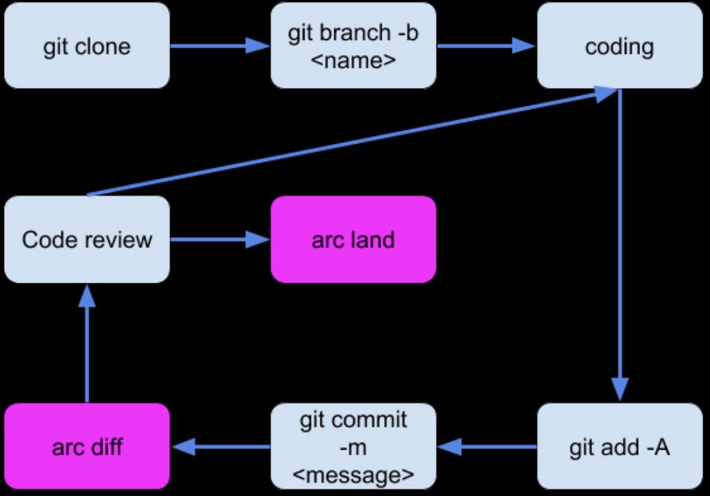

# Phabricator

最近公司把代码review的工作由`gitlab`迁移到了`Phabricator`。刚开始使用把一些要点记录一下。


## 为什么要使用Phabricator

`Phabricator`的代码review机制要比`Gitlab`强大的多，并且自定义度也非常高。


## arc安装

- clone arc项目

```
git clone git://github.com/facebook/libphutil.git
git clone git://github.com/facebook/arcanist.git
```

- 配置环境变量

`export PATH=$PATH:/somewhere/arcanist/bin/`

- 配置arc默认编辑器

`arc set-config editor "vim"`

- 设置phabricator主页Uri

在项目的根目录下，新建`.arcconfig`文件 : 

```
{
  "phabricator.uri" : "http://xxxx.com/"
}
```

- 设置arc token

获取token后，你才能对团队phbricator的项目做操作

```
arc install-certificate
```

## code review 工作流

基本工作流如下图:



### 新建一个feature分支。（这个分支应只包含一个feature的改动）

```
git add .
git commit -m "xxx"
```

### 执行 arc diff

它相当于把代码推到远程的分支，并提一个 merge request 到 origin/master。

- 第一次 arc  diff 时的操作

在第一次`arc diff`时，会要求你填写这个diff的title，review同学的姓名等信息，如下:


在`arc diff`的时候，默认是把你这个feture merge request到 origin/master。

你可以`arc diff xxx`来指定你的这个改的提交到远程的哪个分支。如果感觉每次都敲比较麻烦，可以在`.git/arc`目录下新建`default-relative-commit`文件来指定每次`arc diff`时对应的远程分支 :

文件的内容如下:

```
origin/develop
```

### 代码review

其他人如果对你的代码提出了一些建议，你可以本地修改后，继续`arc diff`直到 review的同学`accept`。

### arc land

当代码review完毕后，你可以通过`arc land`来提交你这次代码到对应的分支。

`arc land`默认也是land到`origin/master`。你可以这样来指定分支`arc land --onto origin/develop`。

你也可以在`.arcconfig`文件中加入下面的配置来避免每次输入 :

```
{
    "arc.land.onto.default":"develop"
}
```

### land后的操作

`arc land`完成后，arc会自动帮你把本地feature分支和远程feature都删除掉，并切回到develop分支。即提倡`一个改动一个分支`