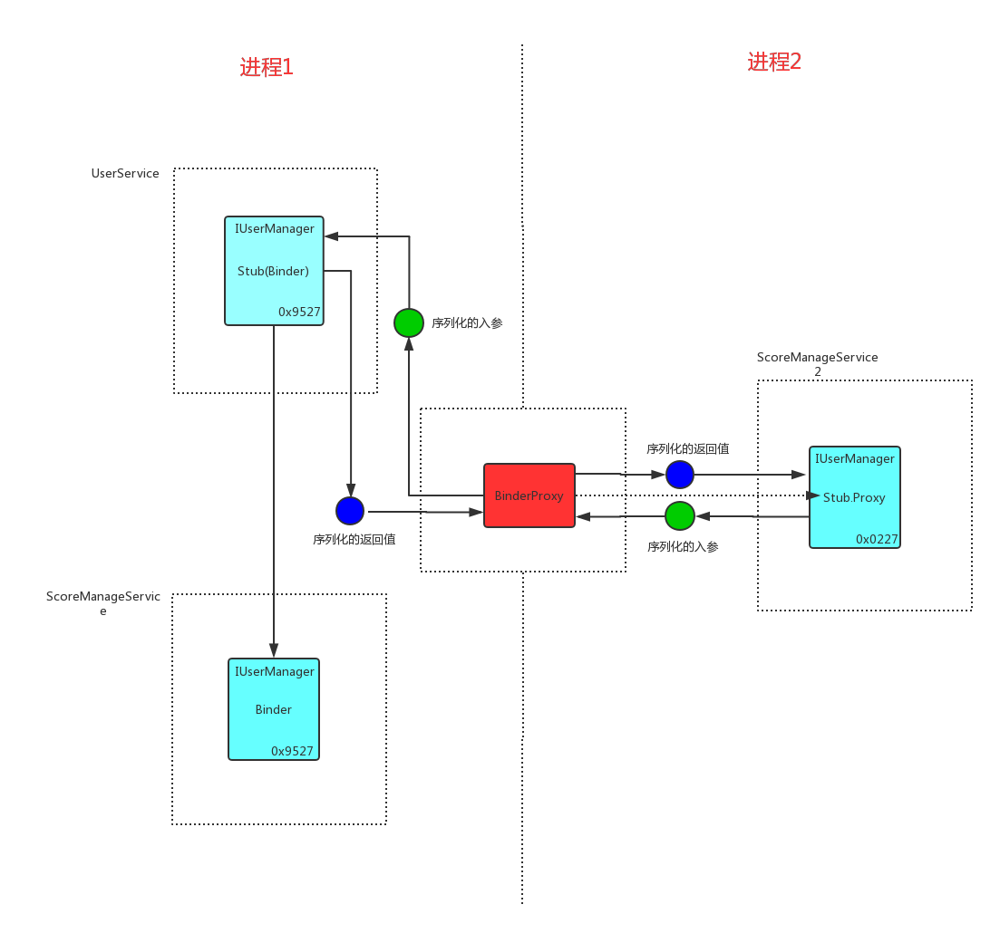

>讲`Binder`的好的文章非常多比如:

- [Android 进阶9：进程通信之 AIDL 解析](https://blog.csdn.net/u011240877/article/details/72825706)
- [Binder学习指南](http://weishu.me/2016/01/12/binder-index-for-newer/)

那我为什么还要写这篇文章呢？主要还是为了理一下自己对于`Binder`的理解。本文不是一篇介绍Binder的文章(可以看上面两篇文章), 本文会以`aidl`为例来看`Binder`,来理解`aidl`中涉及的每一个东西的含义。
所以说如果你本身对`Binder`不是很理解的话，这篇文章估计我也不能很好的表达我的理解给你。

首先我们使用`AndroidStudio`来定义一个`aidl`接口:
```
interface IUserManager {
    int getUserAge(in String userName);
}
```

然后我们来直接看一个由`AndroidStudio`根据自定义的`aidl`接口`IUserManager`产生的`IUserManager.java`文件。

这个文件我们来分3个部分看:

## IUserManager接口结构

```
public interface IUserManager extends android.os.IInterface {

    public static abstract class Stub extends android.os.Binder implements com.susion.demo.aidl.IUserManager {..}

    public int getUserAge(java.lang.String userName) throws android.os.RemoteException;
}
```

这个接口的结构还是很简单的: 

1. 它继承自`android.os.IInterface`。
2. 定义了一个待实现的方法`int getUserAge()`
3. 定义了一个`Stub`类。这个类继承自`Binder`，并实现了`IUserManager`接口。

`int getUserAge()`这个方法就是我们`IUserManager接口`的方法。而`android.os.IInterface`是什么呢？先看一下它在源码中的定义:

```
/**
 * Base class for Binder interfaces.  When defining a new interface,
 * you must derive it from IInterface.
 */
public interface IInterface
{
    /**
     * Retrieve the Binder object associated with this interface.
     * You must use this instead of a plain cast, so that proxy objects
     * can return the correct result.
     */
    public IBinder asBinder(); //IBinder是Binder的抽象接口
}
```

即他是所有`Binder`都要实现的接口, 为什么呢 ？:

举一个我们都熟悉的场景:

比如`ApplicationThread`，`ActivityManagerService`(运行在服务端进程)就可以通过它来调用我们客户端的方法。我们会把这些方法抽象为一个接口（`IApplicationThread`），这个接口可以理解为我们告诉服务端，你可以对客户端执行哪些操作。

我们还知道`ApplicationThread`其实他就是一个`Binder`。所以这两者一结合就可以这么说`ApplicationThread`: 客户端提供给服务端一个`Binder`,通过这个`Binder`服务端可以对客户端做一些操作,这些操作具体定义在`IApplicationThread`接口中。

*我们称`IApplicationThread`为`ApplicationThread`这个`Binder`的功能。* 所以`Binder`除了可以理解为系统给我们提供的一个跨进程通信的对象。 我们在用`Binder`通信时，还可以说`Binder`是一个具有某些功能的一个对象。

那么怎么表示`Binder`有功能呢？ *即要继承`IInterface`* 。`IInterface`可以表示`Binder`有功能， 不然你想一个，那么多`Binder`都只实现自己的接口, 那么系统层就不好操作了，它总不能向下强转为`Binder`吧，所以Android定义了一个更高层级的接口`IInterface`。描述`Binder`功能的接口必须继承自这个接口。 

重点: *Binder、Binder的功能(IApplicationThread)、IInterface它们都在同一个对象上 -> ApplicationThread*

## Stub

它是`IUserManager`的内部静态类，看一下它的具体声明:

```
static abstract class Stub extends android.os.Binder implements com.susion.demo.aidl.IUserManager 
```

即它是一个`Binder`,可以用来跨进程通信。它具有`IUserManager`定义的功能。

看一下它的具体结构:

```
    public static abstract class Stub extends android.os.Binder implements com.susion.demo.aidl.IUserManager {

        private static final java.lang.String DESCRIPTOR = "com.susion.demo.aidl.IUserManager";

        static final int TRANSACTION_userCount = (android.os.IBinder.FIRST_CALL_TRANSACTION + 0);

        public Stub() {
            this.attachInterface(this, DESCRIPTOR);
        }

        public static com.susion.demo.aidl.IUserManager asInterface(android.os.IBinder obj) {
            if ((obj == null)) {
                return null;
            }
            android.os.IInterface iin = obj.queryLocalInterface(DESCRIPTOR);
            if (((iin != null) && (iin instanceof com.susion.demo.aidl.IUserManager))) {
                return ((com.susion.demo.aidl.IUserManager) iin);
            }
            return new com.susion.demo.aidl.IUserManager.Stub.Proxy(obj);
        }

        @Override
        public android.os.IBinder asBinder() {retun this;}

        @Override
        public boolean onTransact(int code, android.os.Parcel data, android.os.Parcel reply, int flags) throws android.os.RemoteException {...}

        private static class Proxy implements com.susion.demo.aidl.IUserManager {...}

    }
```

我们还是一个一个的看一下:

### `DESCRIPTOR`

基于我们前面的解释，我们知道在跨进程通信中`Binder`对象具有某种功能->`IInterface`。但是`Binder`通信机制中那么多`Binder`都有`IInterface`。那么系统怎么识别哪个`Binder`是哪个`Binder`呢？所以`IInterface`只是一个能力的抽象，`DESCRIPTOR`就是来表示具体是哪一个功能`IInterface`。

### `TRANSACTION_userCount` 

即功能下的哪个操作。

### Stub构造函数

```
    public Stub() {
        this.attachInterface(this, DESCRIPTOR);
    }
```

即一个`Stub`(`Binder`)在构造的时候，就标识好了自己的具体功能`IUserManager`。来看一下`attachInterface(this, DESCRIPTOR)`做了什么:

```
//Binder.java
public void attachInterface(@Nullable IInterface owner, @Nullable String descriptor) {
    mOwner = owner;  
    mDescriptor = descriptor;
}
```

即，Binder在内部会用`IInterface`来保存自己的功能。和这个功能更对应的唯一描述`descriptor`。

### asBinder()

自己返回自己，因为自己本身就是个`Binder`呀。

### onTransact()

当其他进程想跨进程调用我这个`Binder`的功能时，必须通过这个方法来沟通。这个方法我们最后再来看。

### `asInterface(android.os.IBinder obj)`

即接收一个`IBinder`(这个IBinder是系统传入的), 把这个`IBinder`转化为它所具有功能接口。*其实这里就是`Binder`跨进程通信的一个核心* 。那怎么转化的呢？

- 调用者和Binder对象位于同一个进程

那么系统就会直接传给你在这个进程创建的`Stub`(Binder)。所以 `obj.queryLocalInterface(DESCRIPTOR)`:

```
public  IInterface queryLocalInterface(String descriptor) {
    if (mDescriptor.equals(descriptor)) {
        return mOwner;
    }
    return null;
}
```

即如果`参数descriptor`和这个`Binder的功能唯一描述相同`。就会返回`Binder`的功能`mOwner`。

- 调用者和Binder对象不在同一个进程

这时系统实际传的是一个`BinderProxy`, 你可以理解为它是另一个进程中的`Binder`的替身。我们就可以把它当成另一个进程的`Binder`。我们看一下`BinderProxy`的`queryLocalInterface()`方法:

```
/**
* Retrieve a local interface - always null in case of a proxy
*/
public IInterface queryLocalInterface(String descriptor) {
    return null;
}
```
所以此时`asInterface()`返回的是: `IUserManager.Stub.Proxy(obj)`, 即代理对象，它代理了`BinderProxy`。

### IUserManager.Stub.Proxy

它又是`Stub`的静态内部类,如果调用者和`Binder`不在同一个进程的话，调用者拿到的实际是它:

```
    private static class Proxy implements com.didi.virtualapk.demo.aidl.IUserManager {
        private android.os.IBinder mRemote;

        Proxy(android.os.IBinder remote) {
            mRemote = remote;
        }

        @Override
        public android.os.IBinder asBinder() {
            return mRemote;
        }

        public java.lang.String getInterfaceDescriptor() {
            return DESCRIPTOR;
        }

        @Override
        public int getUserAge(java.lang.String userName) throws android.os.RemoteException {
            android.os.Parcel _data = android.os.Parcel.obtain();
            android.os.Parcel _reply = android.os.Parcel.obtain();
            int _result;
            try {
                _data.writeInterfaceToken(DESCRIPTOR);
                _data.writeString(userName);
                mRemote.transact(Stub.TRANSACTION_getUserAge, _data, _reply, 0);
                _reply.readException();
                _result = _reply.readInt();
            } finally {
                _reply.recycle();
                _data.recycle();
            }
            return _result;
        }
    }
```

我们前面说了它其实是`BinderProxy`的代理。为什么要对`BinderProxy`加这个代理呢？看一下`getUserAge()`:

```
    public int getUserAge(java.lang.String userName) throws android.os.RemoteException {
        android.os.Parcel _data = android.os.Parcel.obtain();
        android.os.Parcel _reply = android.os.Parcel.obtain();
        int _result;
        try {
            _data.writeInterfaceToken(DESCRIPTOR);
            _data.writeString(userName);
            mRemote.transact(Stub.TRANSACTION_getUserAge, _data, _reply, 0);
            _reply.readException();
            _result = _reply.readInt();
        } finally {
            _reply.recycle();
            _data.recycle();
        }
        return _result;
    }
```

即是调用`mRemote.transact()`(BinderProxy的)方法。`Stub.TRANSACTION_getUserAge`是要调用的远程`Binder`方法的`getUserAge()`对应的描述符。

`_data`是序列化后的入参、`_reply`是序列化后的返回值。可以看到`_data`所携带的参数是需要序列化的，`_reply`所带的内容是被序列化的，所以读取要反序列化。

所以`IUserManager.Stub.Proxy`类的作用就是对传给`mRemote(BinderProxy)`的参数做序列化，对`mRemote(BinderProxy)`返回值做反序列化。

具体调用`Binder`的能力是使用`BinderProxy`的`transact()`方法,*它是跨进程通信的核心* , 我们来看一下这个方法:

```
public boolean transact(int code, Parcel data, Parcel reply, int flags) throws RemoteException {
    ...
    return transactNative(code, data, reply, flags); // native 方法
}
```

省略了不重要的代码。即`BinderProxy`是通过`transactNative`来与远程`Binder`跨进程通信的。具体怎么实现，这里就不追究了。

## Stub.onTransact()

我们前面没有看这个方法，这里我们来看一下:

```
public boolean onTransact(int code, android.os.Parcel data, android.os.Parcel reply, int flags) throws android.os.RemoteException {
    switch (code) {
        case INTERFACE_TRANSACTION: {
            reply.writeString(DESCRIPTOR);
            return true;
        }
        case TRANSACTION_userCount: {
            data.enforceInterface(DESCRIPTOR);
            int _result = this.userCount();
            reply.writeNoException();
            reply.writeInt(_result);
            return true;
        }
    }
    return super.onTransact(code, data, reply, flags);
}
```

根据`IUserManager.Stub.Proxy`我们知道，如果不在同一个进程，那么参数是被序列化后传过来的，*所以这个方法是用来对入参做反序列化，并对返回值做序列化的*。

最后我们用一张图来总结`Binder进程通信机制` : 




